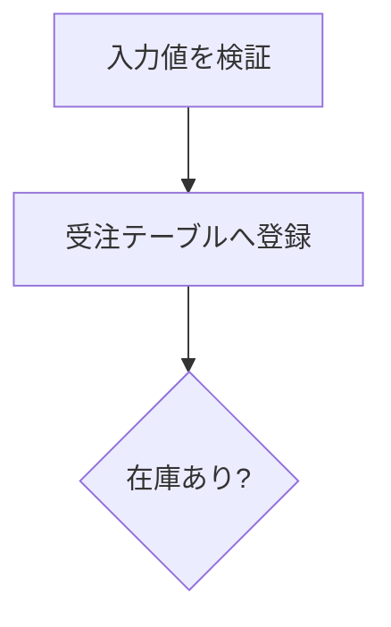
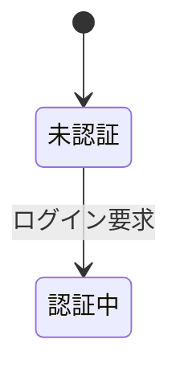
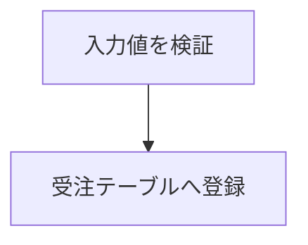

# 執筆ガイド（Markdown / Quarto 記法）

執筆者はこのテンプレートの上で **Markdown（Quarto の `.qmd`）だけ**を書きます。
会社様式（外枠・資料番号・ページ番号）・章番号・図表番号・相互参照・字下げ・
縦横混在・IPO図は基盤側（`template/`）が自動で受け持つので、本文づくりに集中できます。

このガイドは **執筆で使う記法**を説明します。ビルド方法やセットアップは
[README.md](README.md)、様式そのものの調整は [template/PIPELINE.md](template/PIPELINE.md) を参照してください。

- 対象読者: 基本的な Markdown は分かっている執筆者
- 書く場所: `docs/chapters/**.qmd`（章を増減するときだけ `docs/_quarto.yml`）

---

## 1. 基本の Markdown（ざっと確認）

一般的な Markdown はそのまま使えます。ここは既知の前提で要点だけ。

| 記法 | 書き方 |
|------|--------|
| 見出し | `# 章` / `## 節` / `### 項` / `#### 目`（`#` の数でレベル。最大4） |
| 強調 | `**太字**` / `*斜体*` |
| 箇条書き | `- 項目`（入れ子はインデント2〜4スペース） |
| 番号付き | `1. 項目` |
| インラインコード | `` `code` `` |
| コードブロック | ` ``` ` で囲む |
| リンク | `[表示文字](URL)` |

> **見出しレベルと字下げ（自動）**: 見出しはレベルごとに字下げされ（レベル1=0／2=1／3=2文字）、
> その配下の本文段落・箇条書きも同じ位置から始まります。段落の先頭は1文字字下げされます。
> 執筆者が字下げを手で書く必要はありません。

このテンプレート特有の記法（相互参照・横向き・IPO図・改ページ・ファイル分割）を
以降で説明します。

---

## 2. 文書全体の設定（`_quarto.yml`）

タイトルや資料番号などは `docs/_quarto.yml` の先頭で設定します（本文には書きません）。

```yaml
book:
  title: 受注管理システム 基本設計書   # 表題
  subtitle: サンプル・ボイラープレート  # 副題（任意）
  author: 設計チーム                    # 作成者（任意）
  chapters:                             # 章の並び（3章参照）
    - index.qmd
    - chapters/01-overview/_chapter.qmd
    - chapters/02-architecture.qmd

lang: ja
doc-number: SD-2026-001   # 資料番号（各ページ右上・横ページ右端に出る）
doc-revision: ""          # 改訂記号（A〜Z / NC）。doc-number の末尾に結合。空=なし

spec: false               # スペック様式（表題欄）にするか。true で切り替え
company-ja: ソフト開発株式会社          # スペック様式フッターの会社名（日本語）
company-en: Soft Development Co., Ltd.  # スペック様式フッターの会社名（英語）

cover: false              # 表紙（タイトルページ）を出す。true で出す
toc: true                 # 目次を出す
toc-title: 目 次          # 目次の見出し
toc-depth: 3              # 目次に載せる見出しの深さ
```

- **`doc-number`**: 全ページの資料番号欄に表示されます。
- **`doc-revision`**: 改訂記号（`A`〜`Z` または `NC`）。`doc-number` の末尾に結合して表示されます（例: `SD-2026-001A`）。空なら番号のみ。
- **`cover`**: 既定は表紙なし。表紙が要るときだけ `true` にします。
- **`toc`**: 目次の自動生成。章番号・リーダー線・実ページ番号つきで、本文を直せば自動追従します。

### スペック様式（`spec: true`）

`spec: true` にすると、資料番号欄のかわりに**表題欄**（左に「スペック / SPECIFICATION」、右に
スペック番号＝`doc-number` と 改訂符号＝`doc-revision`）を全ページの上部（A4横・IPO は右側に
90°回転）に出す様式へ切り替わります。あわせて外枠の下に会社名フッターを出します。

- **`spec`**: `true` でスペック様式。既定 `false`（通常の資料番号様式）。
- **`company-ja` / `company-en`**: スペック様式フッターに出す会社名（日本語・英語）。
  `spec: true` のときだけ表示されます（A4縦は外枠下・ページ中央、A4横/IPO は左余白に回転）。

執筆する Markdown（本文の書き方）は `spec` の値に関係なく同じです。

---

## 3. 章・節・項の構成とファイル分割

### 見出しレベル ＝ 文書構造

| Markdown | 役割 | 採番例 |
|----------|------|--------|
| `# 見出し` | 章 | `1` |
| `## 見出し` | 節 | `1.1` |
| `### 見出し` | 項 | `1.1.1` |
| `#### 見出し` | 目 | `1.1.1.1` |

章番号は**自動採番**されます。番号を手で書かないでください。

### ファイル分割（``）

400〜1000ページ級を想定し、**1ファイル ＝ 1章**を基本に、長い章はさらに
ファイルを分けて `` で取り込みます。**ファイルを分割しても、
章番号・節番号・図表番号・相互参照・ページ番号は文書全体で連続**します。

章ファイル（`chapters/03-functions/_chapter.qmd`）:

```markdown
# 機能仕様



```

取り込まれる側（`01-part1.qmd`）は節から書きます:

```markdown
## ユーザ管理機能
...
```

> **重要**: 章の見出し（`#` ＝ h1）は**章ファイル側に置く**こと。
> include されるファイルだけに h1 があると、左ペインの章名にファイル名が出てしまいます。

### 章を増減するとき

`docs/_quarto.yml` の `chapters:` にファイルを追加・削除・並べ替えするだけです。
章番号はその順序で自動的に振り直されます。

---

## 4. 改ページ

章の途中でページを改めたい位置に `` を置きます。
見出しの有無に関係なく、任意の位置で改ページできます。

```markdown
ここまでが前のページ。



ここから新しいページ。段落の途中で不自然に割れるのを防ぎたいときなどに使う。
```

---

## 5. 図と相互参照

### 画像

```markdown
{#fig-arch width=55%}
```

- `#fig-arch` … 参照用のID（`fig-` で始める）
- `width=55%` … 表示幅（任意）
- **画像パスは必ずプロジェクトルート基準の `/diagrams/...` で書く**こと。
  `../` を使うと Windows でパス結合が壊れ、ビルドに失敗します。

### mermaid 図

` ```mermaid ` のコードフェンスに書くと、ビルド時に SVG 化されて貼られます。

````markdown

````

図として**番号とキャプションを付けて参照**したいときは、`::: {#fig-id}` で囲みます:

````markdown
::: {#fig-auth-state}



認証状態遷移
:::
````

（`:::` の直前の行がキャプションになります。）

### 図番号の参照

本文中で `@fig-arch` と書くと「図 1.1-1」のような番号に自動で置き換わります。
**別ファイルの図を参照しても番号は正しく解決**されます。

- 図表番号は「**章.節-連番**」形式（例: 図 3.2-1）。連番は節ごとに 1 に戻ります。

---

## 6. 表

### 通常の表

パイプ表で書き、`: キャプション {#tbl-id}` で番号とIDを付けます。
表の**幅は本文いっぱいに自動調整**されます。

```markdown
| 属性     | 型          | 必須 | 説明         |
|----------|-------------|------|--------------|
| ユーザID | 文字列(8)   | ○   | 一意な識別子 |
| 氏名     | 文字列(64)  | ○   | 表示名       |

: ユーザ属性一覧 {#tbl-user-attrs}
```

本文で `@tbl-user-attrs` と書くと「表 1.1-1」のように参照できます。

### セル結合（縦に続く同じ値をまとめる）

大分類・中分類のように縦に同じ値が続く表は、`::: {.merge-rows}` で囲むと
**連続する同一セルが自動で rowspan 結合**されます。表は普通に書くだけです。

```markdown
::: {.merge-rows}
| 大分類 | 中分類 | 小分類         | 必須 |
|--------|--------|----------------|:----:|
| 受注   | 登録   | 入力チェック   | ○   |
| 受注   | 登録   | 重複チェック   | ○   |
| 受注   | 引当   | 在庫確認       | ○   |

: 機能分類 {#tbl-cls}
:::
```

---

## 7. 横向きページ（ランドスケープ）

横幅の広い表や図は、`::: {.landscape}` 〜 `:::` で囲むと**その中身だけが横向き
ページ**になります（前後の本文は縦のまま）。用紙は縦綴じのまま90°回して読む配置です。

```markdown
::: {.landscape}
## 処理一覧（横向きページ）

| ID   | 処理名   | 入力         | 処理内容                         | 出力       |
|------|----------|--------------|----------------------------------|------------|
| P-01 | 受注登録 | 受注入力画面 | 入力値を検証し受注テーブルへ登録 | 受注ID     |
:::
```

- 中は通常の Markdown（見出し・表・図・mermaid）をそのまま書けます。
- 横向きページにも外枠・資料番号・ページ番号が自動で付きます。

---

## 8. IPO図（横向きの定型ページ）

入力・処理・出力を1枚にまとめる IPO 図は、`::: {.ipo}` 〜 `:::` で囲みます。

- **機能名** … `module=` 属性で指定
- **処理名** … 最初の見出し（`##`）に書く
- **表番号のタイトル** … `caption=` 属性で指定（省略可）
- 続けて `### 入力` `### 処理` `### 出力` の3欄。各欄は**通常の Markdown**（箇条書き・段落・mermaid）で自由に書ける

機能名・処理名・タイトルを別々に指定するので、名称に `/` を含めても大丈夫です。
IPO図の上部には「表 章-連番」（章.節-連番。表として採番）が自動で入ります。

````markdown
::: {.ipo module="受注管理" caption="受注処理の流れ"}
## 受注処理

### 入力

- 受注入力画面
- 顧客マスタ

### 処理



### 出力

- 受注ID
- 出荷指示書
:::
````

- IPO図は自動的に横向きの定型ページ（機能名/処理名の欄 ＋ 入力/処理/出力の3列）になります。
- 入力・出力欄は幅が可変なので、ネストした箇条書きも収まります。
- 機能に複数の処理があるときは、同じ `module=` で処理ごとに IPO を並べます。

---

## 9. 前付け（採番しない章）

改訂履歴・凡例など、章番号を振りたくない前付けは、見出しに `{.unnumbered}` を付けます。

```markdown
# 本書について {.unnumbered}

本書は……
```

- HTML ではここがトップページ（`index.html`）、PDF では（表紙の次の）先頭に置かれます。
- **注意**: 採番されない章に**キャプション付きの図表を置くと章番号が 0**（図 0.0-1）になります。
  番号付きの図表は必ず採番される章（`#` に `{.unnumbered}` を付けない章）に置いてください。

### 補足: コールアウト（注記ボックス）

Quarto のコールアウトも使えます。

```markdown
::: {.callout-note}
注記の本文。
:::
```

（`callout-note` / `callout-warning` / `callout-tip` など。）

---

## 10. よくあるつまずき

| 症状 | 原因・対処 |
|------|-----------|
| 画像が出ない／ビルド失敗 | 画像パスに `../` を使っている。`/diagrams/...`（ルート基準）で書く |
| 章名にファイル名が出る | 章の h1（`#`）を include 先だけに書いている。**章ファイル側**に h1 を置く |
| 図表番号が 0 になる | 採番されない章（`{.unnumbered}`）にキャプション付き図表を置いている |
| 相互参照が「?」のまま | ID（`#fig-x` / `#tbl-x`）と参照（`@fig-x` / `@tbl-x`）の綴りが不一致 |
| mermaid が画像にならない | mermaid を使う初回のみ準備が必要（[README.md](README.md) の「mermaid を使う場合」参照） |

---

## 記法早見表

| やりたいこと | 記法 |
|------|------|
| 章／節／項 | `#` ／ `##` ／ `###` |
| 採番しない前付け | `# 見出し {.unnumbered}` |
| 改ページ | `` |
| ファイル分割 | `` |
| 画像 | `{#fig-id width=55%}` |
| mermaid（番号付き） | `::: {#fig-id}` 〜 ` ```mermaid ` 〜 キャプション 〜 `:::` |
| 表（番号付き） | パイプ表 ＋ `: キャプション {#tbl-id}` |
| セル結合 | `::: {.merge-rows}` 〜 `:::` |
| 横向きページ | `::: {.landscape}` 〜 `:::` |
| IPO図 | `::: {.ipo module="機能名" caption="タイトル"}` ＋ `## 処理名` ＋ `### 入力/処理/出力` |
| 図表の参照 | `@fig-id` ／ `@tbl-id` |
