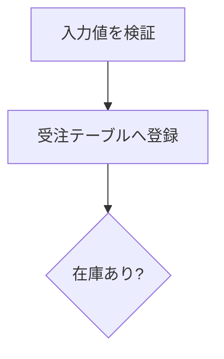
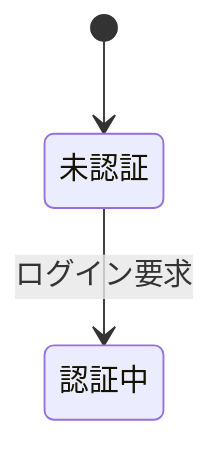
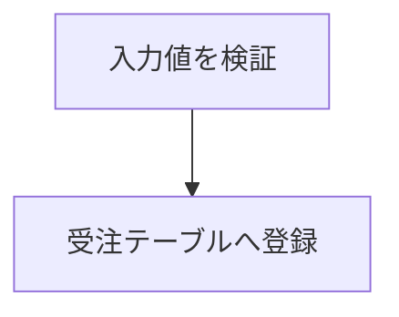
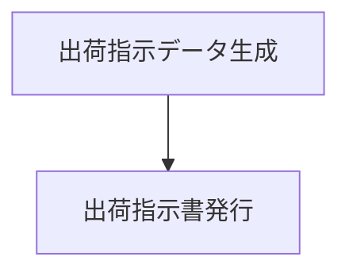
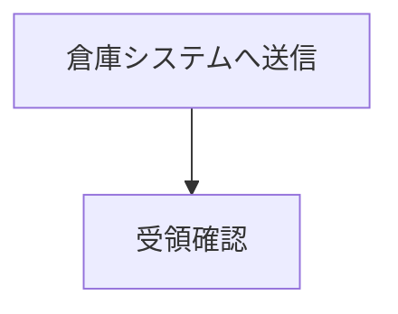

# 執筆ガイド（Markdown / Quarto 記法）

執筆者はこのテンプレートの上で **Markdown（Quarto の `.qmd`）だけ**を書きます。
会社様式（外枠・資料番号・ページ番号）・章番号・図表番号・相互参照・字下げ・
縦横混在・IPO図は基盤側（`template/`）が自動で受け持つので、本文づくりに集中できます。

このガイドは **執筆で使う記法**を説明します。ビルド方法やセットアップは
[README.md](README.md)、様式そのものの調整は [template/PIPELINE.md](template/PIPELINE.md) を参照してください。

- 対象読者: 基本的な Markdown は分かっている執筆者
- 書く場所: `docs/chapters/**.qmd`（章を増減するときだけ `docs/_quarto.yml`）

---

## 1. 基本の Markdown（ざっと確認）

一般的な Markdown はそのまま使えます。ここは既知の前提で要点だけ。

| 記法 | 書き方 |
|------|--------|
| 見出し | `# 章` / `## 節` / `### 項` / `#### 目` / `#####`（`#` の数でレベル。最大5） |
| 強調 | `**太字**` / `*斜体*` |
| 箇条書き | `- 項目`（入れ子はインデント2〜4スペース） |
| 番号付き | `1. 項目`（入れ子の深さで採番記号が自動で変わる。下記） |
| インラインコード | `` `code` `` |
| コードブロック | ` ``` ` で囲む |
| リンク | `[表示文字](URL)` |

> **見出しレベルと字下げ（自動）**: 見出しはレベルごとに字下げされ（レベル1=0／2=1／3=2文字）、
> その配下の本文段落・箇条書きも同じ位置から始まります。段落の先頭は1文字字下げされます。
> 執筆者が字下げを手で書く必要はありません。
> なお**表のセルの中は対象外**で、セル内の箇条書きは見出しレベルによらず常にセル左端から
> 始まります（深い項の表でセルが右へ流れて潰れないようにするため）。

> **番号付きリストの採番（自動）**: `1.` で書いた番号付きリストは、規格（表Ｂ.４）の
> 細別番号に合わせ、**入れ子の深さで採番記号が自動で切り替わります**。
> 1段目 `(1)` → 2段目 `①` → 3段目 `(ア)` → 4段目 `a)` → 5段目 `(a)`。
> 執筆者は各段とも Markdown の `1.`（`1.` `2.` …）で書くだけで、記号は書きません。
> （カタカナはアイウエオ順。様式の調整は `template/lib.typ` の `ENUM-NUMBERING` を参照。）

このテンプレート特有の記法（相互参照・横向き・IPO図・改ページ・ファイル分割）を
以降で説明します。

---

## 2. 文書全体の設定（`_quarto.yml`）

タイトルや資料番号などは `docs/_quarto.yml` の先頭で設定します（本文には書きません）。

```yaml
book:
  title: 受注管理システム 基本設計書   # 表題
  subtitle: サンプル・ボイラープレート  # 副題（任意）
  author: 設計チーム                    # 作成者（任意）
  chapters:                             # 章の並び（3章参照）
    - index.qmd
    - chapters/01-overview/index.qmd
    - chapters/03-design-conditions/index.qmd

lang: ja
doc-number: SD-2026-001   # 資料番号（各ページ右上・横ページ右端に出る）
doc-revision: ""          # 改訂記号（A〜Z / NC）。doc-number の末尾に結合。空=なし

spec: false               # スペック様式（表題欄）にするか。true で切り替え
company-ja: ソフト開発株式会社          # スペック様式フッターの会社名（日本語）
company-en: Soft Development Co., Ltd.  # スペック様式フッターの会社名（英語）

cover: false              # 表紙（タイトルページ）を出す。true で出す
toc: true                 # 目次を出す
toc-title: 目 次          # 目次の見出し
toc-depth: 3              # 目次に載せる見出しの深さ
```

- **`doc-number`**: 全ページの資料番号欄に表示されます。
- **`doc-revision`**: 改訂記号（`A`〜`Z` または `NC`）。`doc-number` の末尾に結合して表示されます（例: `SD-2026-001A`）。空なら番号のみ。
- **`cover`**: 既定は表紙なし。表紙が要るときだけ `true` にします。
- **`toc`**: 目次の自動生成。章番号・リーダー線・実ページ番号つきで、本文を直せば自動追従します。

### スペック様式（`spec: true`）

`spec: true` にすると、資料番号欄のかわりに**表題欄**（左に「スペック / SPECIFICATION」、右に
スペック番号＝`doc-number` と 改訂符号＝`doc-revision`）を全ページの上部（A4横・IPO は右側に
90°回転）に出す様式へ切り替わります。あわせて外枠の下に会社名フッターを出します。

- **`spec`**: `true` でスペック様式。既定 `false`（通常の資料番号様式）。
- **`company-ja` / `company-en`**: スペック様式フッターに出す会社名（日本語・英語）。
  `spec: true` のときだけ表示されます（A4縦は外枠下・ページ中央、A4横/IPO は左余白に回転）。

執筆する Markdown（本文の書き方）は `spec` の値に関係なく同じです。

---

## 3. 章・節・項の構成とファイル分割

### 見出しレベル ＝ 文書構造

| Markdown | 役割 | 採番例 |
|----------|------|--------|
| `# 見出し` | 章 | `1` |
| `## 見出し` | 節 | `1.1` |
| `### 見出し` | 項 | `1.1.1` |
| `#### 見出し` | 目 | `1.1.1.1` |
| `##### 見出し` | （5段目） | `1.1.1.1.1` |

章番号は**自動採番**されます。番号を手で書かないでください。

### フォルダ・ファイル構成（``）

400〜1000ページ級を想定し、見出しレベルに合わせて**フォルダとファイルに分割**します。
**分割しても、章番号・節番号・図表番号・相互参照・ページ番号は文書全体で連続**します。

**分割の規約**（サンプル `docs/chapters/` がこの規約の実例）:

- **章（L1）は必ずフォルダにする**（節が無くても）。ラッパーは `index.qmd`。
- **節（L2）・項（L3）は、子見出しを持つときだけフォルダにする**。ラッパーは常に `index.qmd`。
  `index.qmd` にその階層の見出し（`#`/`##`/`###`）と、子を取り込む `` を書く。
- **子見出しを持たない節・項（リーフ）はファイルのまま**（`NN-name.qmd`）。
- **目（L4）・5段目（L5）は分けず**、親ファイルの中にそのまま書く。

```text
chapters/
  01-overview/            # 章(L1) …子(節)があるのでフォルダ
    index.qmd             #   → # 概要 ＋ include
    01-purpose.qmd        #   節(L2)・子なし＝ファイル → ## 目的
    02-scope.qmd
  04-system/              # 章(L1)
    index.qmd             #   → # システム構成 ＋ include
    01-hardware/          #   節(L2)・子(項)があるのでフォルダ
      index.qmd           #     → ## ハードウェア環境 ＋ include
      01-config.qmd       #     項(L3)・子なし＝ファイル → ### ハードウェア構成
      02-spec.qmd
  05-requirements/        # 章(L1)・節なしでもフォルダにする
    index.qmd             #   → # プログラムに対する要求分析（節が無ければ本文も index に）
```

> **重要1**: 各階層の見出し（`#`/`##`/`###`）は、その階層の `index.qmd`（フォルダの
> ラッパー）側に置く。とくに**章の h1（`#`）は必ず章の `index.qmd` に置く**こと。
> include される子ファイルだけに h1 があると、左ペインの章名にファイル名が出てしまう。

> **重要2（include のパス）**: include のパスは、**その章の `index.qmd` があるディレクトリ**
> 基準で書く（入れ子でも同じ）。たとえば `04-system/01-hardware/index.qmd` から
> `01-config.qmd` を取り込むときも、章フォルダ基準で `01-hardware/01-config.qmd` と書く。

### 章を増減するとき

`docs/_quarto.yml` の `chapters:` にファイルを追加・削除・並べ替えするだけです。
章番号はその順序で自動的に振り直されます。

---

## 4. 改ページ

章の途中でページを改めたい位置に `` を置きます。
見出しの有無に関係なく、任意の位置で改ページできます。

```markdown
ここまでが前のページ。



ここから新しいページ。段落の途中で不自然に割れるのを防ぎたいときなどに使う。
```

---

## 5. 図と相互参照

### 画像

```markdown
{#fig-arch width=55%}
```

- `#fig-arch` … 参照用のID（`fig-` で始める）
- `width=55%` … 表示幅（任意）
- **画像パスは必ずプロジェクトルート基準の `/diagrams/...` で書く**こと。
  `../` を使うと Windows でパス結合が壊れ、ビルドに失敗します。

### mermaid 図

` ```mermaid ` のコードフェンスに書くと、ビルド時に SVG 化されて貼られます。

````markdown

````

図として**番号とキャプションを付けて参照**したいときは、`::: {#fig-id}` で囲みます:

````markdown
::: {#fig-auth-state}



認証状態遷移
:::
````

（`:::` の直前の行がキャプションになります。）

### 図番号の参照

本文中で `@fig-arch` と書くと「図 1.1-1」のような番号に自動で置き換わります。
**別ファイルの図を参照しても番号は正しく解決**されます。

- 図表番号は「**章.節-連番**」形式（例: 図 3.2-1）。連番は節ごとに 1 に戻ります。

### 章・節を参照する（`@sec-`）

見出しに `{#sec-id}` を付けると、本文から `@sec-id` でその章・節を参照できます
（`sec-` で始めること）。番号は自動で解決され、**別ファイルの見出しでも正しく参照**されます。

```markdown
## 性能目標 {#sec-perf}

… 詳細は @sec-perf に示す。
```

- 参照の表記は見出しレベルで変わります: **レベル1（章）＝「5章」**、**レベル2以降（節・項）＝「5.3節」**
  （番号＋「章」／「節」。PDF・HTML とも同じ）。

---

## 6. 表

### 統一テーブル `.tbl`（おすすめ・これ1つで何でも）

表まわりは **`::: {.tbl …}` 1つ**で、通常表・分割・セル結合・列幅・相互参照をすべて
書けます。用途ごとにクラスを使い分ける必要はありません。

属性（すべて任意。組み合わせ自由）:

| 属性 | 効果 |
|------|------|
| `caption="…"` | キャプション。付けると採番される（無ければ番号なしの素の表） |
| `label="tbl-x"` | 相互参照の ID。本文で `@tbl-x`（`tbl-` 始まり必須） |
| `widths="20,30,50"` | 列幅（カンマ区切り。％風でも比率でも可） |
| `merge-cols="2,3"` | 指定列をセル結合（`"all"` で全列を左から結合） |

- **表を1つ**書けば通常表、**空行区切りで複数**書けば分割表（同じ番号＋「（i／M）」）。
- `caption` も `label` も無い1枚表は**採番されません**（幅・結合だけ適用した素の表）。
- `label` は属性の**値**なので、図の `{#fig-x}` と違って `#` は不要です。ただし図に
  慣れて `label="#tbl-x"` と書いても通るよう、**先頭の `#` は自動で取り除かれます**。
- **`.unnumbered` クラス**（`::: {.tbl .unnumbered caption="…"}`）を付けると、
  **表番号を出さずキャプションだけ**表示します。`{.unnumbered}` な章・節では番号の
  接頭辞が 0 になり「表 0-1」となるのを避けるための逃げ道です。番号を持たないため
  連番も消費せず、`@tbl-x` での相互参照もできません（`label=` は無効になります）。

```markdown
::: {.tbl caption="ユーザ属性一覧" label="tbl-user" widths="20,20,60" merge-cols="1"}
| 区分   | 属性   | 説明         |
|--------|--------|--------------|
| 基本   | 氏名   | 利用者の氏名 |
| 基本   | 年齢   | 満年齢       |
| 連絡先 | 電話   | 連絡先       |
:::
```

本文で `@tbl-user` と書くと「表 1.1-1」に解決され、クリックでその表へ飛べます
（PDF・HTML とも。別ファイルからの参照も可）。行数が増えたら空行で区切って表を足すだけで、
そのまま分割表になります。

以降の項（通常の表／列幅／セル結合／分割表）は、上の各属性の**詳しい説明と単体の書き方**です。

### 通常の表

パイプ表で書き、`: キャプション {#tbl-id}` で番号とIDを付けます。
表の**幅は本文いっぱいに自動調整**されます。

```markdown
| 属性     | 型          | 必須 | 説明         |
|----------|-------------|------|--------------|
| ユーザID | 文字列(8)   | ○   | 一意な識別子 |
| 氏名     | 文字列(64)  | ○   | 表示名       |

: ユーザ属性一覧 {#tbl-user-attrs}
```

本文で `@tbl-user-attrs` と書くと「表 1.1-1」のように参照できます。

### 列ごとの揃え（左・中央・右）

**区切り行（`|---|`）にコロン `:` を置く**と、列ごとに文字の揃えを指定できます。
PDF・HTML の両方に効き、`widths` やセル結合と併用しても保たれます。

| 書き方   | 揃え   |
|----------|--------|
| `:---`   | 左寄せ |
| `:--:`   | 中央   |
| `---:`   | 右寄せ |
| `---`    | 既定（通常は左） |

```markdown
| 品目   | 区分 |   単価 |
|:-------|:----:|-------:|
| りんご | 果物 |    120 |
| 牛乳   | 飲料 |    210 |
```

- 上の例では、品目＝左寄せ、区分＝中央、単価＝右寄せ（数値は右寄せが読みやすい）。
- コロンは**区切り行だけ**に書きます（本文のセルには不要）。

### セル内で改行する（`<br>`）

セルの途中で改行したいときは **`<br>`（または `<br/>`）** を入れます。
**PDF・HTML の両方**で改行され、**パイプ表・グリッド表のどちらのセル**でも使えます。

```markdown
| 項目 | 内容                       |
|------|----------------------------|
| 住所 | 東京都千代田区<br>1-2-3    |
```

- グリッド表では `<br>` のほか、**行末にバックスラッシュ `\`**（Markdown のハード改行）でも改行できます。
- グリッド表のセルで**ただ行を分けただけでは改行になりません**（`1行目` `2行目` と書くと
  `1行目 2行目` とつながります）。文章を複数行に見せたいときは `\` か `<br>` が要ります。
  ただし**箇条書きの項目を分けるのに `\` は不要**です（下記「セル内で箇条書き…」参照）。

### 列幅を指定する（`widths`）

既定では**内容量に応じて自動**で列幅が決まります。列幅を自分で決めたいときは
`widths="…"` 属性で指定します。値は**カンマ区切りの数値**で、`20,30,10,40`（％風）でも
`2,3,1,4`（比率）でも同じ結果に正規化されます（**個数は列数と一致**させること。
合わないときは警告して自動幅に戻ります）。

- **通常の表**は `::: {widths="…"}` で囲みます（この div は出力に残りません）:

  ```markdown
  ::: {widths="10,20,70"}
  | 属性 | 型 | 説明   |
  |------|----|--------|
  | ID   | 数 | 識別子 |

  : キャプション {#tbl-x}
  :::
  ```

- **`.tbl`（分割・セル結合を含む）**は、その `:::` に `widths=` を足すだけです
  （`::: {.tbl caption="…" widths="…"}`）。全パート共通の列幅になります。

> **ヒント（通常表と分割表を同じ記法で）**: `.tbl` は**表が1つだけのときは
> 「（1／N）」を付けず**、通常の番号つき表と同じ体裁で出ます。参照 `label=` も付くので、
> 通常表も `::: {.tbl caption="…" label="tbl-x" widths="…"}` で統一して書けます
> （表を増やせばそのまま分割表になります）。

### セル結合（縦に続く同じ値をまとめる）

大分類・中分類のように縦に同じ値が続く表は、`.tbl` に **`merge-cols=`** を付けると
**連続する同一セルが自動で rowspan 結合**されます。表は普通に書くだけです。
`merge-cols="all"` で**全列を左から順に**階層とみなして結合します。

```markdown
::: {.tbl caption="機能分類" label="tbl-cls" merge-cols="all"}
| 大分類 | 中分類 | 小分類         | 必須 |
|--------|--------|----------------|:----:|
| 受注   | 登録   | 入力チェック   | ○   |
| 受注   | 登録   | 重複チェック   | ○   |
| 受注   | 引当   | 在庫確認       | ○   |
:::
```

- 結合は **「その列が上と同じ値」かつ「（階層の）左の列も結合済み」** のときだけ起きます。
  大分類→中分類→小分類の階層に沿い、`必須` の `○` が偶然続いただけ、のような誤結合を防ぎます。

#### 結合する列を指定する（`merge-cols="2,3"`）

**1列目に連番**があるなど左端を階層に含めたくないときは、`merge-cols="2,3"` のように
**結合対象の列（1始まり）**を明示します。

```markdown
::: {.tbl caption="機能一覧" merge-cols="2,3"}
| No | 大分類 | 中分類 | 項目         |
|:--:|--------|--------|--------------|
| 1  | 受注   | 登録   | 入力チェック |
| 2  | 受注   | 登録   | 重複チェック |
| 3  | 受注   | 引当   | 在庫確認     |
| 4  | 出荷   | 指示   | 引当確認     |
:::
```

- 上の例では **2列目（大分類）と3列目（中分類）だけ**が結合され、1列目の連番・末尾の項目は
  結合されません。指定した順が階層の左→右になります（3列目は「2列目が結合済み」のときだけ結合）。
- 対象外の列は結合されず、**連鎖も断ちません**（左端の連番が全部違っても2列目以降は結合されます）。
- 分割（空行区切りで複数の表）と併用するときも、同じ属性が**各パートに**効きます。

### 大きな表をページ分割する（分割表）

行数の多い表を複数ページに分けたいときは、`::: {.tbl caption="…"}` で囲み、
**空行で区切って複数のパイプ表**を並べます。各表が1ページぶんのパートになり、
**表番号は全パート共通・キャプション後ろに「（1／3）（2／3）…」（分割番号／分割総数）**が付きます。
各パートのキャプションは **`表 番号　キャプション（i／M）`** の順で並びます
（例: `表 2.1-1　ユーザ属性一覧（1／3）`）。

```markdown
::: {.tbl caption="ユーザ属性一覧" label="tbl-user-split"}
| 属性名 | 型     | 必須 | 説明         |
|--------|--------|------|--------------|
| 氏名   | 文字列 | ○   | 利用者の氏名 |
| 年齢   | 数値   |      | 満年齢       |

| 属性名 | 型     | 必須 | 説明         |
|--------|--------|------|--------------|
| 住所   | 文字列 | ○   | 現住所       |
| 電話   | 文字列 |      | 連絡先       |
:::
```

- **分割総数は表の数**で決まります（2個でも3個でも、並べた数だけ「／N」に反映）。
- **列幅は全パートで自動的にそろえ**ます（各パートの内容から一括算出。特別な指定は不要）。
  そのため**全パートの列数は必ず一致**させてください（列見出しは各パートに書きます）。
  自分で決めたいときは `widths="…"` を足します（[列幅を指定する](#列幅を指定するwidths)参照。全パート共通）。
- キャプションは `caption=` 属性で渡します（`: … {#tbl-id}` 形式は使いません）。
- 番号は本文中の表と**同じ連番列**に載ります（分割表1つで番号を1つ消費）。
- **相互参照**: `label="tbl-id"` を付けると、本文で `@tbl-id` と書いて参照できます
  （`label=` は必ず `tbl-` で始めること）。番号（例: 表 3.2-1）に解決され、**別ファイルからの
  参照も正しく解決**されます。`label=` を省くと番号は付きますが参照はできません。
- **セル結合と併用**するときは `merge-cols=` を足します。分割した各パートで、縦に続く
  同じ値のセルが rowspan 結合されます（上の「セル結合」を分割表に適用する形）:

  ```markdown
  ::: {.tbl caption="機能分類" label="tbl-cls-split" merge-cols="all"}
  … 空行区切りの複数パイプ表 …
  :::
  ```

- **横向きにするときは `.landscape` で入れ子**にします:

  ```markdown
  ::: {.landscape}
  ::: {.tbl caption="…" label="tbl-id"}
  … …
  :::
  :::
  ```

### 横結合・見出し結合・マルチヘッダ（グリッド表）

パイプ表（`| … |`）は**ヘッダ1行・横結合なし**しか書けません。次のような表は
**グリッド表**（罫線を `+`・`-`・`|` で描く表）で書きます。グリッド表もそのまま `.tbl` に
入れられ、**採番・相互参照・列幅・分割**はすべて同じように効きます。

- **横方向の結合（colspan）**: 見出しを複数列にまたがらせる
- **縦方向の結合（rowspan）を手で指定**したい
- **複数行のヘッダ（マルチヘッダ）**

書き方:

- 列の境界は `+---+---+`、**ヘッダの終わりは重い罫線 `+===+===+`**（この上が複数行でもすべてヘッダ）。
- **横結合**: セル間の縦棒 `|` を書かない（隣の列まで1つのセルになる）。
- **縦結合**: 行の境界線をそのセルの部分だけ空白 `+      +` にする（下の行と1つのセルになる）。
- **列揃え**: **ヘッダ終端 `+===+` 行**にコロンを打つ（`===:` 右／`:===` 左／`:===:` 中央）。
  ヘッダの無いグリッド表では**一番上の罫線**に打つ。パイプ表の区切り行と同じ考え方。

```markdown
::: {.tbl caption="マルチヘッダの例" label="tbl-mh" widths="34,33,33"}
+----------+----------+----------+
| 項目     | 実績                |   ← 「実績」が2列を横結合（colspan）
+          +----------+----------+
|          | 前期     | 当期     |   ← 「項目」が2行を縦結合（ヘッダ2行目）
+==========+==========+==========+
| 売上     | 100      | 120      |
+----------+----------+----------+
| 原価     | 60       | 70       |
+----------+----------+----------+
:::
```

- **分割表にもできます**: グリッド表を**空行で区切って複数**並べれば分割表になります
  （各パートに同じヘッダを書く。番号は共通・「（1／N）」が付く）。
- **列幅 `widths`** は結合に関係なく**基準列（区切り `+` の数）**で数えます。
- **注意**: グリッド表内では自動のセル結合（`merge-cols`）は**無効**です（結合はすべて手で指定）。
  また罫線を**桁で揃える**必要があり、とくに全角文字が混ざると揃えるのが手間です。
  横結合やマルチヘッダが要るときだけグリッド表にし、単純な表はパイプ表のままにするのがおすすめです。

### セル内で箇条書き・番号付きリストを使う

セルの中に**箇条書き（`-`）や番号付きリスト（`1.`）**を入れたいときも**グリッド表**にします。
セルの中に普通の Markdown を書くだけで、入れ子・チェックリスト・段落との混在も使えます。

> **パイプ表（`| … |`）では書けません。** パイプ表のセルは仕様上「1行ぶんの文章」しか
> 持てず、行頭の `-` はただの文字として出ます（`<br>` で改行しても記号のままです）。
> リストが要るセルがある表だけグリッド表にしてください。

```markdown
::: {.tbl caption="入出力データの内訳" label="tbl-io"}
+--------------+----------------------------------------------+
| 項目         | 内容                                         |
+==============+==============================================+
| 入力データ   | - 受注番号                                   |
|              | - 顧客コード                                 |
|              | - 明細行（商品コード・数量）                 |
+--------------+----------------------------------------------+
| 処理手順     | 1. 入力チェック                              |
|              | 2. 在庫引当                                  |
|              | 3. 受注確定                                  |
+--------------+----------------------------------------------+
:::
```

- **`.tbl` と自由に併用できます**（採番・`label=` の相互参照・`widths=`・分割・`.landscape`）。
  `.tbl` で囲まない素のグリッド表でもリストは使えます（その場合は番号が付きません）。
- **入れ子**は子の行を**4つ空白**で字下げします。
- **チェックリスト**（`- [ ]` ／ `- [x]`）も使えます。
- **文章のあとにリストを続けるときは、間に空行が要ります**（Markdown 共通の規則）。
  空行を忘れると、リストが前の文章とつながって**1行に潰れます**:

  ```markdown
  +--------------+----------------------------------------------+
  | 備考         | 次のいずれか:                                |
  |              |                                              |  ← この空行が必須
  |              | - 在庫が確保できる                           |
  |              | - 与信枠に余裕がある                         |
  +--------------+----------------------------------------------+
  ```

- **番号の見た目は PDF と HTML で違います**。PDF は規格に合わせて
  `(1) → ① → (ア)`（深さで切り替え）、HTML はブラウザ既定の `1. → a.` です。
  これはセル内に限らず本文の番号付きリストでも同じで、**納品物である PDF が正**です。

#### バックスラッシュ `\` は要る？ 要らない？

グリッド表のセルでは、**文章**を複数行に見せるのに行末の `\` が要ります
（[セル内で改行する](#セル内で改行するbr)参照）。一方 **`- ` や `1. ` は Markdown の
ブロック記法**なので、**項目を分けるのに `\` は要りません**。`\` の役目は
「**1つのかたまりの中で改行する**」ことだけ、と覚えてください。

| やりたいこと | `\` |
|--------------|-----|
| 箇条書き・番号付きリストの**項目を分ける** | **不要**（行を分けるだけ） |
| 1つの**項目の中で**折り返す | **要る**（行末に `\` ＋ 続きを2字下げ。`<br>` でも可） |
| リストではない**文章**を複数行にする | **要る**（行末に `\`。`<br>` でも可） |

```markdown
+--------------+--------------------------------+
| 入力データ   | - 受注番号\                    |  ← 項目の中で改行するための \
|              |   （13桁の数字）               |  ← 2字下げで前の項目の続き
|              | - 顧客コード                   |  ← 項目を分けるのに \ は不要
+--------------+--------------------------------+
```

- 項目の行末に `\` を付けてしまっても**壊れません**（結果は付けない場合と同じ）。
  ただし書く必要はないので、付けないほうが読みやすくなります。

---

## 7. 横向きページ（ランドスケープ）

横幅の広い表や図は、`::: {.landscape}` 〜 `:::` で囲むと**その中身だけが横向き
ページ**になります（前後の本文は縦のまま）。用紙は縦綴じのまま90°回して読む配置です。

```markdown
::: {.landscape}
## 処理一覧（横向きページ）

| ID   | 処理名   | 入力         | 処理内容                         | 出力       |
|------|----------|--------------|----------------------------------|------------|
| P-01 | 受注登録 | 受注入力画面 | 入力値を検証し受注テーブルへ登録 | 受注ID     |
:::
```

- 中は通常の Markdown（見出し・表・図・mermaid）をそのまま書けます。
- 横向きページにも外枠・資料番号・ページ番号が自動で付きます。

---

## 8. IPO図（横向きの定型ページ）

入力・処理・出力を1枚にまとめる IPO 図は、`::: {.ipo}` 〜 `:::` で囲みます。

- **機能名** … `module=` 属性で指定
- **処理名** … 最初の見出し（`##`）に書く
- **表番号のタイトル** … `caption=` 属性で指定（省略可）
- **相互参照の ID** … `label="tbl-x"` 属性で指定（省略可・`tbl-` 始まり必須。`#` は付けても
  自動で取り除かれる）
- 続けて `### 入力` `### 処理` `### 出力` の3欄。各欄は**通常の Markdown**（箇条書き・段落・mermaid）で自由に書ける

機能名・処理名・タイトルを別々に指定するので、名称に `/` を含めても大丈夫です。
IPO図の上部には「表 章-連番」（章.節-連番。表として採番）が自動で入ります。表として
採番されるので、**本文中の表や `.tbl` と同じ連番列**に載ります（PDF・HTML とも同じ番号）。

````markdown
::: {.ipo module="受注管理" caption="受注処理の流れ"}
## 受注処理

### 入力

- 受注入力画面
- 顧客マスタ

### 処理



### 出力

- 受注ID
- 出荷指示書
:::
````

- IPO図は自動的に横向きの定型ページ（機能名/処理名の欄 ＋ 入力/処理/出力の3列）になります。
- 入力・出力欄は幅が可変なので、ネストした箇条書きも収まります。**箇条書きは余白を詰めて
  左寄せ**し欄を広く使いますが、記号（`-` の「•」）は残ります（折り返しても項目を見分けられる
  よう、続き行は記号ぶんぶら下げます）。
- 機能に複数の処理があるときは、同じ `module=` で処理ごとに IPO を並べます。

### 相互参照する

`label="tbl-x"` を付けると、本文で `@tbl-x` と書いて IPO の表番号を参照できます
（`label=` は必ず `tbl-` で始めること。別ファイルからの参照も解決されます）。

```markdown
::: {.ipo module="受注管理" caption="受注処理の流れ" label="tbl-order-ipo"}
```

本文で `@tbl-order-ipo に示す。` → 「表 3.2-1 に示す。」のように解決されます。

### 大きな IPO をパートに分割する（1／2, 2／2 …）

処理が複数のまとまりに分かれるときは、**`### 入力` `### 処理` `### 出力` のセットを
繰り返す**と、各セットが1パート（＝横向き1ページ）になります。**表番号は全パート共通で、
キャプション後ろに「（1／2）（2／2）…」**（分割番号／分割総数）が付きます（表の分割 `.tbl`
と同じ体裁）。

````markdown
::: {.ipo module="出荷指示" caption="出荷指示処理" label="tbl-ship-ipo"}
## 出荷指示

### 入力
- 引当結果
### 処理

### 出力
- 出荷指示書

### 入力
- 出荷指示データ
### 処理

### 出力
- 倉庫連携メッセージ
:::
````

- **分割総数はセットの数**で決まります（並べた数だけ「／N」に反映）。
- 番号は本文中の表と**同じ連番列**に載ります（分割 IPO 1つで番号を1つ消費）。`@tbl-x` は
  分割全体を指す1つの番号に解決されます。
- **パートごとにファイルを分けても構いません**（`` で取り込む）。囲み
  `::: {.ipo …}` 〜 `:::` は親ファイルに置き、各パートの `### 入力/処理/出力` を別ファイルに
  切り出します。実例はサンプルの `docs/chapters/06-functions/04-details/03-ship.qmd` と
  `_ship-ipo-1.qmd` / `_ship-ipo-2.qmd`（`` のパスは**章ルートからの相対**で
  書く規約。パート断片は単体レンダーされないよう `_` 始まりのファイル名にします）。

---

## 9. 前付け（採番しない章）

改訂履歴・凡例など、章番号を振りたくない前付けは、見出しに `{.unnumbered}` を付けます。

```markdown
# 本書について {.unnumbered}

本書は……
```

- HTML ではここがトップページ（`index.html`）、PDF では（表紙の次の）先頭に置かれます。
- **注意**: 採番されない章に**キャプション付きの図表を置くと章番号が 0**（図 0.0-1）になります。
  番号付きの図表は必ず採番される章（`#` に `{.unnumbered}` を付けない章）に置いてください。

### 補足: コールアウト（注記ボックス）

Quarto のコールアウトも使えます。

```markdown
::: {.callout-note}
注記の本文。
:::
```

種類は 5 つで、PDF・HTML とも同じ絵柄のアイコンが左上に付きます。

| クラス | 見出し | アイコン |
|---|---|---|
| `.callout-note` | ノート | 〇に i（青） |
| `.callout-tip` | ヒント | 電球（緑） |
| `.callout-important` | 重要 | 〇に !（赤） |
| `.callout-warning` | 警告 | △に !（橙） |
| `.callout-caution` | 注意 | 炎（橙赤） |

アイコンを消したいときは `::: {.callout-note icon=false}` とします。

---

## 10. よくあるつまずき

| 症状 | 原因・対処 |
|------|-----------|
| 画像が出ない／ビルド失敗 | 画像パスに `../` を使っている。`/diagrams/...`（ルート基準）で書く |
| 章名にファイル名が出る | 章の h1（`#`）を include 先だけに書いている。**章ファイル側**に h1 を置く |
| 図表番号が 0 になる | 採番されない章（`{.unnumbered}`）にキャプション付き図表を置いている |
| 相互参照が「?」のまま | ID（`#fig-x` / `#tbl-x`）と参照（`@fig-x` / `@tbl-x`）の綴りが不一致 |
| mermaid が画像にならない | mermaid を使う初回のみ準備が必要（[ADVANCED.md「mermaid を使う場合」](ADVANCED.md#4-mermaid-を使う場合)参照） |

---

## 記法早見表

| やりたいこと | 記法 |
|------|------|
| 章／節／項 | `#` ／ `##` ／ `###` |
| 採番しない前付け | `# 見出し {.unnumbered}` |
| 改ページ | `` |
| ファイル分割 | `` |
| 画像 | `{#fig-id width=55%}` |
| mermaid（番号付き） | `::: {#fig-id}` 〜 ` ```mermaid ` 〜 キャプション 〜 `:::` |
| 統一テーブル（おすすめ） | `::: {.tbl caption="…" label="tbl-id" widths="…" merge-cols="…"}` 〜 `:::`（通常・分割・結合・列幅を1つで） |
| 表（番号付き・素） | パイプ表 ＋ `: キャプション {#tbl-id}` |
| 列の揃え | 区切り行にコロン（`:---` 左／`:--:` 中央／`---:` 右） |
| セル内の改行 | `<br>` または `<br/>`（表・グリッド表とも、PDF・HTML 両対応）。グリッド表は行末 `\` でも可 |
| 列幅の指定 | `::: {widths="10,20,70"}` 〜 `:::`（`.tbl`/分割/結合は `:::` に `widths=` を追記） |
| セル結合 | `::: {.tbl merge-cols="all"}` 〜 `:::`（列指定は `merge-cols="2,3"`） |
| 表のページ分割 | `::: {.tbl caption="…" label="tbl-id"}` ＋ 空行区切りの複数パイプ表 〜 `:::` |
| 分割＋セル結合 | `::: {.tbl caption="…" label="tbl-id" merge-cols="all"}` 〜 `:::` |
| 横結合・マルチヘッダ | グリッド表（`+---+`／ヘッダ終端 `+===+`）を `.tbl` に入れる |
| セル内の箇条書き・番号付きリスト | グリッド表のセルに `-` ／ `1.` を書く（**パイプ表では不可**） |
| 横向きページ | `::: {.landscape}` 〜 `:::` |
| IPO図 | `::: {.ipo module="機能名" caption="タイトル" label="tbl-x"}` ＋ `## 処理名` ＋ `### 入力/処理/出力`（`### 入力/処理/出力` を繰り返すと「（1／N）」で分割） |
| 図表の参照 | `@fig-id` ／ `@tbl-id` |
| 章・節の参照 | 見出しに `{#sec-id}` ＋ 本文で `@sec-id`（「5章」「5.3節」） |
