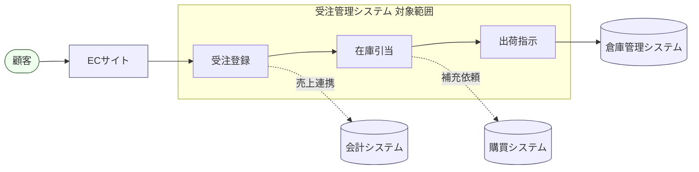

## 対象範囲

本システムの対象範囲は、受注登録・在庫引当・出荷指示の3業務とする。会計処理・
仕入（購買）・配送手配は他システムの担当とし、本システムはそれらとデータ連携のみを
行う。他システムとの関連を含めたシステムコンテキストを @fig-context に示す。

::: {#fig-context}

システムコンテキスト
:::

@fig-context のとおり、点線は他システムとのデータ連携、実線は本システム内の
処理の流れを表す。破線で示した会計・購買・倉庫の各システムは対象範囲外である。
