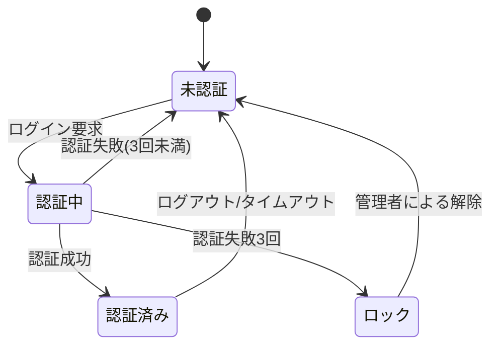

## ユーザ管理機能

利用者の登録・変更・削除を行う。管理するユーザ属性を @tbl-user-attrs に示す。

| 属性     | 型          | 必須 | 説明           |
|----------|-------------|------|----------------|
| ユーザID | 文字列(8)   | ○   | 一意な識別子   |
| 氏名     | 文字列(64)  | ○   | 表示名         |
| 所属     | コード(4)   | ○   | 部門コード     |
| メール   | 文字列(256) | —   | 通知先         |

: ユーザ属性一覧 {#tbl-user-attrs}

## ユーザ認証機能

ID/パスワードによる認証を行い、連続失敗でアカウントをロックする。
認証の状態遷移を @fig-auth-state に示す。

::: {#fig-auth-state}

認証状態遷移
:::
