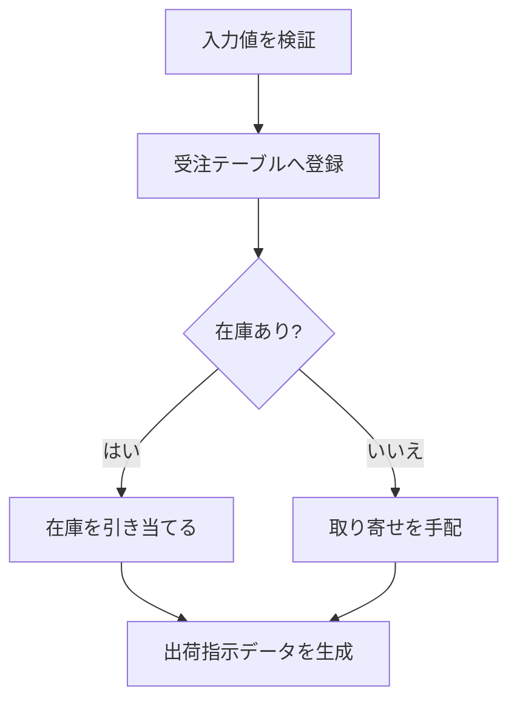

# IPO図（横向き定型ページ）

IPO図は `::: {.ipo}` 〜 `:::` で囲み、最初の見出しに「機能名 / 処理名」、
続けて `### 入力` `### 処理` `### 出力` を書く。各欄は通常の Markdown
（リスト・段落・mermaid）で自由に書ける。

::: {.ipo}
## 受注管理 / 受注処理

### 入力

- 受注入力画面
- 顧客マスタ
- 在庫マスタ

### 処理

### 出力

- 受注ID
- 引当結果
- 出荷指示書
:::
