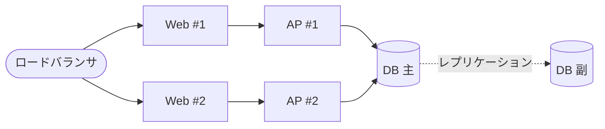

## ハードウェア環境

### ハードウェア構成

本システムを構成する各装置とその接続関係を @fig-hw に示す。Web／AP／DB の3層を
冗長化し、ロードバランサ配下に2台ずつ配置する。

::: {#fig-hw}

ハードウェア構成
:::

### ハードウェア仕様

各装置の仕様を @tbl-hw に示す。横幅が広いため横向きページに配置する。

::: {.landscape}
| 装置       | 型式          | 数量 | CPU        | メモリ | ストレージ   | 備考           |
|------------|---------------|:----:|------------|--------|--------------|----------------|
| ロードバランサ | LB-2000   | 2    | 8 コア     | 16 GB  | 240 GB SSD   | Active/Standby |
| Web サーバ | SV-R620       | 2    | 16 コア    | 32 GB  | 480 GB SSD   | —              |
| AP サーバ  | SV-R620       | 2    | 32 コア    | 64 GB  | 480 GB SSD   | —              |
| DB サーバ  | SV-R740       | 2    | 32 コア    | 128 GB | 2 TB SSD ×4  | 主/副 レプリカ |

: ハードウェア仕様 {#tbl-hw}
:::
