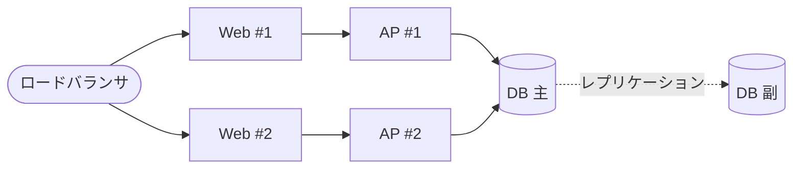

### ハードウェア構成

本システムを構成する各装置とその接続関係を @fig-hw に示す。Web／AP／DB の3層を
冗長化し、ロードバランサ配下に2台ずつ配置する。

::: {#fig-hw}

```mermaid
flowchart LR
  lb(["ロードバランサ"])
  web1["Web #1"]
  web2["Web #2"]
  ap1["AP #1"]
  ap2["AP #2"]
  db1[("DB 主")]
  db2[("DB 副")]
  lb --> web1 --> ap1 --> db1
  lb --> web2 --> ap2 --> db1
  db1 -. レプリケーション .-> db2
```

ハードウェア構成
:::
