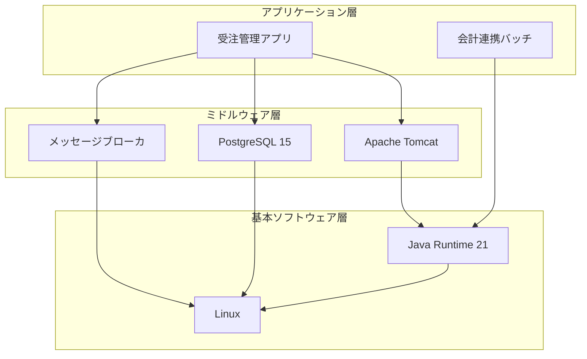

## ソフトウェア環境

### ソフトウェア構成

基本ソフトウェアからアプリケーションまでの階層を @fig-sw に示す。

::: {#fig-sw}

ソフトウェア構成
:::

### ソフトウェア仕様

使用する個々のソフトウェアを @tbl-sw に示す。

| ソフトウェア   | バージョン | 用途                     | 稼働条件           |
|----------------|------------|--------------------------|--------------------|
| Linux          | 9.x        | 基本ソフトウェア         | —                  |
| Java Runtime   | 21 (LTS)   | アプリ実行基盤           | —                  |
| Apache Tomcat  | 10.x       | Web アプリケーション基盤 | Java 21 以上       |
| PostgreSQL     | 15         | データベース             | —                  |
| メッセージブローカ | 3.x    | 倉庫システムとの連携     | 永続化キュー有効化 |

: ソフトウェア仕様 {#tbl-sw}

### ソフトウェア設定パラメータ

市販ソフトウェアで設定が必要な主なパラメータを @tbl-swparam に示す。

| ソフトウェア | パラメータ         | 設定値 |
|--------------|--------------------|--------|
| Tomcat       | maxThreads         | 200    |
| Tomcat       | connectionTimeout  | 20000  |
| PostgreSQL   | max_connections    | 200    |
| PostgreSQL   | shared_buffers     | 32 GB  |

: ソフトウェア設定パラメータ {#tbl-swparam}
