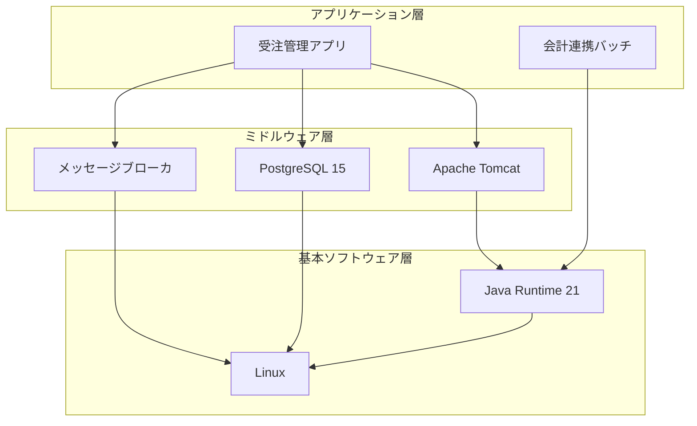

### ソフトウェア構成

基本ソフトウェアからアプリケーションまでの階層を @fig-sw に示す。

::: {#fig-sw}

```mermaid
flowchart TD
  subgraph app[アプリケーション層]
    oms[受注管理アプリ]
    batch[会計連携バッチ]
  end
  subgraph mw[ミドルウェア層]
    tomcat[Apache Tomcat]
    pg[PostgreSQL 15]
    mq[メッセージブローカ]
  end
  subgraph os[基本ソフトウェア層]
    linux[Linux]
    jre[Java Runtime 21]
  end
  oms --> tomcat --> jre --> linux
  batch --> jre
  oms --> pg
  oms --> mq
  pg --> linux
  mq --> linux
```

ソフトウェア構成
:::
