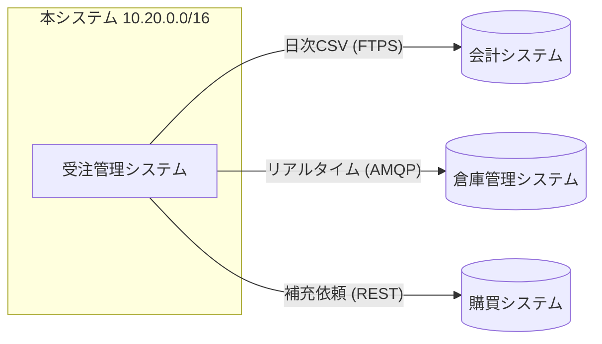

## ネットワーク環境

### ネットワーク体系

本システムが使用するネットワークセグメントと固定的に割り当てる代表 IP を
@tbl-net に示す（実 IP は運用時に採番するため、ここでは体系を示す）。

| セグメント | 用途             | アドレス体系      |
|------------|------------------|-------------------|
| DMZ        | ロードバランサ   | 203.0.113.0/28    |
| Web/AP     | 業務サーバ       | 10.20.10.0/24     |
| DB         | データベース     | 10.20.20.0/24     |
| 連携       | 他システム連携   | 10.20.30.0/24     |

: ネットワーク体系 {#tbl-net}

### 他システムとの接続

他システムとの接続状況を @fig-net に示し、接続ごとの方式を @tbl-conn に整理する。

::: {#fig-net}

他システムとの接続
:::

| 接続先         | 方式             | プロトコル | 周期         |
|----------------|------------------|------------|--------------|
| 会計システム   | ファイル連携     | FTPS       | 日次バッチ   |
| 倉庫管理システム | メッセージ連携 | AMQP       | リアルタイム |
| 購買システム   | API 連携         | REST/HTTPS | 都度         |

: 他システムとの接続 {#tbl-conn}
