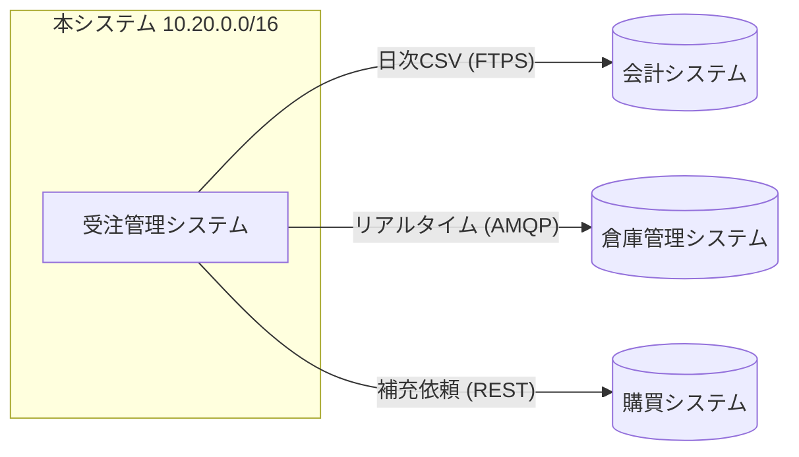

### 他システムとの接続

他システムとの接続状況を @fig-net に示し、接続ごとの方式を @tbl-conn に整理する。

::: {#fig-net}

他システムとの接続
:::

| 接続先         | 方式             | プロトコル | 周期         |
|----------------|------------------|------------|--------------|
| 会計システム   | ファイル連携     | FTPS       | 日次バッチ   |
| 倉庫管理システム | メッセージ連携 | AMQP       | リアルタイム |
| 購買システム   | API 連携         | REST/HTTPS | 都度         |

: 他システムとの接続 {#tbl-conn}
