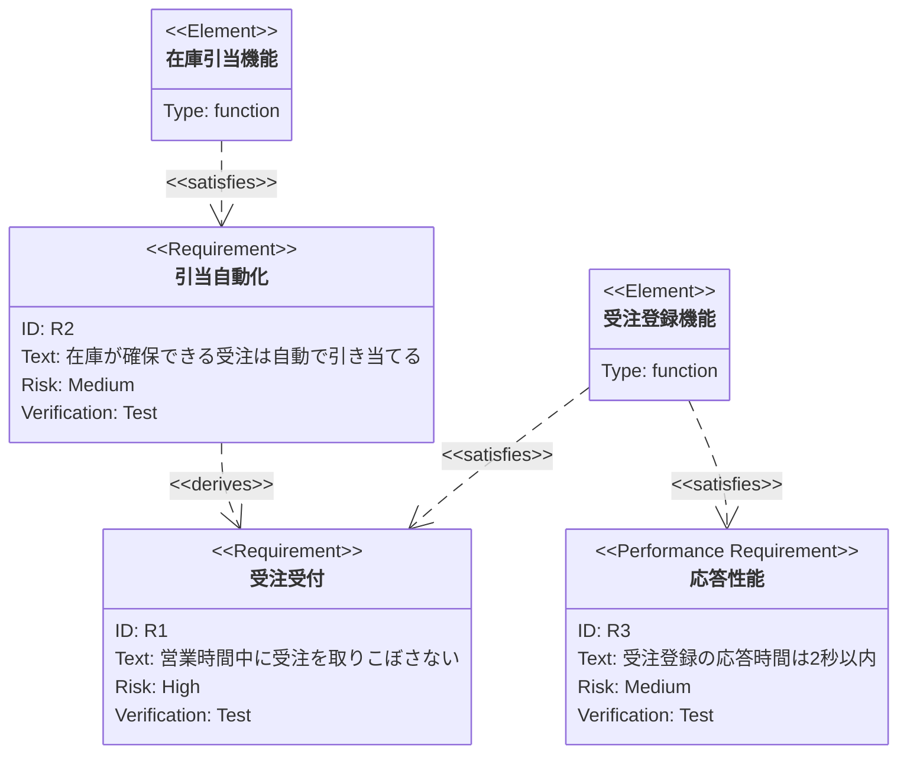

# プログラムに対する要求分析

プログラムに対する要求事項を分析し、機能・性能・環境・セキュリティ等の観点で整理する。
要求とその充足関係を @fig-req に示し、要求一覧を @tbl-req にまとめる。

::: {#fig-req}

要求と機能の充足関係
:::

要求事項の一覧を観点ごとに @tbl-req に示す。観点が縦に続くため rowspan で示す。

::: {.merge-rows}
| 観点         | 要求ID | 要求事項                                   | 対応機能/章 |
|--------------|--------|--------------------------------------------|-------------|
| 機能         | R1     | 営業時間中に受注を取りこぼさない           | 6.4.1       |
| 機能         | R2     | 在庫が確保できる受注は自動で引き当てる     | 6.4.2       |
| 性能         | R3     | 受注登録の応答時間は2秒以内                | 第7章       |
| 性能         | R4     | ピーク時 100 件/分を処理できる             | 第7章       |
| セキュリティ | R5     | 認証は社内 SSO を利用する                  | 6.4.1       |
| 運用・保守   | R6     | 主系障害時に副系へ自動切替する             | 第12章      |
| 運用・保守   | R7     | 日次で会計システムへ売上を連携する         | 第8章       |

: 要求事項一覧 {#tbl-req}
:::
