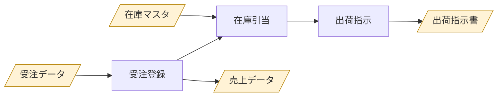

## 機能概要

本システム全体の機能を、入出力と関連づけて @fig-func-overview に示す。顧客の受注が
入力され、在庫引当を経て出荷指示・売上連携が出力される。

::: {#fig-func-overview}

```mermaid
flowchart LR
  in1[/受注データ/]:::io
  in2[/在庫マスタ/]:::io
  f1[受注登録]
  f2[在庫引当]
  f3[出荷指示]
  out1[/出荷指示書/]:::io
  out2[/売上データ/]:::io
  in1 --> f1 --> f2 --> f3 --> out1
  in2 --> f2
  f1 --> out2
  classDef io fill:#fff3d6,stroke:#b8860b
```

機能概要（全体データフロー）
:::
