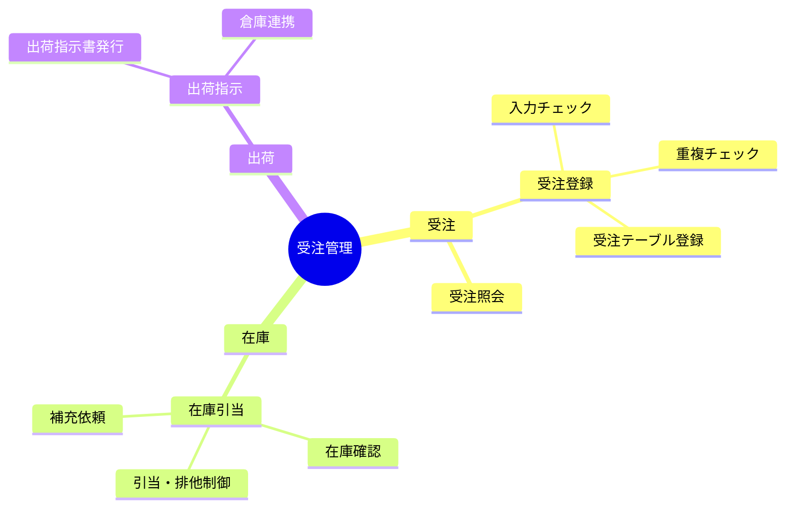

## 機能構成

本システムの機能を機能ブロックに分割し、その階層を @tbl-func-hierarchy に示す。
大分類（業務）→中分類（機能ブロック）→小分類（細部機能）の3階層であり、縦に続く
分類はセル結合（rowspan）で表す。同じ階層を図で表したものが @fig-func-tree である。

::: {.tbl caption="機能階層" label="tbl-func-hierarchy" merge-cols="all"}
| 大分類 | 中分類     | 小分類           | 要否 |
|--------|------------|------------------|:----:|
| 受注   | 受注登録   | 入力チェック     | ○   |
| 受注   | 受注登録   | 重複チェック     | ○   |
| 受注   | 受注登録   | 受注テーブル登録 | ○   |
| 受注   | 受注照会   | 受注検索         | ○   |
| 在庫   | 在庫引当   | 在庫確認         | ○   |
| 在庫   | 在庫引当   | 引当・排他制御   | ○   |
| 在庫   | 在庫引当   | 補充依頼         | △   |
| 出荷   | 出荷指示   | 出荷指示書発行   | ○   |
| 出荷   | 出荷指示   | 倉庫連携         | ○   |
:::

::: {#fig-func-tree}

機能構成（機能階層図）
:::
