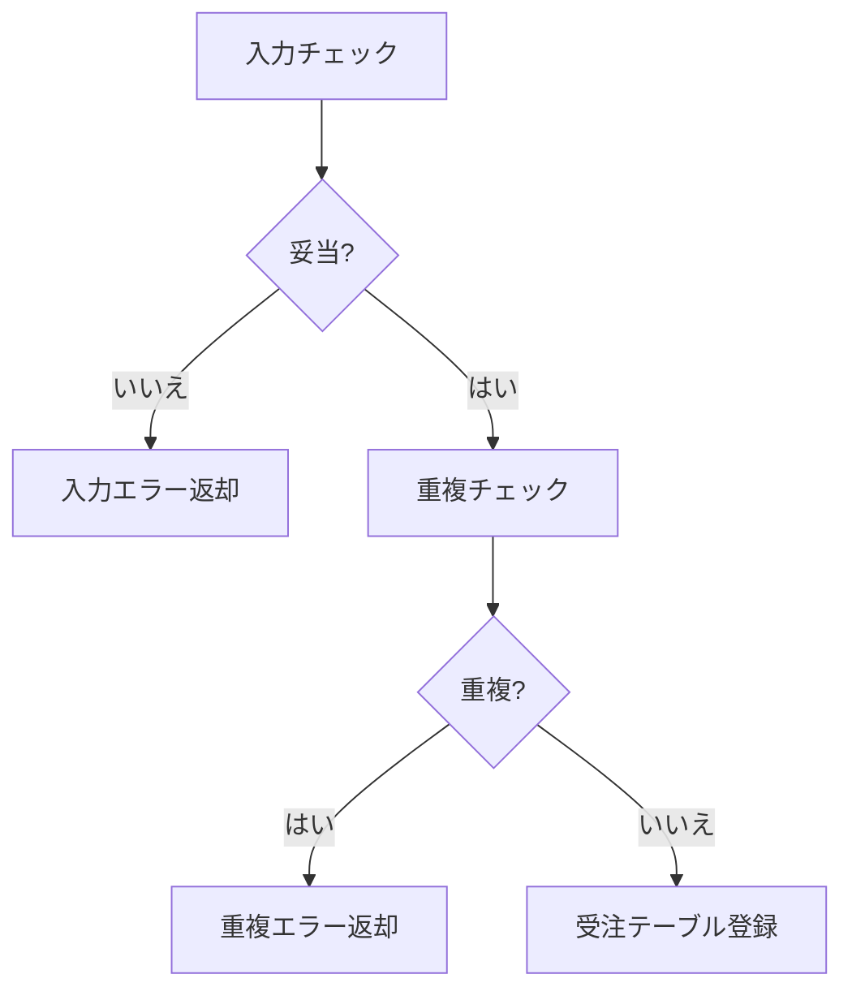
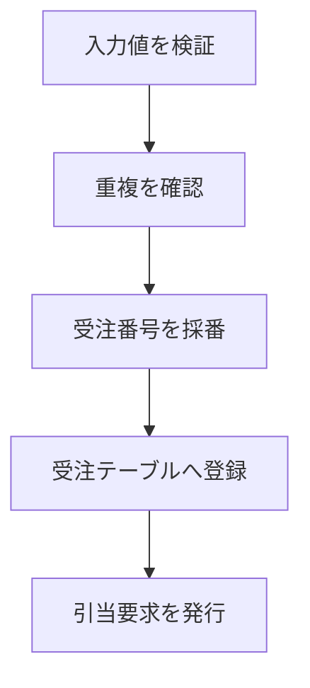
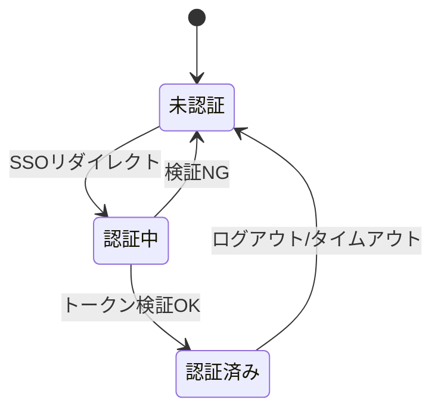

### 受注登録機能

顧客からの受注を受け付け、検証のうえ受注テーブルへ登録する機能ブロックである。

#### 機能の構成

受注登録機能を構成する細部機能を @tbl-order-parts に示す。

| 細部機能         | 概要                                     |
|------------------|------------------------------------------|
| 入力チェック     | 必須項目・書式・数量の妥当性を検証する   |
| 重複チェック     | 同一顧客・同一商品の二重受注を検出する   |
| 受注テーブル登録 | 検証済みの受注を受注テーブルへ登録する   |

: 受注登録機能の構成 {#tbl-order-parts}

#### 細部機能間の関係

細部機能間の処理順序を @fig-order-flow に示す。

::: {#fig-order-flow}

受注登録の細部機能間の関係
:::

#### 各細部機能の説明

受注登録の入力・処理・出力を @tbl-order-ipo に示す。認証は社内 SSO を
利用し、その状態遷移を @fig-order-auth に示す。

::: {.ipo module="受注登録" caption="受注登録処理" label="tbl-order-ipo"}
## 受注登録

### 入力

- 受注入力画面（顧客ID・商品コード・数量）
- 顧客マスタ
- 商品マスタ

### 処理

### 出力

- 受注ID
- 受注確定通知
- 引当要求メッセージ
:::

::: {#fig-order-auth}

受注登録の認証状態遷移
:::

#### エラー処理

受注登録で発生するエラーとメッセージ・回復手順を @tbl-order-err に示す。

| エラーコード | メッセージ                   | 回復手順                     |
|--------------|------------------------------|------------------------------|
| E-ORD-001    | 必須項目が未入力です         | 該当項目を入力し再送信       |
| E-ORD-002    | 数量は1以上を指定してください | 数量を修正し再送信           |
| E-ORD-003    | 同一受注が既に存在します     | 受注照会で既存受注を確認     |

: 受注登録のエラー一覧 {#tbl-order-err}

#### 入出力データ・例外条件

- **入出力データ**: 詳細は第8章（入出力データ仕様）の受注データを参照。
- **例外条件**: 顧客マスタに存在しない顧客IDは受け付けない。
- **制約条件**: 1受注あたりの明細は最大 100 行とする（画面・帳票の都合）。
