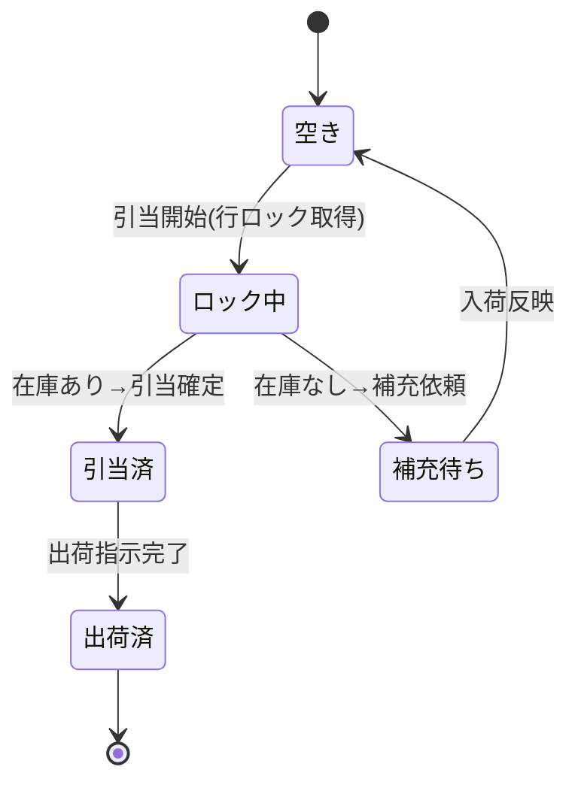
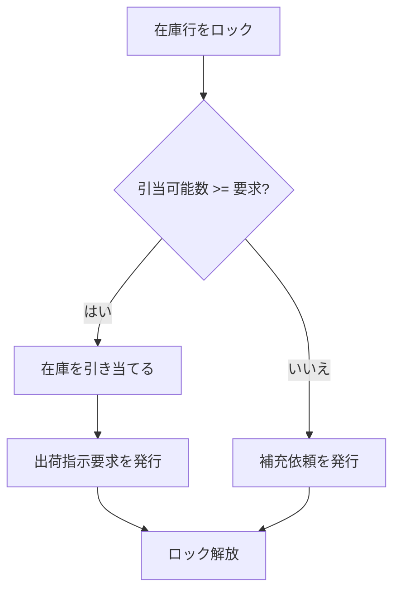

### 在庫引当機能

受注に対して在庫を確保し、出荷可能な状態にする機能ブロックである。同一商品への
同時引当を直列化する排他制御を持つ。

#### 機能の構成

在庫引当機能を構成する細部機能を @tbl-alloc-parts に示す。

| 細部機能       | 概要                                       |
|----------------|--------------------------------------------|
| 在庫確認       | 対象商品の引当可能数を確認する             |
| 引当・排他制御 | 在庫を引き当て、同時実行を直列化する       |
| 補充依頼       | 在庫不足時に購買システムへ補充を依頼する   |

: 在庫引当機能の構成 {#tbl-alloc-parts}

#### 細部機能間の関係

引当対象在庫の状態遷移を @fig-alloc-state に示す。排他制御により、確認から確定まで
在庫行はロックされる。

::: {#fig-alloc-state}

引当在庫の状態遷移
:::

#### 各細部機能の説明

在庫引当の入力・処理・出力を次の IPO 図に示す。

::: {.ipo module="在庫引当" caption="在庫引当処理"}
## 在庫引当

### 入力

- 引当要求（受注ID・商品コード・数量）
- 在庫マスタ

### 処理

### 出力

- 引当結果（成功/一部/不可）
- 出荷指示要求 または 補充依頼
:::

#### エラー処理

| エラーコード | メッセージ                 | 回復手順                       |
|--------------|----------------------------|--------------------------------|
| E-ALC-001    | 在庫ロックの取得に失敗     | 一定時間後に自動リトライ       |
| E-ALC-002    | 在庫がマイナスになりました | 棚卸を実施し在庫を補正         |

: 在庫引当のエラー一覧 {#tbl-alloc-err}

#### 入出力データ・例外条件

- **例外条件**: 一部引当（要求数量に満たない引当）は担当者へエスカレーションする。
- **制約条件**: 在庫行ロックの最大保持時間は 5 秒とし、超過時は引当を中断する。
