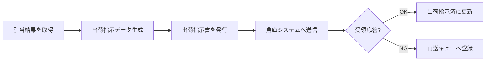
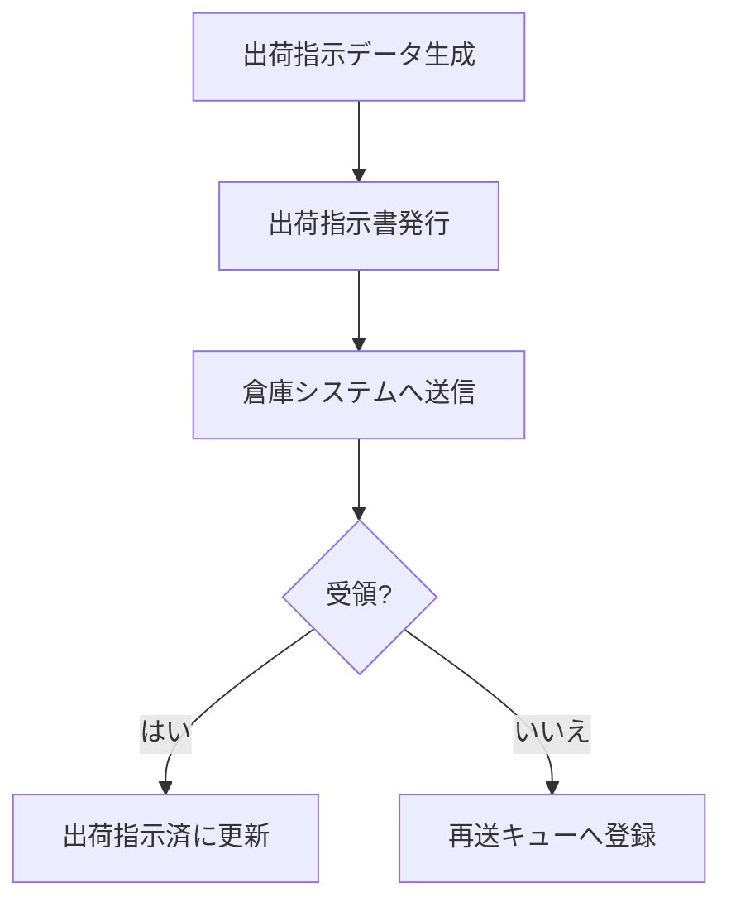

### 出荷指示機能

引当済みの受注に対して出荷指示書を発行し、倉庫管理システムへ連携する機能ブロックである。

#### 機能の構成

出荷指示機能を構成する細部機能を @tbl-ship-parts に示す。

| 細部機能       | 概要                                     |
|----------------|------------------------------------------|
| 出荷指示書発行 | 引当結果から出荷指示データを生成する     |
| 倉庫連携       | 出荷指示を倉庫システムへ送信する         |

: 出荷指示機能の構成 {#tbl-ship-parts}

#### 細部機能間の関係

出荷指示の生成から倉庫連携までの流れを @fig-ship-flow に示す。

::: {#fig-ship-flow}

出荷指示の細部機能間の関係
:::

#### 各細部機能の説明

出荷指示の入力・処理・出力を次の IPO 図に示す。

::: {.ipo module="出荷指示" caption="出荷指示処理"}
## 出荷指示

### 入力

- 引当結果（受注ID・引当明細）
- 出荷先マスタ

### 処理

### 出力

- 出荷指示書
- 倉庫連携メッセージ
- 出荷ステータス更新
:::

#### エラー処理

| エラーコード | メッセージ                     | 回復手順                   |
|--------------|--------------------------------|----------------------------|
| E-SHP-001    | 倉庫システムへの送信に失敗     | 再送キューから自動リトライ |
| E-SHP-002    | 出荷先マスタが見つかりません   | 出荷先マスタを登録し再実行 |

: 出荷指示のエラー一覧 {#tbl-ship-err}

#### 入出力データ・例外条件

- **入出力データ**: 出荷指示書のレイアウトは第8章（入出力データ仕様）を参照。
- **例外条件**: 倉庫システムが応答しない場合、最大 3 回まで再送する。
- **制約条件**: 出荷指示は 1 受注につき 1 通のみ発行する。
