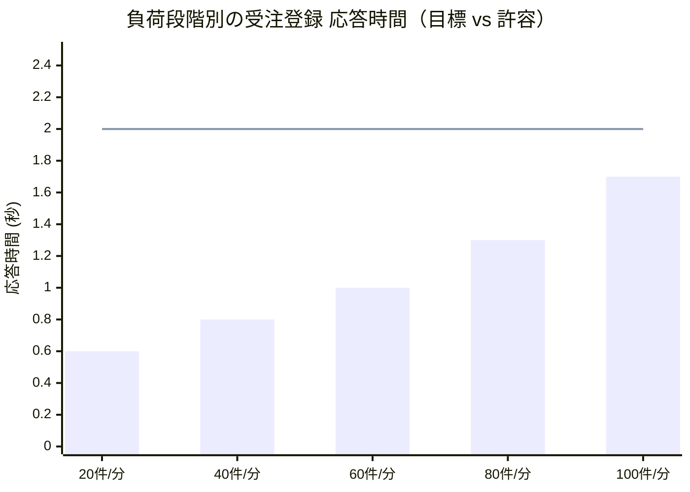

## 性能目標値・許容範囲

主要処理の性能目標を @tbl-perf に示す。負荷段階ごとの応答時間の想定を @fig-perf に示す。

| 処理       | 指標         | 目標値       | 許容範囲       |
|------------|--------------|--------------|----------------|
| 受注登録   | 応答時間     | 1.0 秒       | 2.0 秒以内     |
| 在庫引当   | 応答時間     | 0.5 秒       | 1.0 秒以内     |
| 受注処理   | スループット | 100 件/分    | 80 件/分以上   |
| 会計連携   | バッチ時間   | 10 分        | 30 分以内      |

: 性能目標値・許容範囲 {#tbl-perf}

::: {#fig-perf}

負荷段階別の応答時間（棒＝目標、線＝許容上限）
:::
