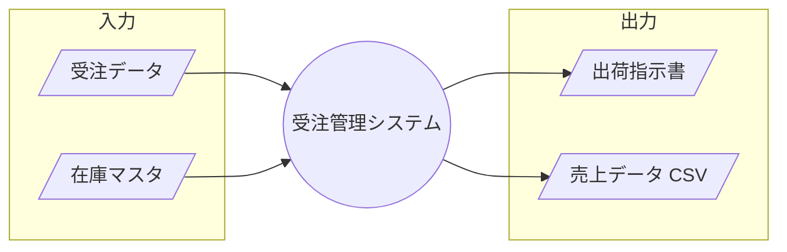

## 概要

### 全体構成

入力データ・出力データの全体構成を @fig-io に示す。

::: {#fig-io}

入出力データ全体構成
:::

### 入出力データの概要説明

個々の入出力データの概要を @tbl-io-list に示す。

| データ名     | 区分   | 媒体       | 説明                             |
|--------------|--------|------------|----------------------------------|
| 受注データ   | 入力   | 画面/API   | 顧客からの受注1件分のデータ      |
| 在庫マスタ   | 入力   | データベース | 商品ごとの在庫数                |
| 出荷指示書   | 出力   | 帳票/PDF   | 倉庫向けの出荷指示               |
| 売上データ   | 出力   | CSVファイル | 会計システムへ日次連携する売上  |

: 入出力データ一覧 {#tbl-io-list}
