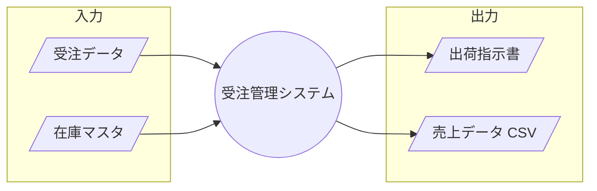

### 全体構成

入力データ・出力データの全体構成を @fig-io に示す。

::: {#fig-io}

```mermaid
flowchart LR
  subgraph 入力
    d1[/受注データ/]
    d2[/在庫マスタ/]
  end
  p((受注管理システム))
  subgraph 出力
    d3[/出荷指示書/]
    d4[/売上データ CSV/]
  end
  d1 --> p
  d2 --> p
  p --> d3
  p --> d4
```

入出力データ全体構成
:::
