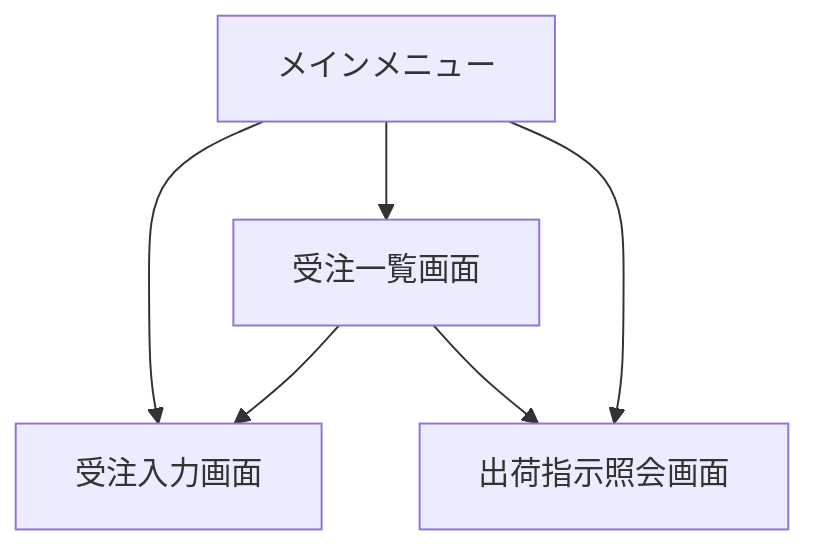
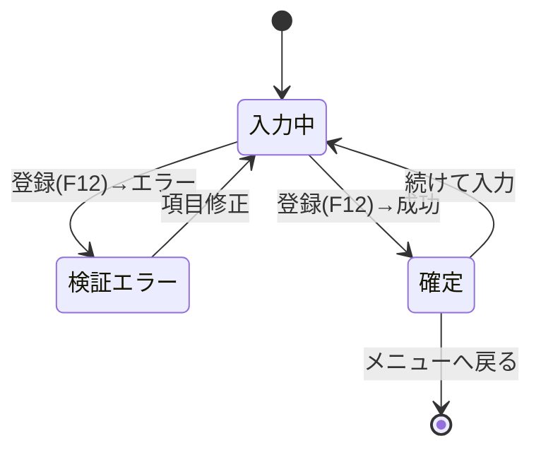

## 画面フロー

表示画面間の移動を、操作フローごとに記述する。メニューを起点とする画面遷移を示す。

### メニュー起点の画面遷移

メニューからの画面遷移を、木構造で @fig-screen-menu に示す。

::: {#fig-screen-menu}

メニュー画面遷移
:::

### 受注登録フロー

受注入力から確定までの画面状態の遷移を @fig-screen-order-state に示す。

::: {#fig-screen-order-state}

受注登録フローの画面状態遷移
:::
