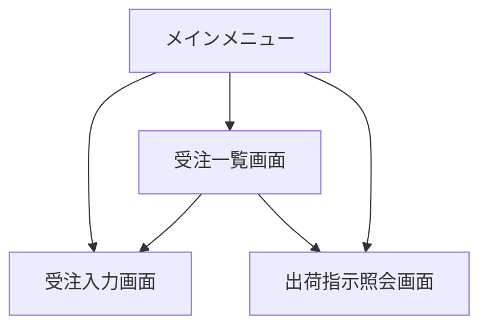

### メニュー起点の画面遷移

メニューからの画面遷移を、木構造で @fig-screen-menu に示す。

::: {#fig-screen-menu}

```mermaid
flowchart TD
  M[メインメニュー] --> A[受注入力画面]
  M --> B[受注一覧画面]
  M --> C[出荷指示照会画面]
  B --> A
  B --> C
```

メニュー画面遷移
:::
