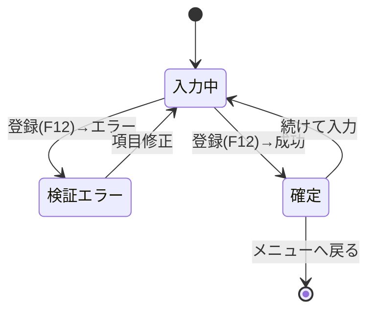

### 受注登録フロー

受注入力から確定までの画面状態の遷移を @fig-screen-order-state に示す。

::: {#fig-screen-order-state}

```mermaid
stateDiagram-v2
  [*] --> 入力中
  入力中 --> 検証エラー : 登録(F12)→エラー
  検証エラー --> 入力中 : 項目修正
  入力中 --> 確定 : 登録(F12)→成功
  確定 --> 入力中 : 続けて入力
  確定 --> [*] : メニューへ戻る
```

受注登録フローの画面状態遷移
:::
