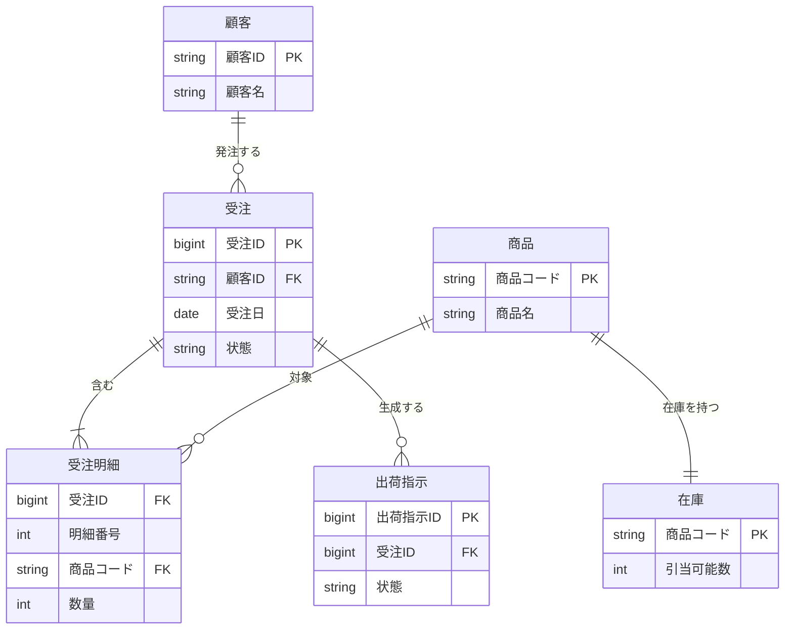

## レコード一覧

受注DB を構成する主なテーブル（レコード）とその関連を @fig-er に示し、一覧を
@tbl-record-list にまとめる。

::: {#fig-er}

受注DB のER図
:::

| レコード名 | 用途                 | キー項目           |
|------------|----------------------|--------------------|
| 顧客       | 顧客の基本情報       | 顧客ID             |
| 受注       | 受注ヘッダ           | 受注ID             |
| 受注明細   | 受注の商品明細       | 受注ID＋明細番号   |
| 商品       | 商品マスタ           | 商品コード         |
| 在庫       | 商品ごとの在庫数     | 商品コード         |
| 出荷指示   | 出荷指示             | 出荷指示ID         |

: レコード一覧 {#tbl-record-list}
