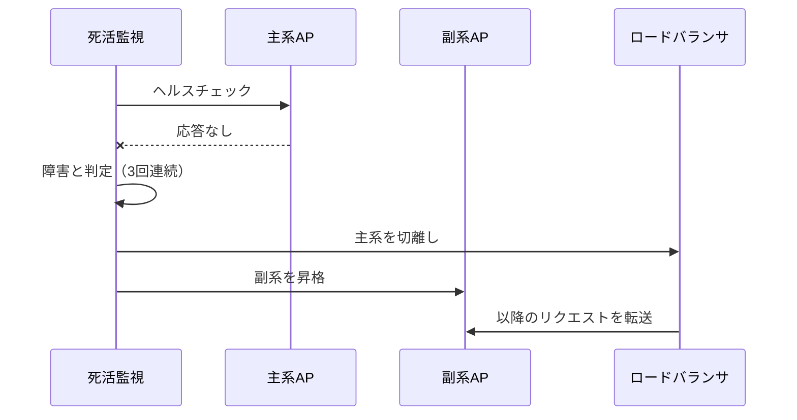

## 機能

主系サーバの障害時に副系へ自動切替する。切替の流れを @fig-failover に示す。

::: {#fig-failover}

主系→副系のフェイルオーバ
:::

リスタート処理では、処理中だった受注は「受付」状態のまま残し、二重引当を防ぐため
未完了の引当をロールバックする。

主系AP障害時の復旧手順を次に示す（番号付きリストの採番は入れ子の深さで
`(1)→①→(ア)` と自動で切り替わる）。

1. 障害を検知する。
   1. 死活監視が 3 回連続で応答なしを検出する。
   2. 主系を障害と判定する。
2. 副系へ切り替える。
   1. ロードバランサから主系を切り離す。
   2. 副系 AP を昇格する。
      1. 未完了の引当をロールバックする。
      2. 受注受付を再開する。
3. 主系を復旧し、正常確認後にクラスタへ再組込する。
