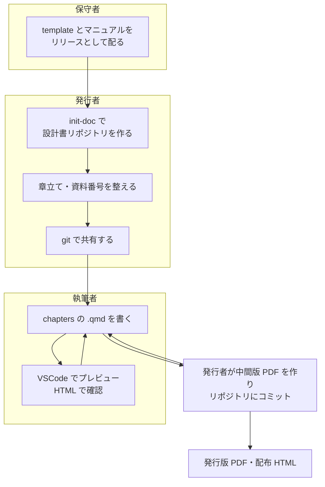

## 作業の全体の流れ

設計書リポジトリができてから成果物までの流れを @fig-flow に示す。

::: {#fig-flow}

原稿から成果物までの流れ
:::

各段階で参照する章を次に示す。

| 段階 | 作業 | 参照する章 |
|------|------|------------|
| 準備 | Quarto の導入 | 2章 |
| 準備 | 設計書リポジトリの作成（発行者） | 2章 |
| 準備 | 役割ごとの追加設定 | 3章（執筆者）／11章（発行者） |
| 執筆 | 文書の設定・章立て | 4章 |
| 執筆 | 本文を書く | 6章〜10章 |
| 確認 | プレビュー・中間版での確認 | 5章 |
| 出力 | PDF・HTML の生成と配布 | 12章 |

### 中間版を挟む理由

執筆者が見るのは HTML であり、紙の様式（外枠・資料番号欄・ページ番号）や改ページ、
横向きページ、表の分割は再現されない。これらは**発行者が体裁を整える範囲**である。

そこで、原稿がある程度まとまった段階で発行者が PDF を作り、
`<執筆フォルダ>/design-doc.pdf` としてリポジトリにコミットする。これを「中間版」と呼ぶ。
執筆者は中間版で紙面を確認し、必要なら発行者に整形を依頼する。

::: {.callout-tip}
中間版は定期的に（節目ごと・週次など）作るとよい。発行直前に初めて PDF を出すと、
表がページ幅を超える・図が大きすぎるといった手戻りがまとめて発生する。
:::

### 執筆と出力を分けて考える

原稿（`.qmd`）は**プレーンテキスト**である。したがって次のことが言える。

- 差分が読めるので、バージョン管理（Git）と相性がよい。
- 出力形式（PDF / HTML）を後から選べる。原稿は1つで済む。
- 出力に必要な環境が揃っていなくても、**執筆は進められる**。

この性質があるため、執筆者と発行者の分担が成り立つ。原稿を書く端末に
発行用の重い環境を入れる必要はない。
