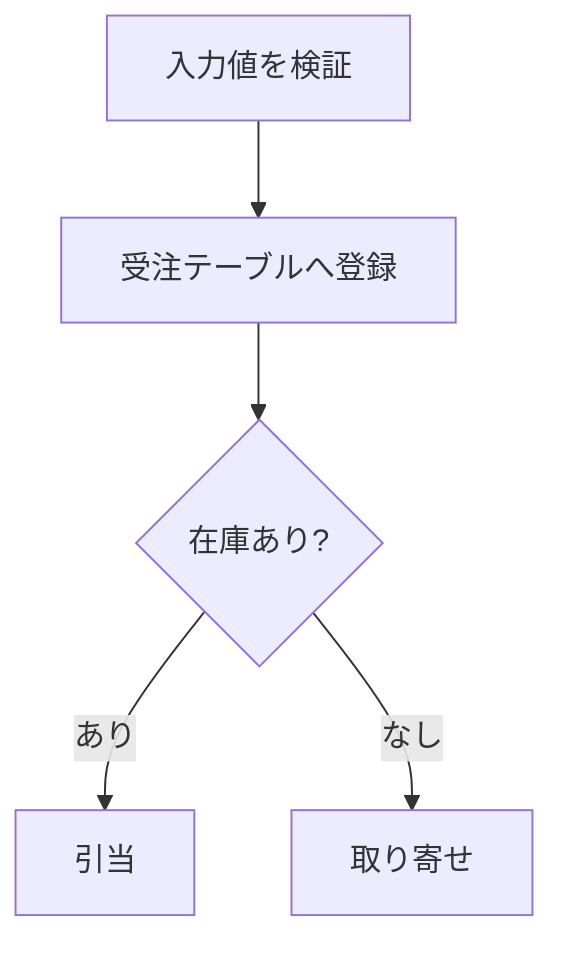
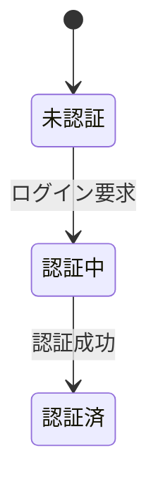

## mermaid 図（文字で書く図）

フローチャート・状態遷移図・シーケンス図などは、**文字で書くとそのまま図版になる**。
作図ツールを使わずに済み、原稿の差分としてレビューできる利点がある。

### 書き方

` ```mermaid ` のコードフェンスに図を書く。

````markdown

````

### 番号とキャプションを付ける

図として**番号を付けて参照**したいときは、`::: {#fig-id}` で囲む。
`:::` の直前の行がキャプションになる。

````markdown
::: {#fig-auth-state}



認証状態遷移
:::
````

これで「図 3.2-1　認証状態遷移」のように採番され、本文から `@fig-auth-state` で
参照できる。

### 主な図の種類

| 記法 | 図の種類 |
|------|----------|
| `flowchart TD` | フローチャート（上から下） |
| `flowchart LR` | フローチャート（左から右） |
| `stateDiagram-v2` | 状態遷移図 |
| `sequenceDiagram` | シーケンス図 |
| `erDiagram` | ER 図 |
| `gantt` | ガントチャート |

記法の詳細は mermaid の公式ドキュメント（<https://mermaid.js.org/>）を参照すること。

### 執筆時に追加の準備は要らない

::: {.callout-note}
執筆者のプレビューでは、Quarto 同梱の機能がブラウザ内で mermaid を描画する。
**node も Chrome / Edge も要らず**、図を編集すれば即座に反映される。
:::

::: {.callout-warning}
**納品 PDF・配布 HTML を作るときだけ**、mermaid をベクター SVG に焼き込む処理が走り、
node と Chrome / Edge が必要になる。この処理は発行者の環境で行う（11章）。

執筆者の端末で PDF を出そうとして mermaid のところで失敗する場合、原稿の誤りではなく
環境の不足である。
:::

### プレビューと最終成果物で見た目が違う

プレビューの図は Quarto 標準テーマで描かれるため、最終成果物とは見た目が少し異なる。
内容の確認には十分だが、**体裁の最終確認は PDF で行うこと**（@sec-preview-diff）。

### 静的な図として持ちたいとき

`diagrams/*.mmd` に mermaid のソースを置き、あらかじめ SVG に変換しておくこともできる。

```bash
./template/render-diagrams.sh docs
```

生成された SVG は通常の画像として `` で貼る。
図を頻繁に描き直さない場合や、図だけを別途レビューしたい場合に使う。

::: {.callout-note}
`render-diagrams` は `.sh` だけで、`.bat` 版はない。Windows では Git Bash などの
bash 環境から実行する。この操作は mermaid の SVG 化を行うため、発行者の環境
（node と Chrome / Edge）が要る。
:::
