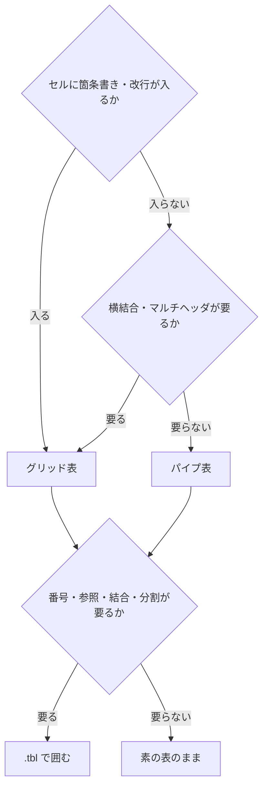

## 表の書き方の選び方 {#sec-tbl-choice}

表を書き始める前に、次の2つを決める。

1. **囲むか囲まないか** … 番号・参照・結合・分割が要るなら `::: {.tbl …}` で囲む。
2. **パイプ表かグリッド表か** … セルに何を書くかで決まる。

### 囲むかどうか

| 必要なもの | 書き方 |
|------------|--------|
| 番号もキャプションも要らない | 素のパイプ表をそのまま書く |
| キャプション・番号が要る | `::: {.tbl caption="…"}` で囲む |
| 本文から参照したい | `label="tbl-x"` を足す |
| セル結合・分割・列幅指定が要る | 対応する属性を足す |

迷ったら `.tbl` で囲んでおけばよい。あとから属性を足すだけで機能を追加でき、
**表そのものを書き直す必要がない**。

### パイプ表かグリッド表か

::: {.tbl caption="パイプ表とグリッド表の比較" label="tbl-pipe-vs-grid" widths="24,38,38"}
| 項目                   | パイプ表（`\| … \|`）      | グリッド表（`+---+`）                    |
|------------------------|----------------------------|------------------------------------------|
| セルの中身             | 1行ぶんの文章だけ          | 段落・箇条書き・番号付きリスト・複数ブロック |
| セル内の改行           | ` ` のみ                | 行末 `\` ／ ` `                       |
| 横結合・マルチヘッダ   | 不可                       | 可（手で指定）                           |
| `merge-cols`（自動結合）| 可                        | 可（手で結合を書いていない表なら）        |
| 書く手間               | 軽い                       | 罫線を桁で揃える必要がある               |
:::

::: {.callout-important}
**セルの中身が1行で収まらない表（改行・箇条書き・番号付きリストがある）は、
はじめからグリッド表で書くこと。** パイプ表は「1セル1行」で収まる表に限る。

こうしておくと、あとから箇条書きを足したくなったときに**表ごと書き直さずに済む**
（パイプ表のセルにはリストを入れられないため、その時点で作り直しになる）。
:::

判断は**セル単位ではなく表単位**である。1つの表の中でパイプ表とグリッド表は
混ぜられない。

### 補足

- 既存の ` ` 入りパイプ表は**そのまま動く**。遡って直す必要はない。これは推奨で
  あって ` ` の禁止ではなく、パイプ表に後から1か所だけ改行が要りになったときの
  逃げ道としては引き続き有効である。
- 逆に、**1セル1行で収まる表までグリッド表にする必要はない**。罫線を揃える手間に
  見合わない。

### 選び方のまとめ

::: {#fig-tbl-choice}

表の書き方の選び方
:::

