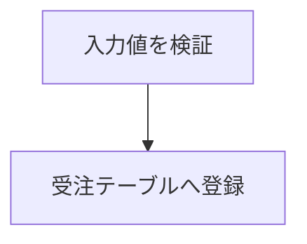

## IPO 図

入力・処理・出力を1枚にまとめる IPO 図は、`::: {.ipo}` 〜 `:::` で囲む。
自動的に**横向きの定型ページ**（機能名／処理名の欄 ＋ 入力／処理／出力の3列）になる。

### 書き方

````markdown
::: {.ipo module="受注管理" caption="受注処理の流れ" label="tbl-order-ipo"}
## 受注処理

### 入力

- 受注入力画面
- 顧客マスタ

### 処理



### 出力

- 受注ID
- 出荷指示書
:::
````

実際に出力されるページは、@tbl-order-ipo のようになる。

::: {.ipo module="受注管理" caption="受注処理の流れ" label="tbl-order-ipo"}
## 受注処理

### 入力

- 受注入力画面
- 顧客マスタ

### 処理


### 出力

- 受注ID
- 出荷指示書
:::

### 各部分の指定

::: {.tbl caption="IPO 図の指定項目" label="tbl-ipo-attr" widths="22,20,58"}
| 項目               | 指定方法              | 備考                                     |
|--------------------|-----------------------|------------------------------------------|
| 機能名             | `module=` 属性        | 必須                                     |
| 処理名             | 最初の見出し（`##`）  | 必須                                     |
| 表番号のタイトル   | `caption=` 属性       | 省略可                                   |
| 相互参照の ID      | `label="tbl-x"` 属性  | 省略可・`tbl-` 始まり必須                |
| 入力・処理・出力欄 | `### 入力/処理/出力`  | 通常の Markdown を自由に書ける           |
:::

機能名・処理名・タイトルを別々に指定するため、**名称に `/` を含めても問題ない**。

`label=` は `#` を付けても自動で取り除かれるので、`label="#tbl-x"` と書いても通る。

### 採番と参照

IPO 図の上部には「表 章.節-連番」が自動で入る。**表として採番される**ため、
本文中の表や `.tbl` と**同じ連番列**に載る（PDF・HTML とも同じ番号）。

`label="tbl-x"` を付けると、本文で `@tbl-x` と書いて参照できる。

```markdown
受注処理の内容を @tbl-order-ipo に示す。
```

出力では「表 3.2-1 に示す。」のように解決される。別ファイルからの参照も解決される。

### 書き方の注意

- 入力・処理・出力欄は**通常の Markdown** である。箇条書き・段落・mermaid を自由に書ける。
- 入力・出力欄は幅が可変なので、ネストした箇条書きも収まる。
- 箇条書きは余白を詰めて左寄せし欄を広く使うが、記号（`-` の「•」）は残る
  （折り返しても項目を見分けられるよう、続き行は記号ぶんぶら下げる）。
- 機能に複数の処理があるときは、**同じ `module=` で処理ごとに IPO を並べる**。

::: {.callout-note}
`### 入力` `### 処理` `### 出力` の見出しは、IPO 図の欄を表す固定の名前である。
この3つ以外の見出しを書いてはならない。
:::

