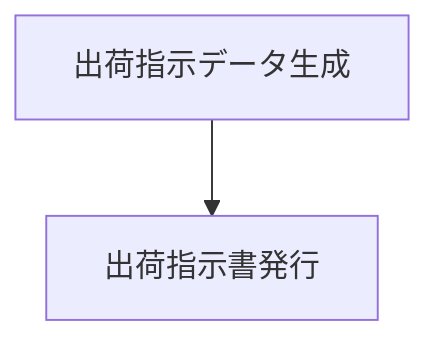
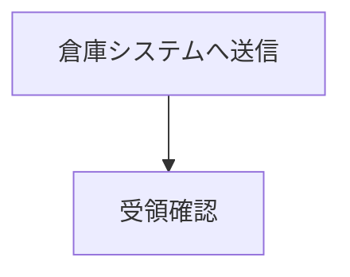

## IPO 図をパートに分割する

処理が複数のまとまりに分かれるときは、**`### 入力` `### 処理` `### 出力` のセットを
繰り返す**。各セットが1パート（＝横向き1ページ）になる。

**表番号は全パート共通**で、キャプションの後ろに「（1／2）（2／2）…」が付く
（表の分割 `.tbl` と同じ体裁である）。

### 書き方

````markdown
::: {.ipo module="出荷指示" caption="出荷指示処理" label="tbl-ship-ipo"}
## 出荷指示

### 入力
- 引当結果
### 処理

### 出力
- 出荷指示書

### 入力
- 出荷指示データ
### 処理

### 出力
- 倉庫連携メッセージ
:::
````

- **分割総数はセットの数**で決まる（並べた数だけ「／N」に反映される）。
- 番号は本文中の表と**同じ連番列**に載る（分割 IPO 1つで番号を1つ消費する）。
- `@tbl-x` は**分割全体を指す1つの番号**に解決される。

### パートごとにファイルを分ける

パートが長くなるときは、ファイルを分けてもよい。囲み `::: {.ipo …}` 〜 `:::` は
親ファイルに置き、各パートの `### 入力/処理/出力` を別ファイルに切り出す。

```markdown
::: {.ipo module="出荷指示" caption="出荷指示処理" label="tbl-ship-ipo"}
## 出荷指示

{}

{}
:::
```

- `{}` のパスは**章ルートからの相対**で書く（@sec-include）。
- パート断片は単体でレンダリングされないよう、**ファイル名を `_` で始める**。

実例はサンプルの `docs/chapters/06-functions/04-details/03-ship.qmd` と
`_ship-ipo-1.qmd` / `_ship-ipo-2.qmd` にある。

### 分割するかどうかの判断

| 状況 | 判断 |
|------|------|
| 処理が1つのまとまりで収まる | 分割しない |
| 処理の段階が明確に分かれる | 段階ごとにパートを分ける |
| 1ページに入りきらない | 分割する |
| 入力・出力の組が処理ごとに違う | 分割する（同じ表番号でまとまる） |
