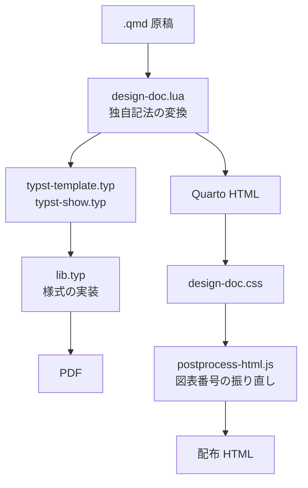

## 出力経路

出力は PDF と HTML の2経路があり、共通の変換（`design-doc.lua`）を通ったあとで
分かれる。

::: {#fig-pipeline}

```mermaid
flowchart TD
  Q[.qmd 原稿] --> L[design-doc.lua<br/>独自記法の変換]
  L --> T[typst-template.typ<br/>typst-show.typ]
  T --> LIB[lib.typ<br/>様式の実装]
  LIB --> PDF[PDF]
  L --> H[Quarto HTML]
  H --> CSS[design-doc.css]
  CSS --> POST[postprocess-html.js<br/>図表番号の振り直し]
  POST --> HTML[配布 HTML]
```

出力経路

:::
