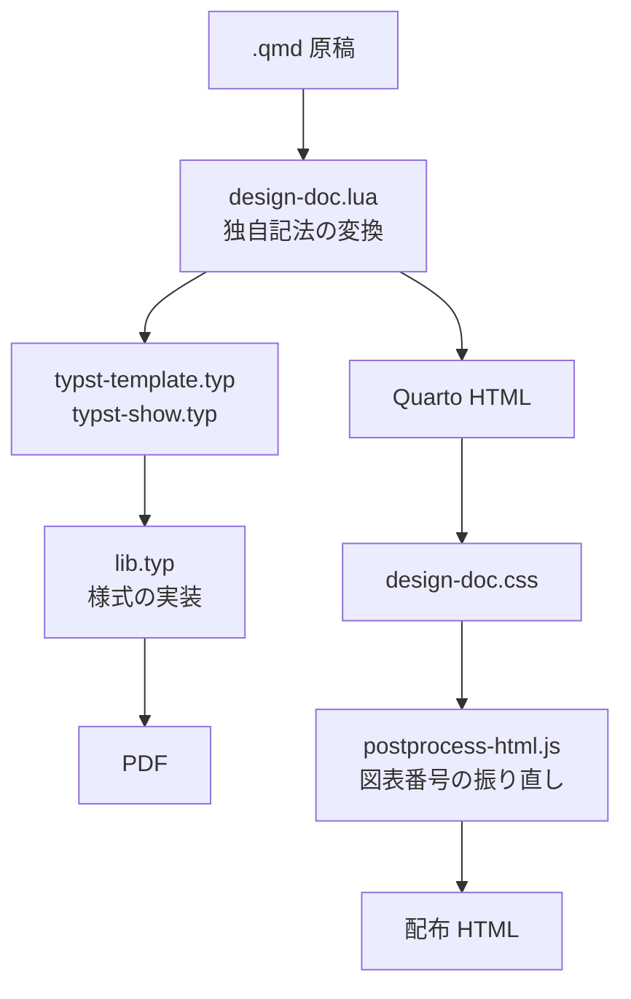

# テンプレート保守者向け

本章では、様式そのものを直す**保守者**のための入口を示す。詳細は
`template/PIPELINE.md` にあるため、本章は「どこを見ればよいか」に絞る。

::: {.callout-important}
本章の作業は、テンプレートを利用するすべての文書に影響する。利用側のリポジトリで
`template/` を直接書き換えると、テンプレートを更新したときに変更が失われる。
要望は提供元へ差し戻すことが望ましい。
:::

## 出力経路

出力は PDF と HTML の2経路があり、共通の変換（`design-doc.lua`）を通ったあとで
分かれる。

::: {#fig-pipeline}



出力経路

:::

## 何をどこで直すか

::: {.tbl caption="調整箇所の対応" label="tbl-maint-where" widths="34,26,40"}
| 直したいもの                     | 直す場所                    | 備考                                   |
|----------------------------------|-----------------------------|----------------------------------------|
| 外枠の寸法・余白                 | `lib.typ`                   | 冒頭の「【1】調整パラメータ」に集約     |
| フォント・文字サイズ             | `lib.typ`                   | 同上                                   |
| 章番号・図表番号の書式           | `lib.typ`                   | 採番の実装                             |
| 番号付きリストの記号             | `lib.typ`                   | `ENUM-NUMBERING`                       |
| IPO 図の欄割り・横向きの体裁     | `lib.typ`                   | ―                                     |
| 独自記法の追加・変更             | `design-doc.lua`            | `.tbl` / `.landscape` / `.ipo` / mermaid |
| HTML の見た目                    | `design-doc.css`            | ―                                     |
| HTML の図表番号の振り直し        | `postprocess-html.js`       | Quarto の採番より後段で走る必要がある   |
| mermaid のテーマ・フォント       | `mermaid-config.json`       | SVG 化とプレビューの共通ソース          |
| `_quarto.yml` の設定項目の追加   | `typst-show.typ` ＋ `lib.typ` | 引数として渡す                        |
| 設計書リポジトリの雛形           | `template/scaffold/`        | `init-doc` が展開する                   |
:::

::: {.callout-important}
`design-doc.lua`・`design-doc.css`・`postprocess-html.js`・`mermaid-config.json` は
**設計書リポジトリへ配布される**（コミットされる）。これらを直したら
`template/VERSION` を上げ、利用側の発行者に `update-doc` の実行を依頼する。
:::

様式の調整パラメータは `template/lib.typ` の冒頭「【1】調整パラメータ」に
集約してある。まずここを見ればよい。

## 変更したときの手順

1. `template/` のファイルを直す。
2. 配布される機構ファイルを直したら `template/VERSION` を上げる。
3. `setup` を再実行して、執筆フォルダへ反映する。

   ```bat
   .\template\setup.bat docs
   ```

4. サンプル文書（`docs/`）で PDF・HTML の両方を出し、体裁を確認する。
5. 本書（`manual/`）でも出力を確認する（記法の網羅度が高いため、退行を見つけやすい）。
6. リリースを作る（`template/` 一式＋本書の PDF / HTML）。発行者はこれを受け取り、
   `update-doc` で利用中の設計書リポジトリへ反映する。

::: {.callout-warning}
`setup` の再実行を忘れると、執筆フォルダに古い機構ファイルが残ったままになり、
変更が反映されない。「直したのに変わらない」ときはまずここを疑うこと。
:::

::: {.callout-important}
`postprocess-html.js` を直したときは、**同じ `_book/` に2回続けて流しても結果が
変わらないこと**（冪等性）を必ず確認する。この後処理は `quarto preview` が保存の
たびに呼ぶため、2回目で番号が積み重なると執筆者の画面が壊れる。
:::

## なぜ HTML の番号を後処理で直すのか

Quarto の図表採番（crossref）は、**すべての Lua フィルタより後段**で走る。
フィルタの時点では表に ID もキャプションも付いておらず、参照は未解決のままである。
つまりフィルタでは上書きできないため、生成された HTML を直している。

book 形式では、連番が文書全体で決まることと、相互参照が他の章ファイルを指すことから、
全章を走査して番号を確定してから全ファイルの参照を解決する2パス構成としている。

この後処理は `_quarto.yml` の `project.post-render` に登録してあり、**Quarto に同梱の
実行環境（Deno）**で走る。そのため執筆者の環境に node は要らず、`quarto preview` でも
発行版と同じ番号が出る。

## 詳細を読む

| 知りたいこと | 参照先 |
|--------------|--------|
| 出力経路の詳細・様式の調整箇所 | `template/PIPELINE.md` |
| リポジトリ構成・配布の単位・ビルドの詳細 | `ADVANCED.md` |
| 記法の仕様 | 本書 6章〜10章 |
