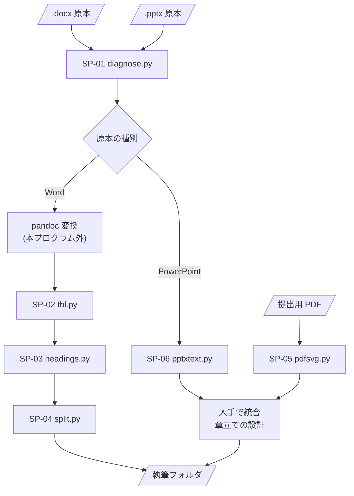

## プログラム構成 {#sec-structure}

本プログラムは6本のサブプログラムから成る。各サブプログラムは独立した
コマンドラインプログラムであり、相互に import しない。データの受け渡しは
**ファイルを介してのみ**行う。

サブプログラムの一覧を @tbl-sp-list に、相互関連と処理の流れを @fig-sp-flow に示す。

::: {.tbl caption="サブプログラム一覧" label="tbl-sp-list" widths="10,16,34,20,20"}
| ID | 名称 | 機能 | 入力 | 出力 |
|---|---|---|---|---|
| SP-01 | `diagnose.py` | 原本の移行コストを見積もる | `.docx` / `.pptx` | 診断結果（md／csv／json） |
| SP-02 | `tbl.py` | 表・図に採番機構を載せ、本文の参照を置換する | markdown | markdown、対応表 TSV |
| SP-03 | `headings.py` | 見出しの手書き番号を削除する | markdown | markdown |
| SP-04 | `split.py` | 章・節のファイルへ分割する | markdown | 執筆フォルダ一式 |
| SP-05 | `pdfsvg.py` | PDF から図をベクター SVG で取り出す | PDF | SVG、貼り付け用 markdown |
| SP-06 | `pptxtext.py` | PowerPoint から文字・表・ノートを抽出する | `.pptx` | markdown、画像 |
:::

### 処理の流れ

SP-01 はどの経路でも最初に実行し、移行するか否か及び着手順を決める材料とする。
以降は原本の種別により経路が分かれる。

Word 単独の原本は SP-02 → SP-03 → SP-04 の順に**直列**で適用する。
この順序には依存関係があり、入れ替えてはならない（@sec-cond 参照）。

PowerPoint が絡む原本は、文字を SP-06 から、図を SP-05 から取り、
**2つの出力を人手で統合**する。

::: {#fig-sp-flow}

サブプログラムの相互関連と処理の流れ
:::

### 相互関連の性質

::: {.tbl caption="サブプログラム間の結合" label="tbl-sp-coupling" widths="20,20,30,30"}
| 上流 | 下流 | 受け渡すもの | 結合の強さ |
|---|---|---|---|
| SP-02 | SP-03 | markdown ファイル | 弱（ファイル経由。形式は markdown のみ） |
| SP-03 | SP-04 | markdown ファイル | 弱（同上） |
| SP-06 | SP-05 | 図が主体のスライド番号（画面出力） | なし（人が読んで指定に使う） |
| SP-01 | 全て | なし | なし（判断材料を人に提示するだけ） |
:::

サブプログラム間に呼出し関係は存在しない。したがって循環呼出しは原理的に生じない。


