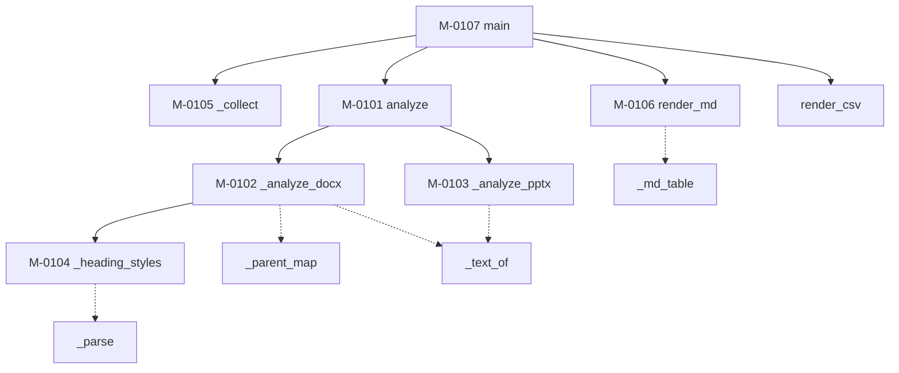

### モジュール構造 {#sec-sp01-struct}

SP-01 を構成するモジュールを @tbl-sp01-mods に、補助モジュールを @tbl-sp01-sub に、
相互関連を @fig-sp01-tree に示す。

::: {.tbl caption="SP-01 モジュール一覧" label="tbl-sp01-mods" widths="12,20,46,22"}
| ID | 名称 | 機能の概要 | 呼出元 |
|---|---|---|---|
| M-0101 | `analyze` | ファイル1件を種別に応じて診断する。異常時も例外を返さず結果に含める | `main` |
| M-0102 | `_analyze_docx` | Word 文書の本文を走査し、見出し・表・図形・図表番号を数える | `analyze` |
| M-0103 | `_analyze_pptx` | PowerPoint のスライドを走査し、図形・コネクタ・ノートを数える | `analyze` |
| M-0104 | `_heading_styles` | `styles.xml` から「スタイル ID → 見出しレベル」の対応を作る | `_analyze_docx` |
| M-0105 | `_collect` | 引数のパスから診断対象のファイル一覧を作る | `main` |
| M-0106 | `render_md` | 診断結果を markdown の表に整形する | `main` |
| M-0107 | `main` | 引数を解釈し、全体を制御する | （利用者） |
:::

::: {.tbl caption="SP-01 補助モジュール一覧" label="tbl-sp01-sub" widths="16,12,38,34"}
| 名称 | 戻り値 | 機能 | 備考 |
|---|---|---|---|
| `_local` | `str` | タグ名から名前空間を除く | `{ns}tag` → `tag` |
| `_family` | `str` | 名前空間 URI を短い記号に丸める | `w` / `p` / `a` / `wps` / `mc` / `m` / `v`。該当なしは空文字 |
| `_attr` | `str \| None` | 名前空間を無視して属性を引く | 見つからなければ `None` |
| `_parent_map` | `dict` | 全要素の親を引ける辞書を作る | ElementTree に親参照が無いため |
| `_ancestors` | 生成器 | 祖先要素を順に返す | `_parent_map` の結果を用いる |
| `_text_of` | `str` | 配下のテキストノードを連結する | `w:t` / `a:t` を対象とする |
| `_parse` | `Element \| None` | zip 内の XML を解析する | 不在・解析失敗は `None` |
| `_int` | `int` | 数値に変換する | 変換できない場合は 0 |
| `_md_table` | `list[str]` | ヘッダと行から markdown の表を組む | 罫線行を自動で挿入する |
| `render_csv` | `None` | 診断結果を CSV に書く | 列は固定。`Report` の全項目 |
:::

::: {#fig-sp01-tree}

SP-01 モジュール構造
:::

破線は補助モジュールの呼出しを表す。再帰呼出しは `_ancestors` の反復のみで、
関数としての再帰は存在しない。循環呼出しはない。


