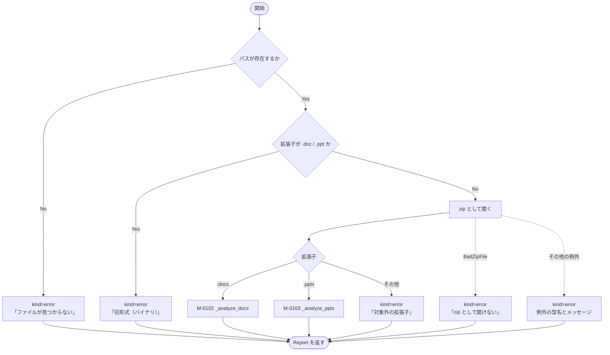
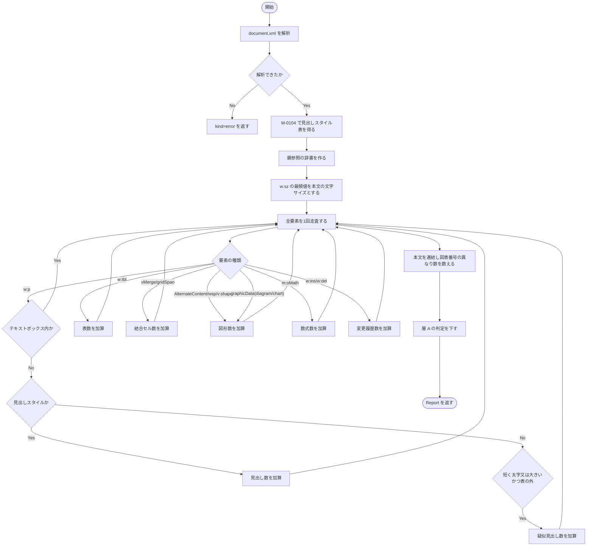
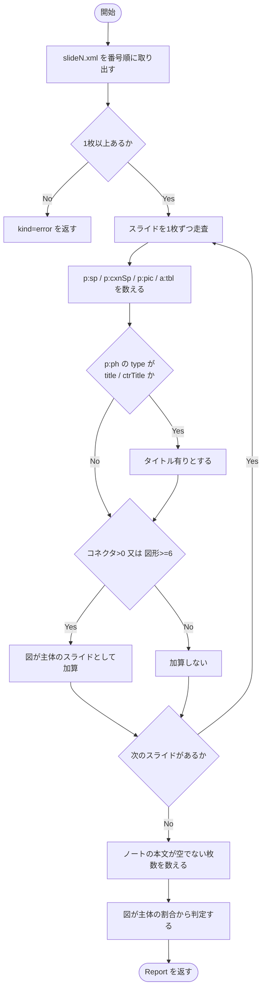
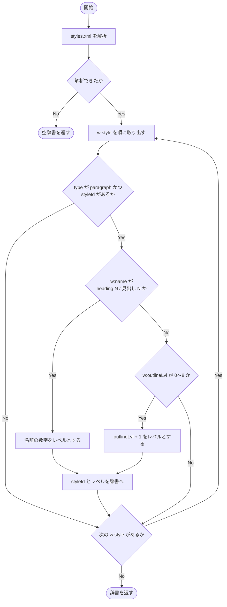
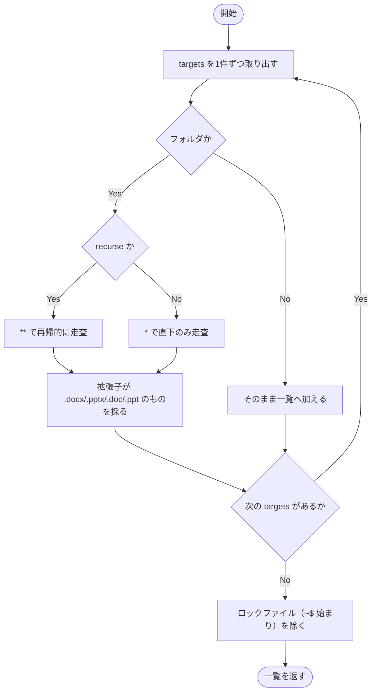
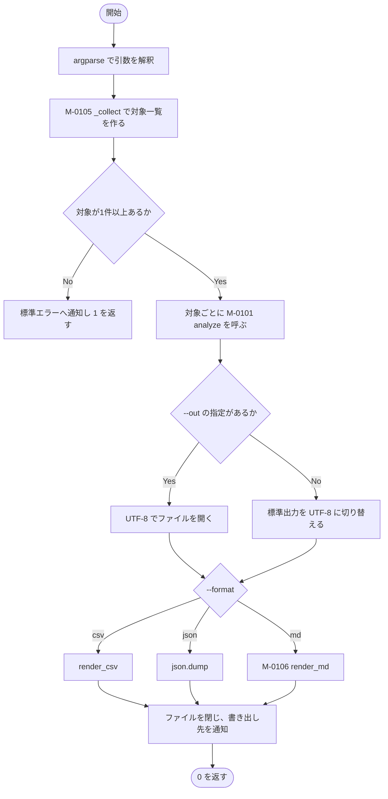

### モジュール詳細 {#sec-sp01-detail}

#### M-0101 `analyze` {#sec-m0101}

##### 機能

ファイル1件を受け取り、拡張子に応じた診断モジュールへ振り分け、
診断結果（`Report`。@sec-lt-report）を返す。診断できない場合も**例外を投げず**、
`kind` を `error` とした `Report` を返す。

##### インタフェース

```
rep = analyze(path)
```

::: {.tbl caption="M-0101 インタフェース" label="tbl-m0101-if" widths="10,14,16,44,16"}
| 区分 | 名称 | 型 | 内容・値域 | 未設定時 |
|:---:|---|---|---|---|
| 引数 | `path` | `Path` | 診断対象のパス。存在しなくてよい | 不可（必須） |
| 戻り値 | `rep` | `Report` | `kind` が `docx` / `pptx` / `error` のいずれか。`error` の場合は `error` に理由が入る | － |
:::

##### 処理

処理内容を @tbl-m0101-ipo に示す。

::: {.ipo module="M-0101 analyze" caption="ファイル1件の診断" label="tbl-m0101-ipo"}
## ファイル種別の判定と振り分け

### 入力

- 引数 `path`（診断対象のパス）

### 処理



### 出力

- 戻り値 `rep`（`Report`）
:::

処理条件及び例外条件を @tbl-m0101-exc に示す。

::: {.tbl caption="M-0101 処理条件・例外条件" label="tbl-m0101-exc" widths="12,34,54" merge-cols="1"}
| 区分 | 条件 | 処理内容 |
|---|---|---|
| 事前 | なし | 呼出し前に成立していなければならない条件はない |
| 例外 | パスが存在しない | `kind=error`、`error="ファイルが見つからない"` を返す |
| 例外 | 拡張子が `.doc` / `.ppt` | 旧形式である旨と、`.docx` / `.pptx` への保存し直しが要る旨を `error` に設定して返す |
| 例外 | zip として開けない（破損・パスワード保護） | `zipfile.BadZipFile` を捕捉し、`error` に設定して返す |
| 例外 | 上記以外の例外 | すべて捕捉し、例外の型名とメッセージを `error` に設定して返す。**1ファイルの失敗で全体を止めない**（設計方針 @sec-others） |
:::

##### モジュールの呼出し関係

M-0102 又は M-0103 のいずれか一方を呼び出す。再帰呼出し及び循環呼出しはない。

##### その他

M-0107 `main` から、診断対象ファイル1件につき1回呼び出される。
内部状態を持たないため再入可能である。



#### M-0102 `_analyze_docx` {#sec-m0102}

##### 機能

Word 文書（`word/document.xml`）を走査し、`Report` の各計数項目を埋めたうえで、
層 A についての判定（低・中・高）を下す。

##### インタフェース

```
rep = _analyze_docx(path, zf)
```

::: {.tbl caption="M-0102 インタフェース" label="tbl-m0102-if" widths="10,14,18,42,16"}
| 区分 | 名称 | 型 | 内容・値域 | 未設定時 |
|:---:|---|---|---|---|
| 引数 | `path` | `Path` | 診断対象のパス。`Report.path` に格納するためだけに用いる | 不可（必須） |
| 引数 | `zf` | `ZipFile` | 開かれた `.docx`。呼出元が開閉する | 不可（必須） |
| 戻り値 | `rep` | `Report` | `kind="docx"`。`word/document.xml` を読めない場合は `kind="error"` | － |
:::

##### 処理

処理内容を @tbl-m0102-ipo に示す。

::: {.ipo module="M-0102 _analyze_docx" caption="Word 文書の走査" label="tbl-m0102-ipo"}
## 見出し・表・図形・図表番号の計数

### 入力

- 引数 `zf` 内の `word/document.xml` 及び `word/styles.xml`
- 引数 `zf` の格納ファイル一覧（`word/media/` の数を画像数とする）
- モジュール定数 `FIGREF`（図表番号の正規表現）

### 処理



### 出力

- 戻り値 `rep`（`Report`。計数項目・`verdict`・`notes` を設定済み）
:::

判定の条件を @tbl-m0102-verdict に示す。

::: {.tbl caption="M-0102 層 A の判定条件" label="tbl-m0102-verdict" widths="10,34,56"}
| 判定 | 条件 | 付記する所見 |
|:---:|---|---|
| 高 | 見出しスタイルが 0 | 章立てを一から起こすことになる旨 |
| 中 | 疑似見出し数 ＞ 見出しスタイル数 | スタイルと直接書式が混在している旨と、双方の件数 |
| 低 | 上記以外 | なし |
:::

処理条件及び例外条件を @tbl-m0102-exc に示す。

::: {.tbl caption="M-0102 処理条件・例外条件" label="tbl-m0102-exc" widths="12,34,54" merge-cols="1"}
| 区分 | 条件 | 処理内容 |
|---|---|---|
| 事前 | `zf` が開かれていること | 呼出元 M-0101 が保証する |
| 例外 | `word/document.xml` が無い、又は解析できない | `kind=error` を返す |
| 例外 | `w:sz` が1つも無い | 本文の文字サイズを 21（10.5 ポイント）とみなして続行する |
| 例外 | `w:sz` の値が数値でない | `_int` が 0 を返し、疑似見出しの判定では不成立となる |
| 境界 | 段落が0件 | 判定は「高」となる（見出しスタイルが 0 のため）。空文書として正しい |
:::

図形の計数では、`mc:AlternateContent` が同一図形の新旧2表現を包むため、
**`AlternateContent` 自体を1個と数え、その配下の `wps:wsp` 及び `v:shape` は数えない**。
これを行わないと同じ図形を二重・三重に数える。

##### モジュールの呼出し関係

M-0104 `_heading_styles` を呼び出す。ほかに補助モジュール `_parent_map`、
`_ancestors`、`_text_of`、`_parse`、`_int`、`_local`、`_family`、`_attr` を用いる。
再帰呼出し及び循環呼出しはない。

##### その他

M-0101 から、`.docx` 1件につき1回呼び出される。



#### M-0103 `_analyze_pptx` {#sec-m0103}

##### 機能

PowerPoint のスライドを走査し、図形・コネクタ・表・画像・発表者ノートを数え、
「図が主体のスライド」の割合から判定を下す。

##### インタフェース

```
rep = _analyze_pptx(path, zf)
```

::: {.tbl caption="M-0103 インタフェース" label="tbl-m0103-if" widths="10,14,18,42,16"}
| 区分 | 名称 | 型 | 内容・値域 | 未設定時 |
|:---:|---|---|---|---|
| 引数 | `path` | `Path` | 診断対象のパス | 不可（必須） |
| 引数 | `zf` | `ZipFile` | 開かれた `.pptx` | 不可（必須） |
| 戻り値 | `rep` | `Report` | `kind="pptx"`。`ppt/slides/` が無い場合は `kind="error"` | － |
:::

##### 処理

処理内容を @tbl-m0103-ipo に示す。

::: {.ipo module="M-0103 _analyze_pptx" caption="PowerPoint の走査" label="tbl-m0103-ipo"}
## スライドごとの図形構成の計数

### 入力

- 引数 `zf` 内の `ppt/slides/slideN.xml`（スライド番号順に整列する）
- 引数 `zf` 内の `ppt/notesSlides/notesSlideN.xml`
- モジュール定数 `FIGREF`（図表番号の正規表現）

### 処理



### 出力

- 戻り値 `rep`（`Report`。`slides`・`titled_slides`・`connectors`・`diagram_slides` 等を設定済み）
:::

判定の条件を @tbl-m0103-verdict に示す。割合は「図が主体のスライド数 ÷ 全スライド数」である。

::: {.tbl caption="M-0103 判定条件" label="tbl-m0103-verdict" widths="10,20,70"}
| 判定 | 条件 | 付記する所見 |
|:---:|---|---|
| 高 | 0.6 以上 | IPO は `.ipo` に作り直し、それ以外は提出用 PDF から SVG で回収する旨 |
| 中 | 0.25 以上 0.6 未満 | 図の扱いを1枚ずつ判断する旨 |
| 低 | 0.25 未満 | 文字と表の抽出でおおむね移せる旨 |
:::

上記に加え、タイトルプレースホルダの無いスライドがある場合、
発表者ノートがある場合、コネクタがある場合に、それぞれ所見を付記する。

処理条件及び例外条件を @tbl-m0103-exc に示す。

::: {.tbl caption="M-0103 処理条件・例外条件" label="tbl-m0103-exc" widths="12,34,54" merge-cols="1"}
| 区分 | 条件 | 処理内容 |
|---|---|---|
| 事前 | `zf` が開かれていること | 呼出元 M-0101 が保証する |
| 例外 | `ppt/slides/` が存在しない | `kind=error` を返す |
| 例外 | 個々のスライドが解析できない | そのスライドを飛ばして続行する（`_parse` が `None` を返す） |
| 境界 | スライドが0枚 | `ppt/slides/` が空となり、`kind=error` を返す |
| 境界 | ノートに数字と空白しか無い | ページ番号のみのノートとみなし、ノート有りに数えない |
:::

##### モジュールの呼出し関係

補助モジュール `_parse`、`_text_of`、`_local`、`_family`、`_attr` を用いる。
ほかのモジュールは呼び出さない。再帰呼出し及び循環呼出しはない。

##### その他

M-0101 から、`.pptx` 1件につき1回呼び出される。



#### M-0104 `_heading_styles` {#sec-m0104}

##### 機能

`word/styles.xml` を読み、「スタイル ID → 見出しレベル」の対応辞書を作る。
日本語版 Word ではスタイル ID が `a3` のような機械的な名前になるため、
**ID ではなくスタイル名と概要レベルで判定する**。

##### インタフェース

```
styles = _heading_styles(zf)
```

::: {.tbl caption="M-0104 インタフェース" label="tbl-m0104-if" widths="10,14,18,42,16"}
| 区分 | 名称 | 型 | 内容・値域 | 未設定時 |
|:---:|---|---|---|---|
| 引数 | `zf` | `ZipFile` | 開かれた `.docx` | 不可（必須） |
| 戻り値 | `styles` | `dict[str, int]` | キーはスタイル ID、値は見出しレベル（1〜9）。`styles.xml` が無い場合は空辞書 | 空辞書 |
:::

##### 処理

処理内容を @tbl-m0104-ipo に示す。

::: {.ipo module="M-0104 _heading_styles" caption="見出しスタイル対応表の作成" label="tbl-m0104-ipo"}
## スタイル ID と見出しレベルの対応付け

### 入力

- 引数 `zf` 内の `word/styles.xml`
- モジュール定数 `HEADING_NAME`（`heading N` 又は `見出し N` に一致する正規表現）

### 処理



### 出力

- 戻り値 `styles`（スタイル ID → 見出しレベルの辞書）
:::

処理条件及び例外条件を @tbl-m0104-exc に示す。

::: {.tbl caption="M-0104 処理条件・例外条件" label="tbl-m0104-exc" widths="12,34,54" merge-cols="1"}
| 区分 | 条件 | 処理内容 |
|---|---|---|
| 事前 | なし | － |
| 例外 | `styles.xml` が無い、又は解析できない | 空辞書を返す。呼出元では見出しスタイル 0 件として判定「高」になる |
| 例外 | `outlineLvl` の値が数値でない | 当該スタイルを見出しとみなさない |
| 境界 | 名前と概要レベルの双方がある | **名前を優先する**（`w:name` の判定を先に行うため） |
:::

##### モジュールの呼出し関係

補助モジュール `_parse`、`_local`、`_attr` を用いる。
ほかのモジュールは呼び出さない。再帰呼出し及び循環呼出しはない。

##### その他

M-0102 から、`.docx` 1件につき1回呼び出される。



#### M-0105 `_collect` {#sec-m0105}

##### 機能

利用者が与えたパス（ファイル又はフォルダ）から、診断対象のファイル一覧を作る。

##### インタフェース

```
paths = _collect(targets, recurse)
```

::: {.tbl caption="M-0105 インタフェース" label="tbl-m0105-if" widths="10,14,18,42,16"}
| 区分 | 名称 | 型 | 内容・値域 | 未設定時 |
|:---:|---|---|---|---|
| 引数 | `targets` | `list[str]` | 利用者が与えたパスの並び。1件以上 | 不可（必須） |
| 引数 | `recurse` | `bool` | 真ならフォルダを再帰的に探す | 不可（必須） |
| 戻り値 | `paths` | `list[Path]` | 診断対象。**存在しないパスも含む**（エラー行として報告するため） | 空リスト |
:::

##### 処理

処理内容を @tbl-m0105-ipo に示す。

::: {.ipo module="M-0105 _collect" caption="診断対象一覧の作成" label="tbl-m0105-ipo"}
## 対象ファイルの収集

### 入力

- 引数 `targets`（パスの並び）
- 引数 `recurse`（再帰の可否）

### 処理



### 出力

- 戻り値 `paths`（診断対象のパス一覧）
:::

処理条件及び例外条件を @tbl-m0105-exc に示す。

::: {.tbl caption="M-0105 処理条件・例外条件" label="tbl-m0105-exc" widths="12,34,54" merge-cols="1"}
| 区分 | 条件 | 処理内容 |
|---|---|---|
| 事前 | なし | － |
| 例外 | 指定されたパスが存在しない | 除外せず一覧に加える。M-0101 が「ファイルが見つからない」として報告するため、**利用者の打ち間違いが黙って消えない** |
| 例外 | Office のロックファイル（`~$xxx.docx`） | 一覧から除く。開いたままの文書があると必ず現れ、診断できないため |
| 境界 | フォルダが空 | 空リストを返す。M-0107 が対象なしとして終了コード 1 を返す |
:::

##### モジュールの呼出し関係

ほかのモジュールを呼び出さない。再帰呼出し及び循環呼出しはない
（フォルダの再帰走査は `Path.glob` の機能による）。

##### その他

M-0107 から、起動につき1回呼び出される。



#### M-0106 `render_md` {#sec-m0106}

##### 機能

診断結果の並びを、markdown の文書に整形する。Word 用と PowerPoint 用の表を分け、
着手順・合計・診断できなかったファイルを続けて出力する。

##### インタフェース

```
text = render_md(reports)
```

::: {.tbl caption="M-0106 インタフェース" label="tbl-m0106-if" widths="10,14,18,42,16"}
| 区分 | 名称 | 型 | 内容・値域 | 未設定時 |
|:---:|---|---|---|---|
| 引数 | `reports` | `list[Report]` | 診断結果の並び。空でもよい | 不可（必須） |
| 戻り値 | `text` | `str` | markdown 文書。末尾に改行を含まない | － |
:::

##### 処理

処理内容を @tbl-m0106-ipo に示す。

::: {.ipo module="M-0106 render_md" caption="診断結果の整形" label="tbl-m0106-ipo"}
## 診断結果の markdown 化

### 入力

- 引数 `reports`（`Report` の並び）

### 処理

1. `kind` により Word・PowerPoint・エラーの3群に振り分ける。
1. Word 群があれば、段落・見出し・疑似見出し・表・結合・図形・画像・数式・図表番号・判定の表を出す。
1. PowerPoint 群があれば、スライド・タイトル有・図主体・図形・コネクタ・表・画像・ノート・判定の表を出す。
1. 判定の順位（低→中→高）、次いで「図形数＋図表番号数」の昇順に並べ替え、
   **着手順**として所見つきで列挙する。
1. ファイル数・本文の文字数・失われる図形・手書きの図表番号の合計表を出す。
1. エラー群があれば、ファイル名と理由の表を出す。
1. 判定が層 A のみを対象とする旨の注記を末尾に付す。

### 出力

- 戻り値 `text`（markdown 文書）
:::

::: {.callout-note}
着手順の並べ替えは「安いものから」である。判定が同じ場合は、層 B・層 C の作業量
（図形数＋図表番号数）が少ないものを先に置く。
:::

処理条件及び例外条件を @tbl-m0106-exc に示す。

::: {.tbl caption="M-0106 処理条件・例外条件" label="tbl-m0106-exc" widths="12,34,54" merge-cols="1"}
| 区分 | 条件 | 処理内容 |
|---|---|---|
| 事前 | なし | － |
| 境界 | `reports` が空 | 見出しのみの文書を返す。表は出力しない |
| 境界 | エラーのみ | Word・PowerPoint の表と着手順・合計を出さず、エラーの表のみ出力する |
:::

##### モジュールの呼出し関係

補助モジュール `_md_table` を用いる。ほかのモジュールは呼び出さない。

##### その他

M-0107 から、`--format md`（既定）の場合に1回呼び出される。



#### M-0107 `main` {#sec-m0107}

##### 機能

コマンドライン引数を解釈し、対象の収集・診断・整形・出力を順に行う。

##### インタフェース

```
code = main(argv)
```

::: {.tbl caption="M-0107 インタフェース" label="tbl-m0107-if" widths="10,14,18,42,16"}
| 区分 | 名称 | 型 | 内容・値域 | 未設定時 |
|:---:|---|---|---|---|
| 引数 | `argv` | `list[str] \| None` | コマンドライン引数。`None` なら `sys.argv` を用いる | `None` |
| 戻り値 | `code` | `int` | 0＝正常、1＝診断対象が1件も無い | － |
:::

##### 処理

処理内容を @tbl-m0107-ipo に示す。

::: {.ipo module="M-0107 main" caption="SP-01 の全体制御" label="tbl-m0107-ipo"}
## 引数解釈から出力まで

### 入力

- 引数 `argv`（コマンドライン引数）
- 利用者が指定した原本ファイル又はフォルダ

### 処理



### 出力

- 診断結果（`--out` の指定先、又は標準出力）
- 書き出し先の通知（標準エラー出力）
- 戻り値 `code`
:::

処理条件及び例外条件を @tbl-m0107-exc に示す。

::: {.tbl caption="M-0107 処理条件・例外条件" label="tbl-m0107-exc" widths="12,34,54" merge-cols="1"}
| 区分 | 条件 | 処理内容 |
|---|---|---|
| 事前 | なし | － |
| 例外 | 診断対象が1件も無い | メッセージ I-101（@sec-msg-detail）を標準エラーへ出し、1 を返す |
| 例外 | 標準出力が `reconfigure` を持たない | 切り替えを行わずに続行する（リダイレクト先によっては属性が無いため） |
| 例外 | 出力先を開けない | 例外を捕捉しない。Python の既定の異常終了に委ねる |
:::

##### モジュールの呼出し関係

M-0105、M-0101、M-0106 及び `render_csv` を呼び出す。
再帰呼出し及び循環呼出しはない。

##### その他

利用者がコマンドラインから起動したときに1回だけ実行される。
`argv` を引数に取るため、試験からは引数を与えて直接呼び出せる。


