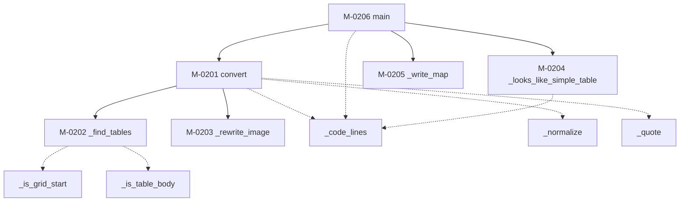

### モジュール構造 {#sec-sp02-struct}

SP-02 を構成するモジュールを @tbl-sp02-mods に、補助モジュールを @tbl-sp02-sub に、
相互関連を @fig-sp02-tree に示す。

::: {.tbl caption="SP-02 モジュール一覧" label="tbl-sp02-mods" widths="12,22,44,22"}
| ID | 名称 | 機能の概要 | 呼出元 |
|---|---|---|---|
| M-0201 | `convert` | 変換の中核。3つのパスで採番・置換・整形を行う | `main` |
| M-0202 | `_find_tables` | 表ブロックの開始行と終了行を求める | `convert` |
| M-0203 | `_rewrite_image` | 画像のパスを書き換え、必要なら `{#fig-x}` を付ける | `convert` |
| M-0204 | `_looks_like_simple_table` | simple table が残っていないか調べる | `main` |
| M-0205 | `_write_map` | 元番号と label の対応表を TSV で書く | `main` |
| M-0206 | `main` | 引数を解釈し、全体を制御する | （利用者） |
:::

::: {.tbl caption="SP-02 補助モジュール一覧" label="tbl-sp02-sub" widths="20,12,34,34"}
| 名称 | 戻り値 | 機能 | 備考 |
|---|---|---|---|
| `_normalize` | `str` | 番号の表記を揃える | `1.1-1` / `１．１－１` → `1-1-1` |
| `_quote` | `str` | 属性値に入れられる形にする | 二重引用符を全角に逃がす |
| `_code_lines` | `set[int]` | コードブロックの行番号を集める | 共通プログラム（@sec-common） |
| `_is_grid_start` | `bool` | グリッド表の罫線行か判定する | `+---+` の形 |
| `_is_table_body` | `bool` | 表の構成行か判定する | 先頭が `|` 又は `+` |
:::

::: {#fig-sp02-tree}

SP-02 モジュール構造
:::

M-0201 `convert` は内部に入れ子の関数 `_define`（採番の登録）、`_probe`（隣接行の探索）、
`_replace`（参照の置換）を持つ。いずれも `convert` の局所状態（採番済み label の集合、
定義辞書）を参照するため外へ出していない。

再帰呼出し及び循環呼出しはない。


