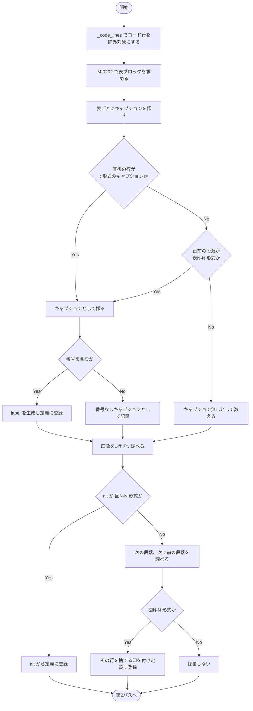
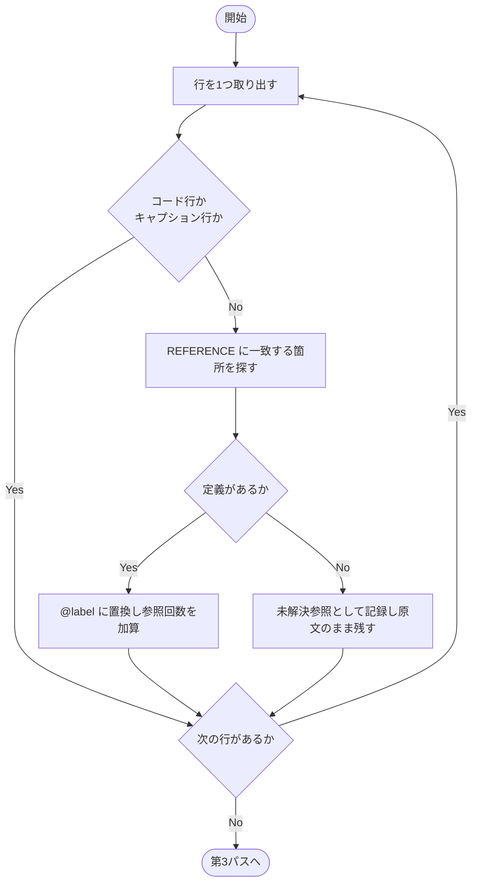
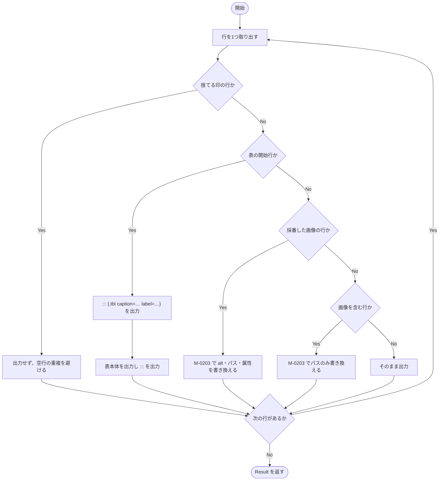
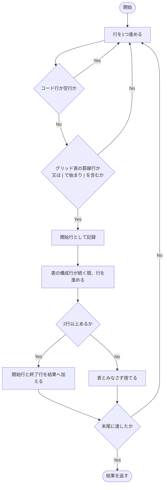
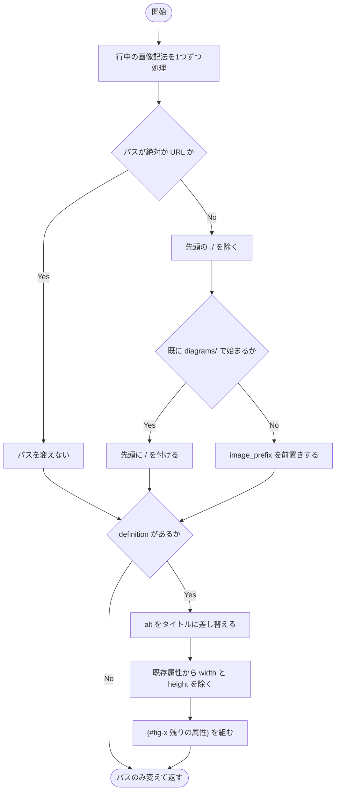
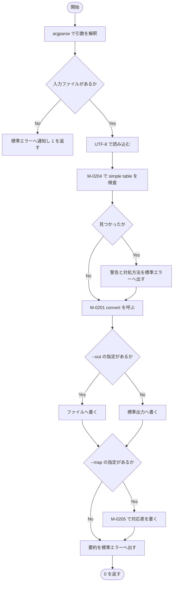

### モジュール詳細 {#sec-sp02-detail}

#### M-0201 `convert` {#sec-m0201}

##### 機能

markdown 全文を受け取り、表と図の採番、本文の参照置換、表の囲みを行った markdown と、
採番の対応表・取りこぼしの情報（`Result`。@sec-lt-result）を返す。

##### インタフェース

```
result = convert(text, image_prefix="/diagrams")
```

::: {.tbl caption="M-0201 インタフェース" label="tbl-m0201-if" widths="10,16,16,42,16"}
| 区分 | 名称 | 型 | 内容・値域 | 未設定時 |
|:---:|---|---|---|---|
| 引数 | `text` | `str` | 対象の markdown 全文 | 不可（必須） |
| 引数 | `image_prefix` | `str` | 画像パスの前置き。先頭の `/` を含む | `"/diagrams"` |
| 戻り値 | `result` | `Result` | 変換後の本文と、定義・未解決参照・取りこぼしの情報 | － |
:::

##### 処理

本モジュールは**3つのパス**で構成する。パスを分ける理由は、参照の置換（第2パス）を
行う時点で「どの番号が定義されているか」が確定していなければならず、
かつ**生成したキャプション行を置換の対象から外す**必要があるためである。

処理内容を @tbl-m0201-ipo に示す。

::: {.ipo module="M-0201 convert" caption="採番機構の付与と参照の置換" label="tbl-m0201-ipo"}
## 第1パス：表と図の採番

### 入力

- 引数 `text`（markdown 全文）
- モジュール定数 `CAPTION`（`表1.1-1　タイトル` に一致する正規表現）
- モジュール定数 `PANDOC_CAPTION`（`: タイトル` 形式）、`IMAGE`（画像記法）

### 処理



### 出力

- 定義辞書（種別と正規化番号 → `Definition`）
- キャプション行の行番号の集合（置換の対象から外すため）

### 入力

- 第1パスで作った定義辞書
- 引数 `text` の各行

### 処理



### 出力

- 参照を置換した行の並び
- 未解決参照の一覧（番号ごとの出現回数）

### 入力

- 第2パスの行の並び
- 第1パスの定義辞書及び捨てる印を付けた行

### 処理



### 出力

- 戻り値 `result`（`Result`。本文・定義一覧・未解決参照・取りこぼし件数）
:::

処理条件及び例外条件を @tbl-m0201-exc に示す。

::: {.tbl caption="M-0201 処理条件・例外条件" label="tbl-m0201-exc" widths="12,34,54" merge-cols="1"}
| 区分 | 条件 | 処理内容 |
|---|---|---|
| 事前 | 入力が設計条件 C-08 を満たすこと | 満たさない場合、表を検出できない。M-0206 が事前に警告する |
| 例外 | 同じ番号が二度定義される | 2件目以降の label に `-2`、`-3` … を付けて重複を避ける |
| 例外 | キャプションに番号が無い | `caption` のみ付け `label` を付けない。件数を `Result` に記録する |
| 例外 | 表にキャプションが無い | 囲まずに素の表のまま残す。件数を `Result` に記録する |
| 例外 | 参照に対応する定義が無い | 原文のまま残し、未解決参照として記録する。**黙って消さない** |
| 境界 | 表が0件・図が0件 | 定義辞書が空になり、置換は行われない。本文はそのまま出力される |
| 境界 | 画像パスが絶対パス又は URL | 書き換えない（`http:` `/` `#` で始まるものを対象外とする） |
:::

##### モジュールの呼出し関係

M-0202 及び M-0203 を呼び出す。補助モジュール `_code_lines`、`_normalize`、`_quote` を用いる。
再帰呼出し及び循環呼出しはない。

##### その他

M-0206 から起動につき1回呼び出される。ファイルの読み書きを行わないため、
入力文字列に対する出力文字列を比較する形で試験できる。



#### M-0202 `_find_tables` {#sec-m0202}

##### 機能

行の並びから表ブロックを見つけ、その開始行と終了行の組を返す。
グリッド表とパイプ表の双方を対象とする。

##### インタフェース

```
blocks = _find_tables(lines, code)
```

::: {.tbl caption="M-0202 インタフェース" label="tbl-m0202-if" widths="10,14,20,40,16"}
| 区分 | 名称 | 型 | 内容・値域 | 未設定時 |
|:---:|---|---|---|---|
| 引数 | `lines` | `list[str]` | 対象の行の並び | 不可（必須） |
| 引数 | `code` | `set[int]` | コードブロックの行番号（0始まり） | 不可（必須） |
| 戻り値 | `blocks` | `list[tuple[int,int]]` | (開始行, 終了行) の並び。**終了行を含む** | 空リスト |
:::

##### 処理

処理内容を @tbl-m0202-ipo に示す。

::: {.ipo module="M-0202 _find_tables" caption="表ブロックの検出" label="tbl-m0202-ipo"}
## 表の開始行と終了行の特定

### 入力

- 引数 `lines`（行の並び）
- 引数 `code`（除外する行番号）

### 処理



### 出力

- 戻り値 `blocks`（表ブロックの位置の並び）
:::

処理条件及び例外条件を @tbl-m0202-exc に示す。

::: {.tbl caption="M-0202 処理条件・例外条件" label="tbl-m0202-exc" widths="12,34,54" merge-cols="1"}
| 区分 | 条件 | 処理内容 |
|---|---|---|
| 事前 | `code` が算出済みであること | 呼出元 M-0201 が保証する |
| 例外 | 1行だけの表らしき行 | 表とみなさない。本文中の `|` を含む1行を誤検出しないため |
| 例外 | コードブロック内の表 | 検出しない。`code` に含まれる行で走査を打ち切る |
| 境界 | 表が文書の末尾で終わる | 末尾行を終了行として返す |
:::

##### モジュールの呼出し関係

補助モジュール `_is_grid_start` 及び `_is_table_body` を用いる。
ほかのモジュールは呼び出さない。

##### その他

M-0201 から、第1パスと第3パスでそれぞれ呼び出される。
第2パスで行の内容が書き換わるため、**第3パスでは求め直す**。



#### M-0203 `_rewrite_image` {#sec-m0203}

##### 機能

画像記法を含む行を受け取り、画像パスをプロジェクトルート基準へ書き換える。
採番の定義が与えられた場合は、alt をタイトルに差し替え `{#fig-x}` を付ける。

##### インタフェース

```
line = _rewrite_image(line, definition, image_prefix)
```

::: {.tbl caption="M-0203 インタフェース" label="tbl-m0203-if" widths="10,16,18,40,16"}
| 区分 | 名称 | 型 | 内容・値域 | 未設定時 |
|:---:|---|---|---|---|
| 引数 | `line` | `str` | 画像記法を含む行 | 不可（必須） |
| 引数 | `definition` | `Definition \| None` | 採番の定義。`None` ならパスのみ書き換える | 不可（必須） |
| 引数 | `image_prefix` | `str` | 画像パスの前置き | 不可（必須） |
| 戻り値 | `line` | `str` | 書き換え後の行 | － |
:::

##### 処理

処理内容を @tbl-m0203-ipo に示す。

::: {.ipo module="M-0203 _rewrite_image" caption="画像記法の書き換え" label="tbl-m0203-ipo"}
## 画像パスと属性の整形

### 入力

- 引数 `line`（画像記法を含む行）
- 引数 `definition`（採番の定義。無い場合は `None`）
- 引数 `image_prefix`（画像パスの前置き）

### 処理



### 出力

- 戻り値 `line`（書き換え後の行）
:::

::: {.callout-note}
幅・高さの指定を捨てるのは、Word が保持している実寸（インチ）が
テンプレートの版面に合わないためである。必要な幅は執筆者が改めて指定する。
:::

処理条件及び例外条件を @tbl-m0203-exc に示す。

::: {.tbl caption="M-0203 処理条件・例外条件" label="tbl-m0203-exc" widths="12,34,54" merge-cols="1"}
| 区分 | 条件 | 処理内容 |
|---|---|---|
| 事前 | なし | 画像記法が無い行を渡しても、そのまま返る |
| 例外 | パスが `http:` などの URL | 書き換えない |
| 例外 | パスが `/` 又は `#` で始まる | 既にルート基準とみなし書き換えない |
| 境界 | 1行に画像が複数ある | すべてに同じ処理を適用する。ただし `definition` は共通のため、採番付きの行に画像を複数置いてはならない |
:::

##### モジュールの呼出し関係

ほかのモジュールを呼び出さない。内部に入れ子の関数 `_sub` を持つ
（正規表現の置換関数として渡すため）。

##### その他

M-0201 の第3パスから、画像を含む行ごとに1回呼び出される。



#### M-0204 `_looks_like_simple_table` {#sec-m0204}

##### 機能

入力に simple table（罫線を空白で揃えた表）が残っていないかを調べる。
設計条件 C-08 が満たされているかの検査である。

##### インタフェース

```
found = _looks_like_simple_table(lines, code)
```

::: {.tbl caption="M-0204 インタフェース" label="tbl-m0204-if" widths="10,14,20,40,16"}
| 区分 | 名称 | 型 | 内容・値域 | 未設定時 |
|:---:|---|---|---|---|
| 引数 | `lines` | `list[str]` | 対象の行の並び | 不可（必須） |
| 引数 | `code` | `set[int]` | コードブロックの行番号 | 不可（必須） |
| 戻り値 | `found` | `bool` | 真＝simple table らしき行がある | － |
:::

##### 処理

処理内容を @tbl-m0204-ipo に示す。

::: {.ipo module="M-0204 _looks_like_simple_table" caption="simple table の検出" label="tbl-m0204-ipo"}
## 前提条件の検査

### 入力

- 引数 `lines`（行の並び）
- 引数 `code`（除外する行番号）

### 処理

1. 行を先頭から順に調べる。
1. コードブロックの行は飛ばす。
1. 「2文字以上の空白で始まり、2文字以上の連続したハイフンが空白区切りで2組以上並ぶ行」に
   一致するかを調べる。これは simple table の罫線行の形である。
1. 一致する行が1つでもあれば真を返す。
1. 末尾まで一致しなければ偽を返す。

### 出力

- 戻り値 `found`（真偽値）
:::

処理条件及び例外条件を @tbl-m0204-exc に示す。

::: {.tbl caption="M-0204 処理条件・例外条件" label="tbl-m0204-exc" widths="12,34,54" merge-cols="1"}
| 区分 | 条件 | 処理内容 |
|---|---|---|
| 事前 | なし | － |
| 例外 | 罫線に見える本文がある | 誤検出しうる。検出しても処理は止めず、警告を出すのみとする |
| 境界 | 該当が0件 | 偽を返し、警告を出さない |
:::

##### モジュールの呼出し関係

ほかのモジュールを呼び出さない。

##### その他

M-0206 から、変換の前に1回呼び出される。真を返しても処理は継続する。
誤検出の可能性があるため、処理を止める根拠にはしない。



#### M-0205 `_write_map` {#sec-m0205}

##### 機能

採番の定義一覧を、タブ区切りの対応表としてファイルへ書き出す。

##### インタフェース

```
_write_map(path, definitions)
```

::: {.tbl caption="M-0205 インタフェース" label="tbl-m0205-if" widths="10,16,20,38,16"}
| 区分 | 名称 | 型 | 内容・値域 | 未設定時 |
|:---:|---|---|---|---|
| 引数 | `path` | `Path` | 書き出し先 | 不可（必須） |
| 引数 | `definitions` | `list[Definition]` | 採番の定義。定義行の昇順 | 不可（必須） |
| 戻り値 | － | `None` | 返さない | － |
:::

##### 処理

処理内容を @tbl-m0205-ipo に示す。

::: {.ipo module="M-0205 _write_map" caption="対応表の書き出し" label="tbl-m0205-ipo"}
## 元番号と label の対応表

### 入力

- 引数 `definitions`（`Definition` の並び）

### 処理

1. UTF-8 でファイルを開く（改行変換を行わない）。
1. 見出し行「種別・元番号・label・タイトル・定義行・参照回数」を書く。
1. 定義を1件ずつ、タブ区切りで書く。
1. ファイルを閉じる。

### 出力

- 対応表ファイル（TSV）
:::

処理条件及び例外条件を @tbl-m0205-exc に示す。

::: {.tbl caption="M-0205 処理条件・例外条件" label="tbl-m0205-exc" widths="12,34,54" merge-cols="1"}
| 区分 | 条件 | 処理内容 |
|---|---|---|
| 事前 | 書き出し先の親フォルダが存在すること | 存在しない場合は例外となり、Python の既定の異常終了に委ねる |
| 境界 | 定義が0件 | 見出し行のみのファイルを作る |
| 例外 | タイトルにタブが含まれる | 列がずれる。pandoc の出力にタブは現れないため、対策を設けていない |
:::

##### モジュールの呼出し関係

ほかのモジュールを呼び出さない。

##### その他

M-0206 から、`--map` が指定された場合にのみ1回呼び出される。



#### M-0206 `main` {#sec-m0206}

##### 機能

コマンドライン引数を解釈し、前提条件の検査・変換・出力・要約の報告を行う。

##### インタフェース

```
code = main(argv)
```

::: {.tbl caption="M-0206 インタフェース" label="tbl-m0206-if" widths="10,14,18,42,16"}
| 区分 | 名称 | 型 | 内容・値域 | 未設定時 |
|:---:|---|---|---|---|
| 引数 | `argv` | `list[str] \| None` | コマンドライン引数 | `None` |
| 戻り値 | `code` | `int` | 0＝正常、1＝入力ファイルが無い | － |
:::

##### 処理

処理内容を @tbl-m0206-ipo に示す。

::: {.ipo module="M-0206 main" caption="SP-02 の全体制御" label="tbl-m0206-ipo"}
## 引数解釈から要約の報告まで

### 入力

- 引数 `argv`（コマンドライン引数）
- 入力の markdown ファイル

### 処理



### 出力

- 変換後の markdown（`--out` の指定先、又は標準出力）
- 対応表（`--map` の指定先）
- 要約と取りこぼしの報告（標準エラー出力）
- 戻り値 `code`
:::

要約として報告する内容を @tbl-m0206-report に示す。

::: {.tbl caption="M-0206 が報告する内容" label="tbl-m0206-report" widths="34,66"}
| 報告 | 意味 |
|---|---|
| 採番した表・図の件数と置換した参照の箇所数 | 正常に処理された量 |
| 参照されていない図表 | 本文から引かれていない。原稿の見落としか、参照の表記ゆれ |
| 定義の見つからない参照 | 図表が別ファイルにあるか、番号の書き間違い。**手で確認が要る** |
| キャプションの無い表 | 素の表のまま残した。採番が要るなら手で `caption=` を付ける |
| 番号の無いキャプション | `caption` だけ付けた。`label` が無いので参照できない |
:::

処理条件及び例外条件を @tbl-m0206-exc に示す。

::: {.tbl caption="M-0206 処理条件・例外条件" label="tbl-m0206-exc" widths="12,34,54" merge-cols="1"}
| 区分 | 条件 | 処理内容 |
|---|---|---|
| 事前 | なし | － |
| 例外 | 入力ファイルが無い | メッセージ E-201 を標準エラーへ出し、1 を返す |
| 例外 | simple table を検出 | 警告 W-201 を出すが処理は継続する |
| 例外 | 出力先を開けない | 例外を捕捉しない |
:::

##### モジュールの呼出し関係

M-0204、M-0201、M-0205 を呼び出す。補助モジュール `_code_lines` を用いる。
再帰呼出し及び循環呼出しはない。

##### その他

利用者がコマンドラインから起動したときに1回だけ実行される。


