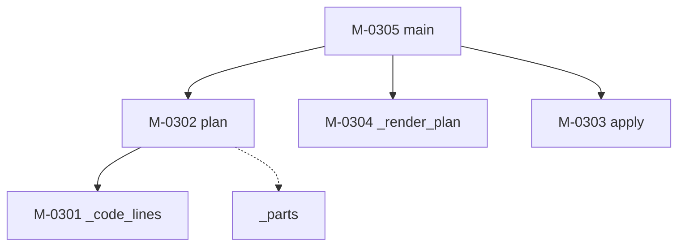

### モジュール構造 {#sec-sp03-struct}

SP-03 を構成するモジュールを @tbl-sp03-mods に、補助モジュールを @tbl-sp03-sub に、
相互関連を @fig-sp03-tree に示す。

::: {.tbl caption="SP-03 モジュール一覧" label="tbl-sp03-mods" widths="12,20,46,22"}
| ID | 名称 | 機能の概要 | 呼出元 |
|---|---|---|---|
| M-0301 | `_code_lines` | コードブロックの行番号を集める（共通プログラム） | `plan` |
| M-0302 | `plan` | 見出しごとの削除可否を判定する。書き換えない | `main` |
| M-0303 | `apply` | 判定が可のものだけを書き換えた行の並びを返す | `main` |
| M-0304 | `_render_plan` | 判定結果を人が読める形に整形して出力する | `main` |
| M-0305 | `main` | 引数を解釈し、全体を制御する | （利用者） |
:::

::: {.tbl caption="SP-03 補助モジュール一覧" label="tbl-sp03-sub" widths="16,14,34,36"}
| 名称 | 戻り値 | 機能 | 備考 |
|---|---|---|---|
| `_parts` | `list[str]` | 番号を階層ごとに分解する | 全角数字を半角に直し、全角読点を半角に揃えてから分割する |
:::

::: {#fig-sp03-tree}

SP-03 モジュール構造
:::

**判定（M-0302）と適用（M-0303）を分離している**ことが本サブプログラムの構造上の
特徴である。`plan` は入力を変更せず判定結果だけを返し、`apply` はその結果を受けて
行を書き換える。この分離により、既定の dry-run では `plan` と `_render_plan` のみを
実行し、`apply` を呼ばないという制御が成り立つ。

再帰呼出し及び循環呼出しはない。


