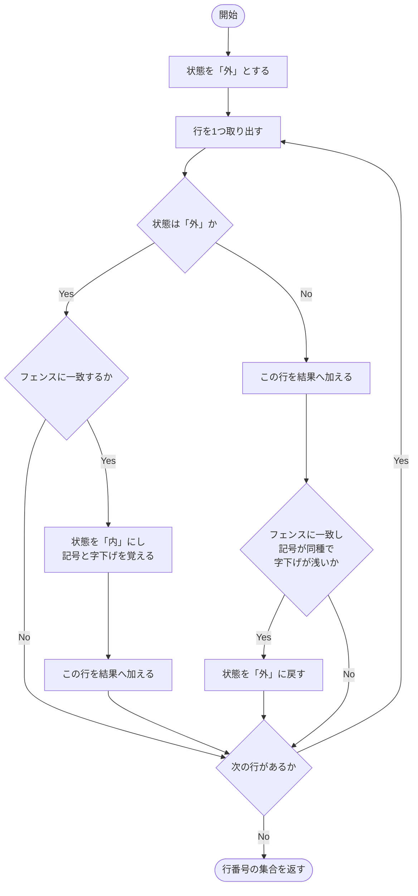
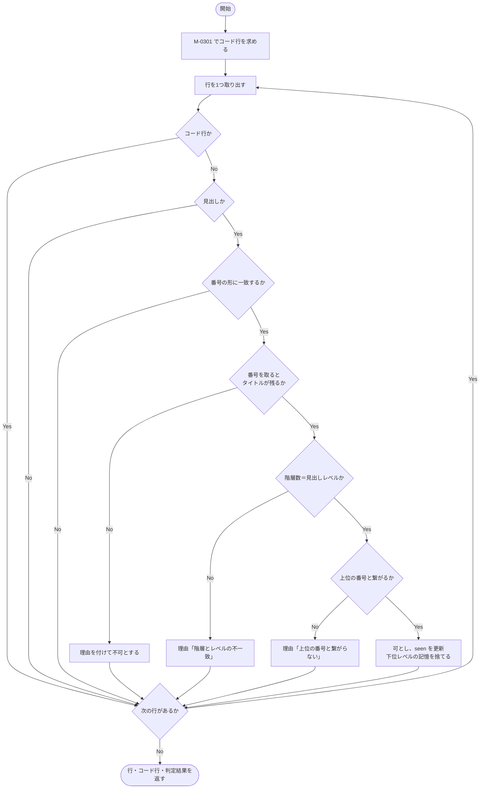
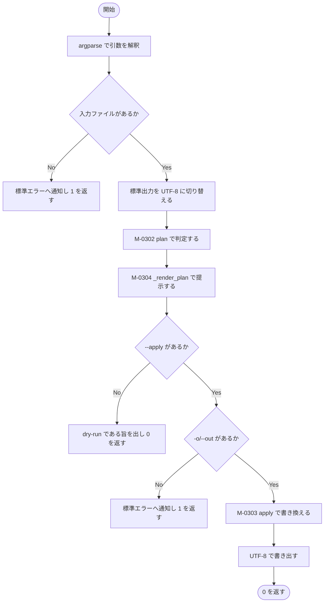

### モジュール詳細 {#sec-sp03-detail}

#### M-0301 `_code_lines` {#sec-m0301}

##### 機能

行の並びから、フェンス付きコードブロックに属する行の番号を集める。
本文の変換処理がコードブロックの中身を書き換えないようにするために用いる。

**本モジュールは共通プログラムであり、SP-02・SP-03・SP-04 に同一内容が
複製されている**（@sec-common）。修正する場合は3ファイルすべてを直すこと（設計条件 C-15）。

##### インタフェース

```
code = _code_lines(lines)
```

::: {.tbl caption="M-0301 インタフェース" label="tbl-m0301-if" widths="10,14,18,42,16"}
| 区分 | 名称 | 型 | 内容・値域 | 未設定時 |
|:---:|---|---|---|---|
| 引数 | `lines` | `list[str]` | 対象の行の並び | 不可（必須） |
| 戻り値 | `code` | `set[int]` | コードブロックに属する行番号（0始まり）。**開始行と終了行を含む** | 空集合 |
:::

##### 処理

処理内容を @tbl-m0301-ipo に示す。

::: {.ipo module="M-0301 _code_lines" caption="コードブロックの行の収集" label="tbl-m0301-ipo"}
## フェンスの内外の判定

### 入力

- 引数 `lines`（行の並び）
- モジュール定数 `FENCE`（行頭の空白と3個以上の ``` 又は ~~~ に一致する正規表現）

### 処理



### 出力

- 戻り値 `code`（コードブロックに属する行番号の集合）
:::

処理条件及び例外条件を @tbl-m0301-exc に示す。

::: {.tbl caption="M-0301 処理条件・例外条件" label="tbl-m0301-exc" widths="12,34,54" merge-cols="1"}
| 区分 | 条件 | 処理内容 |
|---|---|---|
| 事前 | なし | － |
| 例外 | フェンスが閉じられずに文書が終わる | 以降のすべての行をコードブロックとみなす。markdown の解釈と同じ振る舞いである |
| 例外 | 入れ子のフェンス（```` で ``` を囲む） | 開始時の記号の種類と字下げを覚え、同種かつ字下げが開始行＋3以内の行でのみ閉じる |
| 境界 | フェンスが1つも無い | 空集合を返す |
:::

##### モジュールの呼出し関係

ほかのモジュールを呼び出さない。

##### その他

各サブプログラムの変換処理の冒頭で1回呼び出される。
内部状態を持たないため再入可能である。



#### M-0302 `plan` {#sec-m0302}

##### 機能

markdown 全文を読み、見出しごとに番号を削除してよいかを判定する。
**入力を書き換えない。**

##### インタフェース

```
lines, code, changes = plan(text)
```

::: {.tbl caption="M-0302 インタフェース" label="tbl-m0302-if" widths="10,16,18,40,16"}
| 区分 | 名称 | 型 | 内容・値域 | 未設定時 |
|:---:|---|---|---|---|
| 引数 | `text` | `str` | 対象の markdown 全文 | 不可（必須） |
| 戻り値 | 第1要素 | `list[str]` | 入力を行に分割したもの | － |
| 戻り値 | 第2要素 | `set[int]` | コードブロックの行番号 | － |
| 戻り値 | 第3要素 | `list[Change]` | 判定結果（@sec-lt-change）。番号の付いた見出しのみ | 空リスト |
:::

##### 処理

処理内容を @tbl-m0302-ipo に示す。

::: {.ipo module="M-0302 plan" caption="見出し番号の削除可否の判定" label="tbl-m0302-ipo"}
## 番号と見出し構造の照合

### 入力

- 引数 `text`（markdown 全文）
- モジュール定数 `NUMBERED_WITH_UNIT`（`第3章 …` の形）
- モジュール定数 `NUMBERED_PLAIN`（`1.1 …` の形）
- 内部状態 `seen`（レベルごとに直前に確定した番号）

### 処理



### 出力

- 戻り値（行の並び、コード行の集合、`Change` の並び）
:::

番号の形の判定に用いる2つの正規表現を @tbl-m0302-re に示す。

::: {.tbl caption="M-0302 番号の形" label="tbl-m0302-re" widths="26,30,44"}
| 定数 | 対象 | 区切りの扱い |
|---|---|---|
| `NUMBERED_WITH_UNIT` | `第3章 システム構成` | 章・節・項・編の語があるため、後ろの空白を要求しない |
| `NUMBERED_PLAIN` | `1.1 目的`、`1. 概要` | 語が無いため、**番号とタイトルの間に空白を要求する**。これにより `2038年問題` は一致しない |
:::

処理条件及び例外条件を @tbl-m0302-exc に示す。

::: {.tbl caption="M-0302 処理条件・例外条件" label="tbl-m0302-exc" widths="12,34,54" merge-cols="1"}
| 区分 | 条件 | 処理内容 |
|---|---|---|
| 事前 | なし | － |
| 例外 | 番号を取るとタイトルが空になる | 不可とする。見出しが消えるのを防ぐ |
| 例外 | 上位レベルの見出しがまだ現れていない | 連続性の照合を行わず、階層数の一致だけで可とする |
| 境界 | レベル1の見出し | 上位が無いため連続性の照合を行わない |
| 境界 | 見出しが0件 | 空の判定結果を返す。M-0305 が「番号付きの見出しは見つかりませんでした」と報告する |
:::

::: {.callout-important}
判定が可となった見出しについてのみ `seen` を更新する。不可としたものを記憶に入れると、
以後の連続性の照合が誤った基準で行われるためである。あわせて、より深いレベルの
記憶を捨てる（章が変われば節番号の記憶は無効になる）。
:::

##### モジュールの呼出し関係

M-0301 を呼び出す。補助モジュール `_parts` を用いる。
再帰呼出し及び循環呼出しはない。

##### その他

M-0305 から起動につき1回呼び出される。入力を変更しないため、
同じ入力に対して何度呼んでも同じ結果を返す。



#### M-0303 `apply` {#sec-m0303}

##### 機能

判定結果のうち可であるものだけを、実際に書き換えた行の並びを返す。

##### インタフェース

```
out = apply(lines, changes)
```

::: {.tbl caption="M-0303 インタフェース" label="tbl-m0303-if" widths="10,14,18,42,16"}
| 区分 | 名称 | 型 | 内容・値域 | 未設定時 |
|:---:|---|---|---|---|
| 引数 | `lines` | `list[str]` | M-0302 が返した行の並び | 不可（必須） |
| 引数 | `changes` | `list[Change]` | M-0302 が返した判定結果 | 不可（必須） |
| 戻り値 | `out` | `list[str]` | 書き換え後の行の並び。**引数 `lines` は変更しない** | － |
:::

##### 処理

処理内容を @tbl-m0303-ipo に示す。

::: {.ipo module="M-0303 apply" caption="判定結果の適用" label="tbl-m0303-ipo"}
## 見出し行の書き換え

### 入力

- 引数 `lines`（行の並び）
- 引数 `changes`（判定結果）

### 処理

1. 引数 `lines` の複製を作る（元の並びを壊さないため）。
1. 判定結果を1件ずつ取り出す。
1. 判定が不可のものは飛ばす。
1. 対象の行から見出し記号（`#` の並び）を取り出す。
1. 「見出し記号 ＋ 空白 ＋ 番号を除いたタイトル」で行を置き換える。
1. 複製した並びを返す。

### 出力

- 戻り値 `out`（書き換え後の行の並び）
:::

処理条件及び例外条件を @tbl-m0303-exc に示す。

::: {.tbl caption="M-0303 処理条件・例外条件" label="tbl-m0303-exc" widths="12,34,54" merge-cols="1"}
| 区分 | 条件 | 処理内容 |
|---|---|---|
| 事前 | `lines` と `changes` が同じ `plan` の呼出しで得られたものであること | 別々の入力から得たものを渡すと、行番号がずれて誤った行を書き換える |
| 境界 | 判定が可のものが0件 | 入力と同じ内容の複製を返す |
:::

##### モジュールの呼出し関係

ほかのモジュールを呼び出さない。

##### その他

M-0305 から、`--apply` が指定された場合にのみ1回呼び出される。



#### M-0304 `_render_plan` {#sec-m0304}

##### 機能

判定結果を、削除する見出しと削除しない見出しに分けて整形し、出力する。

##### インタフェース

```
_render_plan(changes, stream)
```

::: {.tbl caption="M-0304 インタフェース" label="tbl-m0304-if" widths="10,16,20,38,16"}
| 区分 | 名称 | 型 | 内容・値域 | 未設定時 |
|:---:|---|---|---|---|
| 引数 | `changes` | `list[Change]` | 判定結果 | 不可（必須） |
| 引数 | `stream` | ファイル様オブジェクト | 書き出し先。`write` を持つこと | 不可（必須） |
| 戻り値 | － | `None` | 返さない | － |
:::

##### 処理

処理内容を @tbl-m0304-ipo に示す。

::: {.ipo module="M-0304 _render_plan" caption="判定結果の整形と出力" label="tbl-m0304-ipo"}
## 削除計画の提示

### 入力

- 引数 `changes`（判定結果）

### 処理

1. 判定が可のものと不可のものに分ける。
1. 可のものがあれば、件数を書いたうえで「行番号・見出し記号・変更前 → 変更後」を列挙する。
   見出し文字列の最大長で桁を揃える。
1. 不可のものがあれば、件数を書いたうえで「行番号・見出し記号・見出し … 理由」を列挙する。
1. 判定結果が1件も無ければ、その旨を書く。

### 出力

- 削除計画（引数 `stream`）
:::

処理条件及び例外条件を @tbl-m0304-exc に示す。

::: {.tbl caption="M-0304 処理条件・例外条件" label="tbl-m0304-exc" widths="12,34,54" merge-cols="1"}
| 区分 | 条件 | 処理内容 |
|---|---|---|
| 事前 | `stream` が UTF-8 で書けること | M-0305 が標準出力を切り替えてから呼ぶ（設計条件 C-05） |
| 境界 | 可・不可のいずれかが0件 | その群の見出しと一覧を出力しない |
| 境界 | 判定結果が0件 | 「番号付きの見出しは見つかりませんでした。」と出力する |
:::

##### モジュールの呼出し関係

ほかのモジュールを呼び出さない。

##### その他

M-0305 から、dry-run・適用のいずれの場合でも1回呼び出される。
適用する場合も、何を書き換えたかを必ず提示する。



#### M-0305 `main` {#sec-m0305}

##### 機能

コマンドライン引数を解釈し、判定・提示・（指示があれば）適用を行う。

##### インタフェース

```
code = main(argv)
```

::: {.tbl caption="M-0305 インタフェース" label="tbl-m0305-if" widths="10,14,18,42,16"}
| 区分 | 名称 | 型 | 内容・値域 | 未設定時 |
|:---:|---|---|---|---|
| 引数 | `argv` | `list[str] \| None` | コマンドライン引数 | `None` |
| 戻り値 | `code` | `int` | 0＝正常、1＝入力ファイルが無い、又は `--apply` に `-o` が伴わない | － |
:::

##### 処理

処理内容を @tbl-m0305-ipo に示す。

::: {.ipo module="M-0305 main" caption="SP-03 の全体制御" label="tbl-m0305-ipo"}
## 判定と適用の制御

### 入力

- 引数 `argv`（コマンドライン引数）
- 入力の markdown ファイル

### 処理



### 出力

- 削除計画（標準出力）
- 書き換え後の markdown（`--apply` 指定時。`-o` の指定先）
- 戻り値 `code`
:::

処理条件及び例外条件を @tbl-m0305-exc に示す。

::: {.tbl caption="M-0305 処理条件・例外条件" label="tbl-m0305-exc" widths="12,34,54" merge-cols="1"}
| 区分 | 条件 | 処理内容 |
|---|---|---|
| 事前 | なし | － |
| 例外 | 入力ファイルが無い | メッセージ E-301 を標準エラーへ出し、1 を返す |
| 例外 | `--apply` はあるが `-o` が無い | メッセージ E-302 を標準エラーへ出し、1 を返す。**書き換えを行わない** |
| 例外 | 出力先を開けない | 例外を捕捉しない |
:::

::: {.callout-important}
`--apply` を付けない限り、いかなる場合もファイルを書き換えない（設計条件 C-13）。
利用者は必ず1回目の実行で削除計画を確認し、2回目に適用する。
:::

##### モジュールの呼出し関係

M-0302、M-0304、M-0303 を呼び出す。再帰呼出し及び循環呼出しはない。

##### その他

利用者がコマンドラインから起動したときに1回だけ実行される。


