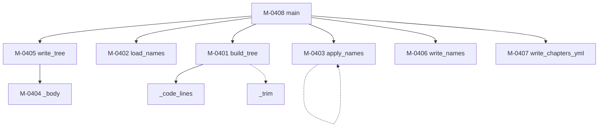

### モジュール構造 {#sec-sp04-struct}

SP-04 を構成するモジュールを @tbl-sp04-mods に、補助モジュールを @tbl-sp04-sub に、
相互関連を @fig-sp04-tree に示す。

::: {.tbl caption="SP-04 モジュール一覧" label="tbl-sp04-mods" widths="12,22,44,22"}
| ID | 名称 | 機能の概要 | 呼出元 |
|---|---|---|---|
| M-0401 | `build_tree` | markdown を前付けと章のツリーに組み立てる | `main` |
| M-0402 | `load_names` | 名前の対応表を読み、キーと ASCII 名の辞書を作る | `main` |
| M-0403 | `apply_names` | ツリーの各節点に ASCII 名を設定する | `main` |
| M-0404 | `_body` | 1ファイルぶんの中身を組み立てる | `write_tree` |
| M-0405 | `write_tree` | ツリーをファイルへ書き出す | `main` |
| M-0406 | `write_names` | 名前の対応表を書き出す | `main` |
| M-0407 | `write_chapters_yml` | 章の並びの断片を書き出す | `main` |
| M-0408 | `main` | 引数を解釈し、全体を制御する | （利用者） |
:::

::: {.tbl caption="SP-04 補助モジュール一覧" label="tbl-sp04-sub" widths="16,14,34,36"}
| 名称 | 戻り値 | 機能 | 備考 |
|---|---|---|---|
| `_code_lines` | `set[int]` | コードブロックの行番号を集める | 共通プログラム（@sec-m0301） |
| `_trim` | `list[str]` | 前後の空行を落とす | 各節点の本文の整形に用いる |
:::

::: {#fig-sp04-tree}

SP-04 モジュール構造
:::

::: {.callout-warning}
M-0403 `apply_names` は**自身を再帰的に呼び出す**（図中の自己ループ）。
再帰の深さは見出しの階層に等しく、`build_tree` がレベル3までしか節点を作らないため、
**最大3段**である。スタックの消費は無視できる。
:::

M-0401 `build_tree` は内部に入れ子の関数 `_current_bucket`（現在の格納先の決定）と
`_assign`（キーの採番。これも再帰）を持つ。M-0405 `write_tree` は `_write`（1ファイルの
書き出し）、M-0406 `write_names` は `_walk`（ツリーの走査。再帰）を持つ。

上記以外に再帰呼出しはなく、循環呼出しもない。


