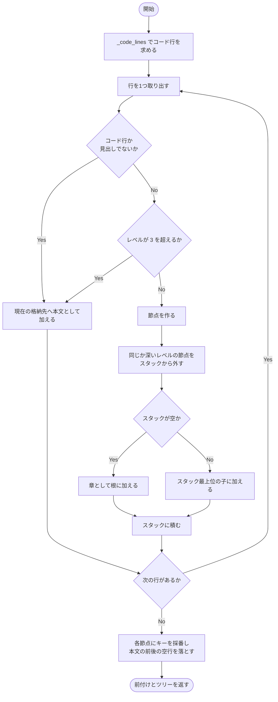
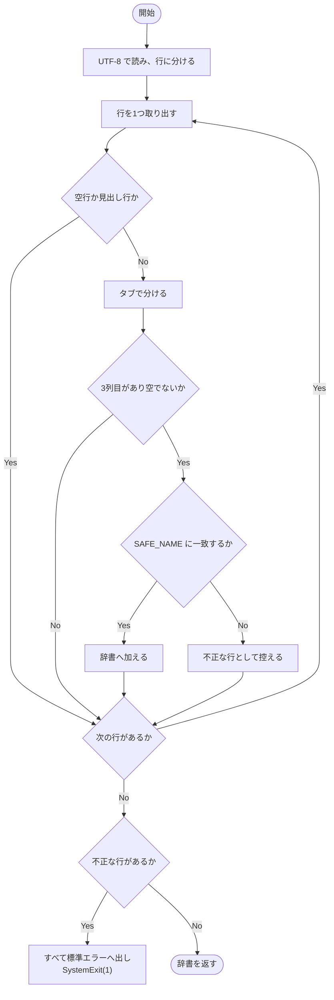
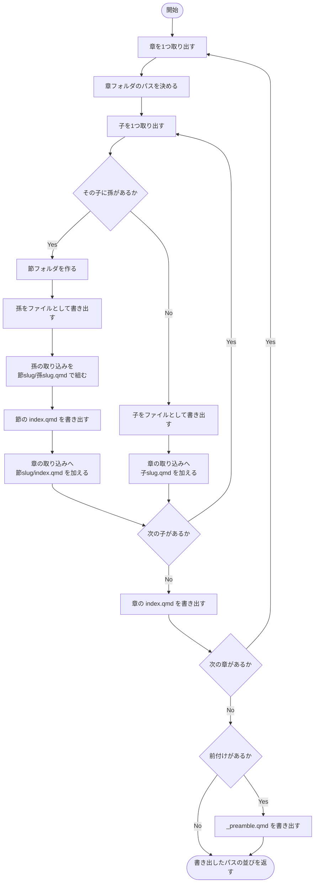
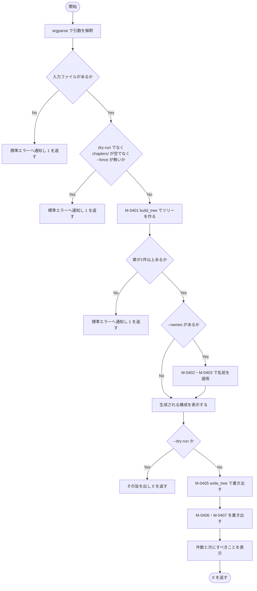

### モジュール詳細 {#sec-sp04-detail}

#### M-0401 `build_tree` {#sec-m0401}

##### 機能

markdown 全文を読み、最初の見出しより前の内容（前付け）と、
章・節・項の節点から成るツリー（`Node`。@sec-lt-node）に組み立てる。

##### インタフェース

```
preamble, roots = build_tree(text)
```

::: {.tbl caption="M-0401 インタフェース" label="tbl-m0401-if" widths="10,16,18,40,16"}
| 区分 | 名称 | 型 | 内容・値域 | 未設定時 |
|:---:|---|---|---|---|
| 引数 | `text` | `str` | 対象の markdown 全文 | 不可（必須） |
| 戻り値 | 第1要素 | `list[str]` | 前付けの行。前後の空行を落としたもの | 空リスト |
| 戻り値 | 第2要素 | `list[Node]` | 章の並び。キーは採番済み | 空リスト |
:::

##### 処理

処理内容を @tbl-m0401-ipo に示す。

::: {.ipo module="M-0401 build_tree" caption="章立てツリーの組み立て" label="tbl-m0401-ipo"}
## 見出しからのツリー構築

### 入力

- 引数 `text`（markdown 全文）
- モジュール定数 `SPLIT_MAX_LEVEL`（分割する最大の見出しレベル。値は 3）

### 処理



### 出力

- 戻り値（前付けの行、章の並び）
:::

キーの採番規則を @tbl-m0401-key に示す。キーは対応表 `_names.tsv` の1列目となる。

::: {.tbl caption="M-0401 キーの採番規則" label="tbl-m0401-key" widths="20,20,60"}
| 階層 | 例 | 規則 |
|---|---|---|
| 章 | `01` | 出現順に1から。2桁の0詰め |
| 節 | `01/02` | 親のキー ＋ `/` ＋ 親の中での出現順 |
| 項 | `01/02/03` | 同上 |
:::

処理条件及び例外条件を @tbl-m0401-exc に示す。

::: {.tbl caption="M-0401 処理条件・例外条件" label="tbl-m0401-exc" widths="12,34,54" merge-cols="1"}
| 区分 | 条件 | 処理内容 |
|---|---|---|
| 事前 | なし | － |
| 例外 | 章より先に節が現れる | その節を章として扱う。文書の先頭がレベル2で始まる場合に備える |
| 例外 | レベルが飛ぶ（章の次が項） | スタックの操作により、直前の章の子として扱う |
| 境界 | 見出しが1つも無い | 前付けのみを返し、章の並びは空になる。M-0408 が「見出しが見つかりません」として 1 を返す |
| 境界 | レベル4以上の見出し | 節点を作らず、直近の節点の本文として保持する |
:::

##### モジュールの呼出し関係

補助モジュール `_code_lines` 及び `_trim` を用いる。内部に入れ子の関数
`_current_bucket` と `_assign`（再帰。深さは最大3）を持つ。

##### その他

M-0408 から起動につき1回呼び出される。ファイルの読み書きを行わない。



#### M-0402 `load_names` {#sec-m0402}

##### 機能

名前の対応表（TSV）を読み、「キー → ASCII 名」の辞書を作る。
ASCII 以外の文字が含まれる場合は、対象をすべて示したうえで異常終了する。

##### インタフェース

```
names = load_names(path)
```

::: {.tbl caption="M-0402 インタフェース" label="tbl-m0402-if" widths="10,14,18,42,16"}
| 区分 | 名称 | 型 | 内容・値域 | 未設定時 |
|:---:|---|---|---|---|
| 引数 | `path` | `Path` | 対応表のパス | 不可（必須） |
| 戻り値 | `names` | `dict[str, str]` | キー → ASCII 名。3列目が空の行は含めない | 空辞書 |
| 例外 | `SystemExit(1)` | － | 使えない文字を含む名前があった場合 | － |
:::

##### 処理

処理内容を @tbl-m0402-ipo に示す。

::: {.ipo module="M-0402 load_names" caption="名前の対応表の読み込み" label="tbl-m0402-ipo"}
## ASCII 名の検証と取り込み

### 入力

- 引数 `path`（対応表ファイル）
- モジュール定数 `SAFE_NAME`（英数字・ピリオド・アンダスコア・ハイフンのみを許す正規表現）

### 処理



### 出力

- 戻り値 `names`（キー → ASCII 名の辞書）
- 不正な名前の一覧（標準エラー出力。異常時のみ）
:::

::: {.callout-note}
不正な名前を見つけても**その場では止めず、全件を調べてからまとめて報告する**。
1件ずつ直して実行し直す手間を避けるためである。
:::

処理条件及び例外条件を @tbl-m0402-exc に示す。

::: {.tbl caption="M-0402 処理条件・例外条件" label="tbl-m0402-exc" widths="12,34,54" merge-cols="1"}
| 区分 | 条件 | 処理内容 |
|---|---|---|
| 事前 | 対応表が UTF-8 であること | 本サブプログラムが書き出したものをそのまま編集する前提 |
| 例外 | ASCII 以外・使えない文字を含む名前 | 対象をすべて報告し `SystemExit(1)` で終了する。設計条件 C-09 に反するファイルを作らないため |
| 例外 | 3列目が無い、又は空 | その行を無視する。名前を付けていない節点は番号のみで生成される |
| 境界 | 対応表が空 | 空辞書を返す。すべて番号のみで生成される |
:::

##### モジュールの呼出し関係

ほかのモジュールを呼び出さない。

##### その他

M-0408 から、`--names` が指定された場合にのみ1回呼び出される。



#### M-0403 `apply_names` {#sec-m0403}

##### 機能

ツリーの各節点に、対応表から得た ASCII 名を設定する。

##### インタフェース

```
apply_names(nodes, names)
```

::: {.tbl caption="M-0403 インタフェース" label="tbl-m0403-if" widths="10,14,18,42,16"}
| 区分 | 名称 | 型 | 内容・値域 | 未設定時 |
|:---:|---|---|---|---|
| 引数 | `nodes` | `list[Node]` | 対象の節点の並び。**内容を書き換える** | 不可（必須） |
| 引数 | `names` | `dict[str, str]` | キー → ASCII 名 | 不可（必須） |
| 戻り値 | － | `None` | 返さない。引数を直接書き換える | － |
:::

##### 処理

処理内容を @tbl-m0403-ipo に示す。

::: {.ipo module="M-0403 apply_names" caption="ASCII 名の設定" label="tbl-m0403-ipo"}
## ツリーへの名前の反映

### 入力

- 引数 `nodes`（節点の並び）
- 引数 `names`（キー → ASCII 名）

### 処理

1. 節点を1つ取り出す。
1. 自身のキーで対応表を引き、見つかれば `name` に設定する。見つからなければ空文字とする。
1. 自身の子の並びに対して、本モジュールを**再帰的に呼び出す**。
1. 節点の並びを終えるまで繰り返す。

### 出力

- 引数 `nodes` の各節点の `name`（直接書き換える）
:::

処理条件及び例外条件を @tbl-m0403-exc に示す。

::: {.tbl caption="M-0403 処理条件・例外条件" label="tbl-m0403-exc" widths="12,34,54" merge-cols="1"}
| 区分 | 条件 | 処理内容 |
|---|---|---|
| 事前 | 各節点のキーが採番済みであること | M-0401 が保証する |
| 例外 | 対応表に無いキー | 空文字を設定する。番号のみの名前で生成される |
| 境界 | 再帰の深さ | 最大3（章・節・項）。`build_tree` がレベル3までしか節点を作らないため |
:::

##### モジュールの呼出し関係

**自身を再帰的に呼び出す。** ほかのモジュールは呼び出さない。循環呼出しはない。

##### その他

M-0408 から、`--names` が指定された場合にのみ、章の並びを引数として1回呼び出される。



#### M-0404 `_body` {#sec-m0404}

##### 機能

1つの節点から、1ファイルぶんの内容（見出し・本文・取り込み）を組み立てる。

##### インタフェース

```
text = _body(node, includes)
```

::: {.tbl caption="M-0404 インタフェース" label="tbl-m0404-if" widths="10,14,18,42,16"}
| 区分 | 名称 | 型 | 内容・値域 | 未設定時 |
|:---:|---|---|---|---|
| 引数 | `node` | `Node` | 対象の節点 | 不可（必須） |
| 引数 | `includes` | `list[str]` | 取り込むファイルのパス。**章フォルダ基準** | 不可（必須。空リスト可） |
| 戻り値 | `text` | `str` | ファイルの内容。末尾に改行を1つ含む | － |
:::

##### 処理

処理内容を @tbl-m0404-ipo に示す。

::: {.ipo module="M-0404 _body" caption="ファイル内容の組み立て" label="tbl-m0404-ipo"}
## 見出し・本文・取り込みの結合

### 入力

- 引数 `node`（節点。レベル・見出し・本文を持つ）
- 引数 `includes`（取り込むファイルのパスの並び）

### 処理

1. 節点のレベルの数だけ `#` を並べ、空白と見出し文字列を続けて先頭の行とする。
1. 節点の本文があれば、それを次の要素として加える。
1. 取り込みがあれば、`` の形で1件ずつ加える。
1. 各要素を空行1つで連結し、末尾に改行を付ける。

### 出力

- 戻り値 `text`（ファイルの内容）
:::

処理条件及び例外条件を @tbl-m0404-exc に示す。

::: {.tbl caption="M-0404 処理条件・例外条件" label="tbl-m0404-exc" widths="12,34,54" merge-cols="1"}
| 区分 | 条件 | 処理内容 |
|---|---|---|
| 事前 | `includes` が章フォルダ基準であること | 呼出元 M-0405 が組み立てる |
| 境界 | 本文が空 | 見出しと取り込みのみのファイルになる |
| 境界 | 取り込みが空 | 見出しと本文のみのファイルになる |
:::

##### モジュールの呼出し関係

ほかのモジュールを呼び出さない。

##### その他

M-0405 から、書き出すファイル1件につき1回呼び出される。



#### M-0405 `write_tree` {#sec-m0405}

##### 機能

章のツリーを、分割の規約に従ってファイル・フォルダへ書き出す。

##### インタフェース

```
written = write_tree(roots, outdir, preamble)
```

::: {.tbl caption="M-0405 インタフェース" label="tbl-m0405-if" widths="10,14,18,42,16"}
| 区分 | 名称 | 型 | 内容・値域 | 未設定時 |
|:---:|---|---|---|---|
| 引数 | `roots` | `list[Node]` | 章の並び | 不可（必須） |
| 引数 | `outdir` | `Path` | 執筆フォルダ | 不可（必須） |
| 引数 | `preamble` | `list[str]` | 前付けの行。空なら書き出さない | 不可（必須） |
| 戻り値 | `written` | `list[Path]` | 書き出したファイルのパスの並び | 空リスト |
:::

##### 処理

処理内容を @tbl-m0405-ipo に示す。

::: {.ipo module="M-0405 write_tree" caption="ツリーのファイル化" label="tbl-m0405-ipo"}
## 規約に従った書き出し

### 入力

- 引数 `roots`（章の並び）
- 引数 `outdir`（執筆フォルダ）
- 引数 `preamble`（前付けの行）

### 処理



### 出力

- 執筆フォルダ配下の `.qmd` ファイル群
- `_preamble.qmd`（前付けがある場合）
- 戻り値 `written`（書き出したパスの並び）
:::

::: {.callout-important}
孫の取り込みパスを「`節slug/孫slug.qmd`」とする点が要である。
節の `index.qmd` から見ると孫は同じフォルダにあるが、`include` のパスは
**章フォルダ基準**であるため、節のフォルダ名を前置きしなければならない。
:::

処理条件及び例外条件を @tbl-m0405-exc に示す。

::: {.tbl caption="M-0405 処理条件・例外条件" label="tbl-m0405-exc" widths="12,34,54" merge-cols="1"}
| 区分 | 条件 | 処理内容 |
|---|---|---|
| 事前 | 出力先が空であるか、`--force` が指定されていること | M-0408 が検査する（設計条件 C-14） |
| 事前 | 各節点のキーと名前が設定済みであること | M-0401 及び M-0403 が保証する |
| 例外 | 親フォルダが存在しない | 書き出しの直前に作成する |
| 例外 | 曾孫（レベル4）以下 | 節点になっていないため、直近の節点の本文に含まれている。個別のファイルにはしない |
| 境界 | 章に子が無い | 章の `index.qmd` のみを書き出す（取り込みは空） |
:::

##### モジュールの呼出し関係

M-0404 を呼び出す。内部に入れ子の関数 `_write`（フォルダの作成とファイルの書き出し）を持つ。
再帰呼出しは行わず、章・節・項の3階層を明示的な繰返しで処理する。

##### その他

M-0408 から起動につき1回呼び出される。改行を LF に固定して書き出す（設計条件 C-07）。



#### M-0406 `write_names` {#sec-m0406}

##### 機能

ツリーの全節点について、キー・見出し・ASCII 名の対応表を書き出す。

##### インタフェース

```
write_names(path, roots)
```

::: {.tbl caption="M-0406 インタフェース" label="tbl-m0406-if" widths="10,14,18,42,16"}
| 区分 | 名称 | 型 | 内容・値域 | 未設定時 |
|:---:|---|---|---|---|
| 引数 | `path` | `Path` | 書き出し先（`_names.tsv`） | 不可（必須） |
| 引数 | `roots` | `list[Node]` | 章の並び | 不可（必須） |
| 戻り値 | － | `None` | 返さない | － |
:::

##### 処理

処理内容を @tbl-m0406-ipo に示す。

::: {.ipo module="M-0406 write_names" caption="名前の対応表の書き出し" label="tbl-m0406-ipo"}
## ツリーの走査と対応表の生成

### 入力

- 引数 `roots`（章の並び）

### 処理

1. 見出し行「キー・見出し・ASCII名」を用意する。
1. 章の並びを先頭から走査する。
1. 各節点について「キー・見出し・現在の ASCII 名」をタブ区切りで加える。
1. 各節点の子に対して**再帰的に**走査する（深さ優先。文書の並び順になる）。
1. UTF-8・LF で書き出す。

### 出力

- 対応表ファイル `_names.tsv`
:::

処理条件及び例外条件を @tbl-m0406-exc に示す。

::: {.tbl caption="M-0406 処理条件・例外条件" label="tbl-m0406-exc" widths="12,34,54" merge-cols="1"}
| 区分 | 条件 | 処理内容 |
|---|---|---|
| 事前 | 各節点のキーが採番済みであること | M-0401 が保証する |
| 例外 | 見出しにタブが含まれる | 列がずれる。markdown の見出しにタブは現れないため対策を設けていない |
| 境界 | `--names` 付きで再実行した場合 | 3列目に現在の名前が入った状態で書き直される。編集内容が保たれる |
:::

##### モジュールの呼出し関係

ほかのモジュールを呼び出さない。内部に入れ子の関数 `_walk`（再帰。深さは最大3）を持つ。

##### その他

M-0408 から起動につき1回呼び出される。`--names` の有無にかかわらず毎回書き出す。



#### M-0407 `write_chapters_yml` {#sec-m0407}

##### 機能

`_quarto.yml` の `chapters:` に転記するための、章の並びの断片を書き出す。

##### インタフェース

```
write_chapters_yml(path, roots)
```

::: {.tbl caption="M-0407 インタフェース" label="tbl-m0407-if" widths="10,14,18,42,16"}
| 区分 | 名称 | 型 | 内容・値域 | 未設定時 |
|:---:|---|---|---|---|
| 引数 | `path` | `Path` | 書き出し先（`_chapters.yml`） | 不可（必須） |
| 引数 | `roots` | `list[Node]` | 章の並び | 不可（必須） |
| 戻り値 | － | `None` | 返さない | － |
:::

##### 処理

処理内容を @tbl-m0407-ipo に示す。

::: {.ipo module="M-0407 write_chapters_yml" caption="章の並びの書き出し" label="tbl-m0407-ipo"}
## chapters 断片の生成

### 入力

- 引数 `roots`（章の並び）

### 処理

1. 用途と注意（取り込まれる子ファイルは書かないこと）を注記として2行書く。
1. `book:` と `chapters:` の見出しを書く。
1. `index.qmd`（前付け）を最初の項目として書く。
1. 章ごとに `chapters/章slug/index.qmd` を書く。
1. UTF-8・LF で書き出す。

### 出力

- 断片ファイル `_chapters.yml`
:::

::: {.callout-note}
執筆フォルダの `_quarto.yml` を直接書き換えない。表題・資料番号・会社名など
利用者が設定した内容を壊す恐れがあるため、**転記用の断片を別ファイルとして出す**。
:::

処理条件及び例外条件を @tbl-m0407-exc に示す。

::: {.tbl caption="M-0407 処理条件・例外条件" label="tbl-m0407-exc" widths="12,34,54" merge-cols="1"}
| 区分 | 条件 | 処理内容 |
|---|---|---|
| 事前 | 各節点のキーと名前が設定済みであること | M-0401 及び M-0403 が保証する |
| 境界 | 章が0件 | `index.qmd` のみの並びを書き出す。ただし M-0408 が事前に 1 を返すため到達しない |
:::

##### モジュールの呼出し関係

ほかのモジュールを呼び出さない。

##### その他

M-0408 から起動につき1回呼び出される。



#### M-0408 `main` {#sec-m0408}

##### 機能

コマンドライン引数を解釈し、ツリーの構築・名前の適用・構成の提示・書き出しを行う。

##### インタフェース

```
code = main(argv)
```

::: {.tbl caption="M-0408 インタフェース" label="tbl-m0408-if" widths="10,14,18,42,16"}
| 区分 | 名称 | 型 | 内容・値域 | 未設定時 |
|:---:|---|---|---|---|
| 引数 | `argv` | `list[str] \| None` | コマンドライン引数 | `None` |
| 戻り値 | `code` | `int` | 0＝正常、1＝入力が無い・出力先が空でない・見出しが無い・`--size` 解釈不能 | － |
:::

##### 処理

処理内容を @tbl-m0408-ipo に示す。

::: {.ipo module="M-0408 main" caption="SP-04 の全体制御" label="tbl-m0408-ipo"}
## 検査から書き出しまで

### 入力

- 引数 `argv`（コマンドライン引数）
- 入力の markdown ファイル、名前の対応表（任意）

### 処理



### 出力

- 生成される構成の一覧（標準出力）
- 執筆フォルダ配下のファイル群、`_names.tsv`、`_chapters.yml`、`_preamble.qmd`
- 戻り値 `code`
:::

処理条件及び例外条件を @tbl-m0408-exc に示す。

::: {.tbl caption="M-0408 処理条件・例外条件" label="tbl-m0408-exc" widths="12,34,54" merge-cols="1"}
| 区分 | 条件 | 処理内容 |
|---|---|---|
| 事前 | なし | － |
| 例外 | 入力ファイルが無い | メッセージ E-401 を出し 1 を返す |
| 例外 | 出力先の `chapters/` が空でない | メッセージ E-402 を出し 1 を返す。`--force` があれば継続する（設計条件 C-14） |
| 例外 | 見出しが1つも無い | メッセージ E-403 を出し 1 を返す |
| 例外 | 対応表に使えない名前がある | M-0402 が `SystemExit(1)` で終了する |
| 境界 | `--dry-run` 指定 | 構成を表示するだけで、既存ファイルの検査も書き出しも行わない |
:::

##### モジュールの呼出し関係

M-0401、M-0402、M-0403、M-0405、M-0406、M-0407 を呼び出す。
再帰呼出し及び循環呼出しはない。

##### その他

利用者がコマンドラインから起動したときに1回だけ実行される。
書き出し後、名前を付け直す手順（`_names.tsv` を埋めて再実行）を案内する。


