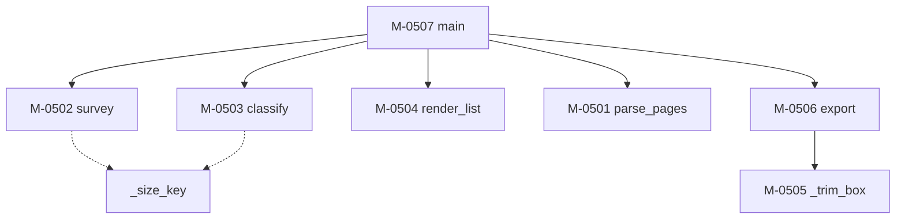

### モジュール構造 {#sec-sp05-struct}

SP-05 を構成するモジュールを @tbl-sp05-mods に、補助モジュールを @tbl-sp05-sub に、
相互関連を @fig-sp05-tree に示す。

::: {.tbl caption="SP-05 モジュール一覧" label="tbl-sp05-mods" widths="12,20,46,22"}
| ID | 名称 | 機能の概要 | 呼出元 |
|---|---|---|---|
| M-0501 | `parse_pages` | ページ指定の文字列をページ番号の並びに変換する | `main` |
| M-0502 | `survey` | ページごとの用紙サイズ・文字数・描画数・画像数を集める | `main` |
| M-0503 | `classify` | 本文の用紙サイズを推定し、各ページに判定を付ける | `main` |
| M-0504 | `render_list` | ページ一覧と図の候補を整形して出力する | `main` |
| M-0505 | `_trim_box` | 描画と文字が占める範囲を求める | `export` |
| M-0506 | `export` | 指定ページを SVG として書き出す | `main` |
| M-0507 | `main` | 引数を解釈し、全体を制御する | （利用者） |
:::

::: {.tbl caption="SP-05 補助モジュール一覧" label="tbl-sp05-sub" widths="16,14,34,36"}
| 名称 | 戻り値 | 機能 | 備考 |
|---|---|---|---|
| `_size_key` | `tuple[int,int]` | ページの幅と高さを整数に丸めた組を返す | 用紙サイズの集計キーに用いる |
:::

::: {#fig-sp05-tree}

SP-05 モジュール構造
:::

`survey` → `classify` の順に呼び、`classify` は `survey` の結果に判定を書き加える。
`classify` は引数の内容を直接書き換えるため、順序を入れ替えてはならない。

再帰呼出し及び循環呼出しはない。

#### 外部ライブラリへの依存

本サブプログラムは PyMuPDF（`fitz`）に依存する。@tbl-sp05-dep に使用する機能を示す。

::: {.tbl caption="PyMuPDF の使用機能" label="tbl-sp05-dep" widths="30,70"}
| 機能 | 用途 |
|---|---|
| `fitz.open` | PDF を開く |
| `Page.rect` | 用紙サイズと向きの判定 |
| `Page.get_text` | 文字数の計数、余白除去の範囲算出 |
| `Page.get_drawings` | 描画数の計数、余白除去の範囲算出 |
| `Page.get_images` | 画像数の計数 |
| `Page.set_cropbox` | 余白の除去 |
| `Page.get_svg_image` | SVG への書き出し |
:::


