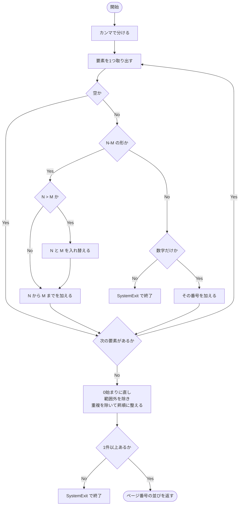
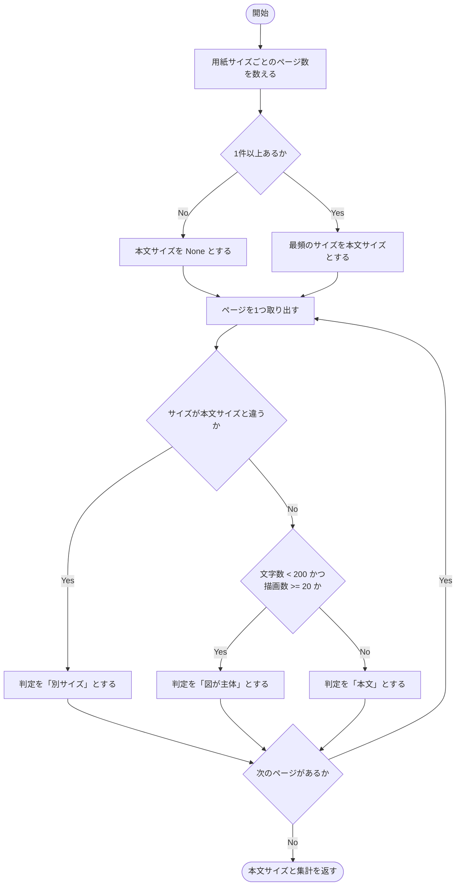
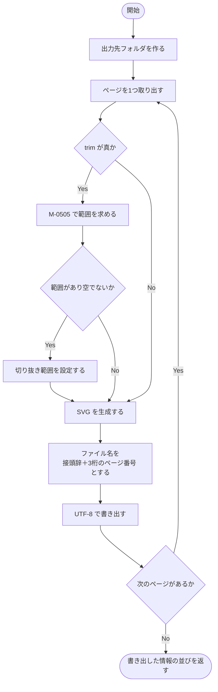
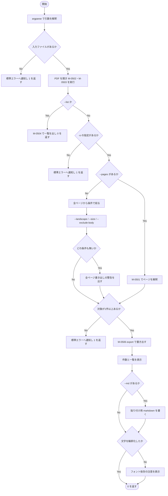

### モジュール詳細 {#sec-sp05-detail}

#### M-0501 `parse_pages` {#sec-m0501}

##### 機能

`3-7,12` のようなページ指定の文字列を、0 始まりのページ番号の並びに変換する。

##### インタフェース

```
pages = parse_pages(spec, total)
```

::: {.tbl caption="M-0501 インタフェース" label="tbl-m0501-if" widths="10,14,18,42,16"}
| 区分 | 名称 | 型 | 内容・値域 | 未設定時 |
|:---:|---|---|---|---|
| 引数 | `spec` | `str` | ページ指定。カンマ区切り。範囲はハイフン。**1始まり** | 不可（必須） |
| 引数 | `total` | `int` | PDF の総ページ数 | 不可（必須） |
| 戻り値 | `pages` | `list[int]` | **0始まり**のページ番号。昇順・重複なし | － |
| 例外 | `SystemExit` | － | 解釈できない指定、又は範囲内のページが1件も無い場合 | － |
:::

##### 処理

処理内容を @tbl-m0501-ipo に示す。

::: {.ipo module="M-0501 parse_pages" caption="ページ指定の解釈" label="tbl-m0501-ipo"}
## 指定文字列からページ番号への変換

### 入力

- 引数 `spec`（ページ指定の文字列）
- 引数 `total`（総ページ数）

### 処理



### 出力

- 戻り値 `pages`（0始まりのページ番号の並び）
:::

処理条件及び例外条件を @tbl-m0501-exc に示す。

::: {.tbl caption="M-0501 処理条件・例外条件" label="tbl-m0501-exc" widths="12,34,54" merge-cols="1"}
| 区分 | 条件 | 処理内容 |
|---|---|---|
| 事前 | なし | － |
| 例外 | 数字でも範囲でもない要素 | メッセージ E-501 を出し `SystemExit` で終了する |
| 例外 | 範囲内のページが1件も無い | メッセージ E-502 を出し `SystemExit` で終了する |
| 例外 | 範囲の始点が終点より大きい（`12-3`） | 入れ替えて解釈する。利用者の書き間違いを許容する |
| 境界 | 総ページ数を超える指定 | 黙って除く。範囲内が残れば処理を続ける |
| 境界 | 同じページの重複指定 | 集合により1件に畳む |
:::

##### モジュールの呼出し関係

ほかのモジュールを呼び出さない。

##### その他

M-0507 から、`--pages` が指定された場合にのみ1回呼び出される。



#### M-0502 `survey` {#sec-m0502}

##### 機能

PDF の全ページについて、用紙サイズ・向き・文字数・描画数・画像数を集める。

##### インタフェース

```
rows = survey(doc)
```

::: {.tbl caption="M-0502 インタフェース" label="tbl-m0502-if" widths="10,14,18,42,16"}
| 区分 | 名称 | 型 | 内容・値域 | 未設定時 |
|:---:|---|---|---|---|
| 引数 | `doc` | `fitz.Document` | 開かれた PDF | 不可（必須） |
| 戻り値 | `rows` | `list[dict]` | ページごとの素性。キーは `index`・`size`・`landscape`・`chars`・`drawings`・`images` | 空リスト |
:::

##### 処理

処理内容を @tbl-m0502-ipo に示す。

::: {.ipo module="M-0502 survey" caption="ページの素性の収集" label="tbl-m0502-ipo"}
## ページごとの計測

### 入力

- 引数 `doc`（開かれた PDF）

### 処理

1. ページを先頭から順に取り出す。
1. 用紙の幅と高さを整数に丸め、組にする。
1. 幅が高さより大きければ横向きとする。
1. 文字を取り出し、**空白を除いた文字数**を数える。
1. 描画（ベクター図形）の数を数える。例外が起きた場合は 0 とする。
1. 埋め込み画像の数を数える。
1. 上記を辞書にまとめ、並びへ加える。

### 出力

- 戻り値 `rows`（ページごとの素性の並び）
:::

処理条件及び例外条件を @tbl-m0502-exc に示す。

::: {.tbl caption="M-0502 処理条件・例外条件" label="tbl-m0502-exc" widths="12,34,54" merge-cols="1"}
| 区分 | 条件 | 処理内容 |
|---|---|---|
| 事前 | `doc` が開かれていること | 呼出元 M-0507 が保証する |
| 例外 | 描画の取得に失敗する | 描画数を 0 とし、処理を続ける。特殊な描画命令を含む PDF に備える |
| 境界 | 0 ページの PDF | 空リストを返す |
| 境界 | 文字を持たないページ | 文字数 0 となり、判定「図が主体」の条件を満たしやすくなる |
:::

##### モジュールの呼出し関係

補助モジュール `_size_key` を用いる。ほかのモジュールは呼び出さない。

##### その他

M-0507 から起動につき1回呼び出される。`--list` の有無にかかわらず必ず実行する。



#### M-0503 `classify` {#sec-m0503}

##### 機能

用紙サイズの最頻値を本文サイズと推定し、各ページに判定を書き加える。

##### インタフェース

```
body_size, counts = classify(rows)
```

::: {.tbl caption="M-0503 インタフェース" label="tbl-m0503-if" widths="10,16,18,40,16"}
| 区分 | 名称 | 型 | 内容・値域 | 未設定時 |
|:---:|---|---|---|---|
| 引数 | `rows` | `list[dict]` | M-0502 の結果。**各要素に `verdict` を書き加える** | 不可（必須） |
| 戻り値 | 第1要素 | `tuple[int,int] \| None` | 本文とみなした用紙サイズ。`rows` が空なら `None` | － |
| 戻り値 | 第2要素 | `Counter` | 用紙サイズごとのページ数 | － |
:::

##### 処理

処理内容を @tbl-m0503-ipo に示す。

::: {.ipo module="M-0503 classify" caption="本文サイズの推定と判定" label="tbl-m0503-ipo"}
## ページ判定の付与

### 入力

- 引数 `rows`（M-0502 が集めた素性）

### 処理



### 出力

- 引数 `rows` の各要素の `verdict`（直接書き加える）
- 戻り値（本文サイズ、用紙サイズごとの集計）
:::

::: {.callout-note}
しきい値（文字数 200 未満、描画数 20 以上）はモジュール定数ではなく本モジュール内に
直接書かれている。調整が要る場合は本モジュールを修正する。
:::

処理条件及び例外条件を @tbl-m0503-exc に示す。

::: {.tbl caption="M-0503 処理条件・例外条件" label="tbl-m0503-exc" widths="12,34,54" merge-cols="1"}
| 区分 | 条件 | 処理内容 |
|---|---|---|
| 事前 | `rows` が M-0502 の結果であること | 必要なキーが揃っていないと例外となる |
| 境界 | `rows` が空 | 本文サイズを `None` とし、判定を付けない |
| 境界 | 用紙サイズが全ページ同一 | 「別サイズ」は生じず、文字数と描画数のみで判定される |
| 境界 | 最頻のサイズが複数ある | `Counter.most_common` の順（先に現れたもの）を採る |
:::

##### モジュールの呼出し関係

補助モジュール `_size_key` を用いる。ほかのモジュールは呼び出さない。

##### その他

M-0507 から、M-0502 の直後に1回呼び出される。



#### M-0504 `render_list` {#sec-m0504}

##### 機能

用紙サイズの分布とページ一覧を整形して出力し、図の候補を `--pages` の形で提示する。

##### インタフェース

```
render_list(rows, counts, body_size, stream)
```

::: {.tbl caption="M-0504 インタフェース" label="tbl-m0504-if" widths="10,16,20,38,16"}
| 区分 | 名称 | 型 | 内容・値域 | 未設定時 |
|:---:|---|---|---|---|
| 引数 | `rows` | `list[dict]` | 判定済みのページの素性 | 不可（必須） |
| 引数 | `counts` | `Counter` | 用紙サイズごとのページ数 | 不可（必須） |
| 引数 | `body_size` | `tuple \| None` | 本文とみなした用紙サイズ | 不可（必須） |
| 引数 | `stream` | ファイル様オブジェクト | 書き出し先 | 不可（必須） |
| 戻り値 | － | `None` | 返さない | － |
:::

##### 処理

処理内容を @tbl-m0504-ipo に示す。

::: {.ipo module="M-0504 render_list" caption="ページ一覧の提示" label="tbl-m0504-ipo"}
## 選別のための情報提示

### 入力

- 引数 `rows`・`counts`・`body_size`

### 処理

1. 用紙サイズの分布を、ページ数の多い順に書く。向き（縦・横）を添える。
   本文とみなしたサイズには「最も多いので本文とみなす」と注記する。
1. ページ一覧の見出しを書く。
1. ページごとに、番号・サイズと向き・文字数・描画数・画像数・判定を桁を揃えて書く。
1. 判定が「本文」でないページの番号を集める。
1. 1件以上あれば件数と `--pages` の指定文字列を提示する。
   0 件であれば `--pages` で明示的に指定するよう促す。

### 出力

- ページ一覧と図の候補（引数 `stream`）
:::

処理条件及び例外条件を @tbl-m0504-exc に示す。

::: {.tbl caption="M-0504 処理条件・例外条件" label="tbl-m0504-exc" widths="12,34,54" merge-cols="1"}
| 区分 | 条件 | 処理内容 |
|---|---|---|
| 事前 | `rows` に判定が付いていること | M-0503 が保証する |
| 境界 | 図の候補が0件 | 候補一覧の代わりに、明示指定を促す文を出す |
| 境界 | ページ数が多い | 全ページを出力する。件数を絞らない（選別が目的のため） |
:::

##### モジュールの呼出し関係

ほかのモジュールを呼び出さない。

##### その他

M-0507 から、`--list` が指定された場合にのみ1回呼び出される。
呼び出された場合、SVG の書き出しは行わずに終了する。



#### M-0505 `_trim_box` {#sec-m0505}

##### 機能

ページ内で描画と文字が占める範囲を求め、少しの余白を加えた矩形を返す。
`--trim` 指定時の切り抜き範囲として用いる。

##### インタフェース

```
box = _trim_box(page)
```

::: {.tbl caption="M-0505 インタフェース" label="tbl-m0505-if" widths="10,14,18,42,16"}
| 区分 | 名称 | 型 | 内容・値域 | 未設定時 |
|:---:|---|---|---|---|
| 引数 | `page` | `fitz.Page` | 対象のページ | 不可（必須） |
| 戻り値 | `box` | `fitz.Rect \| None` | 内容を含む矩形。内容が無ければ `None` | － |
:::

##### 処理

処理内容を @tbl-m0505-ipo に示す。

::: {.ipo module="M-0505 _trim_box" caption="内容の占める範囲の算出" label="tbl-m0505-ipo"}
## 切り抜き範囲の決定

### 入力

- 引数 `page`（対象のページ）

### 処理

1. 文字ブロックを順に取り出し、その矩形の和を取る。
1. 描画を順に取り出し、その矩形の和を取る。取得に失敗した場合は無視する。
1. 和が空、又は1件も無ければ `None` を返す。
1. 上下左右に 6 ポイントの余白を加える。
1. ページの矩形との共通部分を取り、はみ出しを防ぐ。

### 出力

- 戻り値 `box`（切り抜く矩形。内容が無ければ `None`）
:::

処理条件及び例外条件を @tbl-m0505-exc に示す。

::: {.tbl caption="M-0505 処理条件・例外条件" label="tbl-m0505-exc" widths="12,34,54" merge-cols="1"}
| 区分 | 条件 | 処理内容 |
|---|---|---|
| 事前 | なし | － |
| 例外 | 描画の取得に失敗する | 文字の範囲だけで矩形を求める |
| 例外 | 内容が1つも無い（白紙） | `None` を返す。呼出元は切り抜きを行わない |
| 境界 | 内容がページ全面に及ぶ | 余白を加えた結果がページを超えるが、共通部分を取るためページ内に収まる |
:::

##### モジュールの呼出し関係

ほかのモジュールを呼び出さない。

##### その他

M-0506 から、`--trim` が指定された場合にページごとに1回呼び出される。



#### M-0506 `export` {#sec-m0506}

##### 機能

指定されたページを SVG として書き出す。

##### インタフェース

```
written = export(doc, pages, outdir, prefix, outline_text, trim)
```

::: {.tbl caption="M-0506 インタフェース" label="tbl-m0506-if" widths="10,16,18,40,16"}
| 区分 | 名称 | 型 | 内容・値域 | 未設定時 |
|:---:|---|---|---|---|
| 引数 | `doc` | `fitz.Document` | 開かれた PDF | 不可（必須） |
| 引数 | `pages` | `list[int]` | 書き出すページ番号（0始まり） | 不可（必須） |
| 引数 | `outdir` | `Path` | 出力先フォルダ。無ければ作る | 不可（必須） |
| 引数 | `prefix` | `str` | ファイル名の接頭辞 | 不可（必須） |
| 引数 | `outline_text` | `bool` | 真なら文字を輪郭化する | 不可（必須） |
| 引数 | `trim` | `bool` | 真なら余白を落とす | 不可（必須） |
| 戻り値 | `written` | `list[tuple]` | (ページ番号, パス, バイト数) の並び | 空リスト |
:::

##### 処理

処理内容を @tbl-m0506-ipo に示す。

::: {.ipo module="M-0506 export" caption="SVG の書き出し" label="tbl-m0506-ipo"}
## ページのベクター出力

### 入力

- 引数 `doc`・`pages`・`outdir`・`prefix`・`outline_text`・`trim`

### 処理



### 出力

- SVG ファイル（出力先フォルダ）
- 戻り値 `written`（ページ番号・パス・バイト数の並び）
:::

処理条件及び例外条件を @tbl-m0506-exc に示す。

::: {.tbl caption="M-0506 処理条件・例外条件" label="tbl-m0506-exc" widths="12,34,54" merge-cols="1"}
| 区分 | 条件 | 処理内容 |
|---|---|---|
| 事前 | `pages` が範囲内であること | M-0501 又は M-0507 の絞り込みが保証する |
| 例外 | 切り抜き範囲が求まらない | 切り抜きを行わずページ全体を出力する |
| 例外 | 同名ファイルが既にある | 上書きする。ファイル名はページ番号で決まるため、同じ PDF から出し直す場合に限られる |
| 境界 | ページ番号が3桁を超える | 桁が増えるだけで動作に支障はない。ただし整列順が崩れる |
:::

##### モジュールの呼出し関係

M-0505 を呼び出す（`--trim` 指定時のみ）。再帰呼出し及び循環呼出しはない。

##### その他

M-0507 から起動につき1回呼び出される。



#### M-0507 `main` {#sec-m0507}

##### 機能

コマンドライン引数を解釈し、ページの調査・判定・提示・選別・書き出しを行う。

##### インタフェース

```
code = main(argv)
```

::: {.tbl caption="M-0507 インタフェース" label="tbl-m0507-if" widths="10,14,18,42,16"}
| 区分 | 名称 | 型 | 内容・値域 | 未設定時 |
|:---:|---|---|---|---|
| 引数 | `argv` | `list[str] \| None` | コマンドライン引数 | `None` |
| 戻り値 | `code` | `int` | 0＝正常、1＝入力が無い・出力先未指定・`--size` 解釈不能・対象ページが無い | － |
:::

##### 処理

処理内容を @tbl-m0507-ipo に示す。

::: {.ipo module="M-0507 main" caption="SP-05 の全体制御" label="tbl-m0507-ipo"}
## 調査から書き出しまで

### 入力

- 引数 `argv`（コマンドライン引数）
- 入力の PDF

### 処理



### 出力

- ページ一覧（`--list` 指定時。標準出力）
- SVG ファイル群、貼り付け用 markdown（`--md` 指定時）
- 書き出し結果と注意（標準出力）
- 戻り値 `code`
:::

貼り付け用 markdown の形式を @tbl-m0507-md に示す。

::: {.tbl caption="貼り付け用 markdown の形式" label="tbl-m0507-md" widths="24,76"}
| ページの向き | 出力 |
|---|---|
| 縦 | `{#fig-pNNN width=80%}` |
| 横 | 上記を `::: {.landscape}` 〜 `:::` で囲む |
:::

先頭には、IPO 図とフローチャートは貼らずに `.ipo` ／ mermaid へ作り直すべき旨を
コメントとして書き添える。

処理条件及び例外条件を @tbl-m0507-exc に示す。

::: {.tbl caption="M-0507 処理条件・例外条件" label="tbl-m0507-exc" widths="12,34,54" merge-cols="1"}
| 区分 | 条件 | 処理内容 |
|---|---|---|
| 事前 | PyMuPDF が導入済みであること | 未導入の場合、読み込み時にメッセージ E-503 を出して終了する |
| 例外 | 入力ファイルが無い | メッセージ E-504 を出し 1 を返す |
| 例外 | `--list` でなく `-o` が無い | メッセージ E-505 を出し 1 を返す |
| 例外 | `--size` の形式が不正 | メッセージ E-506 を出し 1 を返す |
| 例外 | 条件に合うページが0件 | メッセージ E-507 を出し 1 を返す |
| 例外 | 絞り込みの条件が1つも無い | 警告 W-501 を出したうえで全ページを書き出す |
:::

##### モジュールの呼出し関係

M-0502、M-0503、M-0504、M-0501、M-0506 を呼び出す。
再帰呼出し及び循環呼出しはない。

##### その他

利用者がコマンドラインから起動したときに1回だけ実行される。


