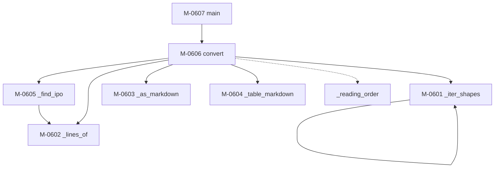

### モジュール構造 {#sec-sp06-struct}

SP-06 を構成するモジュールを @tbl-sp06-mods に、補助モジュールを @tbl-sp06-sub に、
相互関連を @fig-sp06-tree に示す。

::: {.tbl caption="SP-06 モジュール一覧" label="tbl-sp06-mods" widths="12,22,44,22"}
| ID | 名称 | 機能の概要 | 呼出元 |
|---|---|---|---|
| M-0601 | `_iter_shapes` | グループの中まで辿り、すべての図形を返す | `convert` |
| M-0602 | `_lines_of` | 図形の中の文字を、箇条書きの階層つきで取り出す | `convert` ほか |
| M-0603 | `_as_markdown` | 文字の並びを段落・箇条書きに整形する | `convert` |
| M-0604 | `_table_markdown` | PowerPoint の表を markdown のパイプ表にする | `convert` |
| M-0605 | `_find_ipo` | 入力・処理・出力の3欄を持つか調べ、中身を返す | `convert` |
| M-0606 | `convert` | スライドを順に処理し、markdown を組み立てる | `main` |
| M-0607 | `main` | 引数を解釈し、全体を制御する | （利用者） |
:::

::: {.tbl caption="SP-06 補助モジュール一覧" label="tbl-sp06-sub" widths="18,14,32,36"}
| 名称 | 戻り値 | 機能 | 備考 |
|---|---|---|---|
| `_reading_order` | `list` | 図形を上から下、左から右に並べ替える | 縦方向は約 0.2 インチの許容で同じ行とみなす |
:::

::: {#fig-sp06-tree}

SP-06 モジュール構造
:::

::: {.callout-warning}
M-0601 `_iter_shapes` は**自身を再帰的に呼び出す**（図中の自己ループ）。
再帰の深さは PowerPoint の図形グループの入れ子の深さに等しい。
PowerPoint の操作上、実務で数段を超えることはない。
:::

`_reading_order` は内部に入れ子の関数 `key`（整列キーの算出）を持つ。
上記以外に再帰呼出しはなく、循環呼出しもない。

#### 外部ライブラリへの依存

本サブプログラムは python-pptx に依存する。@tbl-sp06-dep に使用する機能を示す。

::: {.tbl caption="python-pptx の使用機能" label="tbl-sp06-dep" widths="34,66"}
| 機能 | 用途 |
|---|---|
| `Presentation` | ファイルを開く |
| `slide.shapes` / `shape.shapes` | 図形の走査（グループの内側を含む） |
| `shape.shape_type` | グループ・画像・線の判別 |
| `shape.top` / `shape.left` | 読み順の決定 |
| `shape.text_frame.paragraphs` | 文字と箇条書きの階層の取得 |
| `shape.has_table` / `table.rows` | 表の取得 |
| `cell.is_spanned` | 結合セルの判別 |
| `shape.image` | 画像の取り出し |
| `slide.shapes.title` / `shape.shape_id` | タイトルの取得と同定 |
| `slide.notes_slide` | 発表者ノートの取得 |
:::

::: {.callout-important}
`slide.shapes.title` は**アクセスのたびに別のラッパオブジェクトを返す**。
同一性の判定には `is` ではなく `shape_id` を用いること。
`is` で比較すると常に偽となり、タイトルが本文にも重複して出力される。
:::


