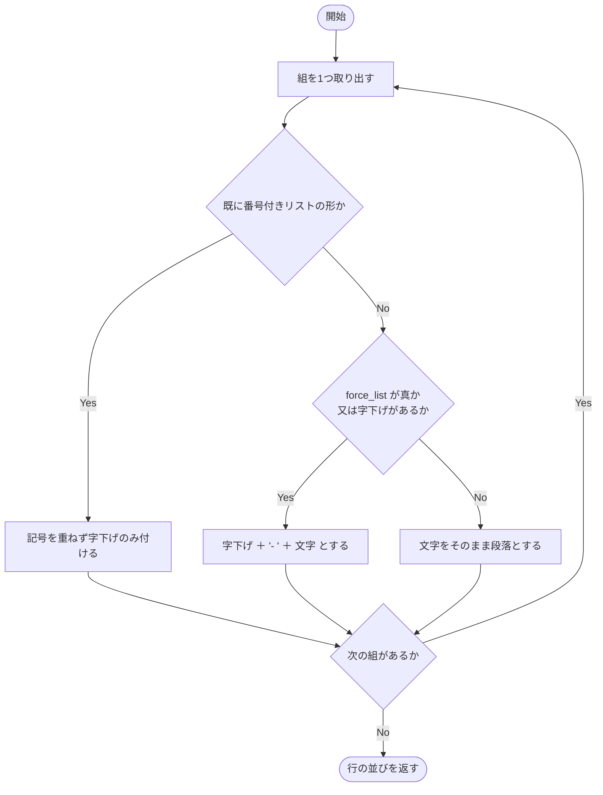
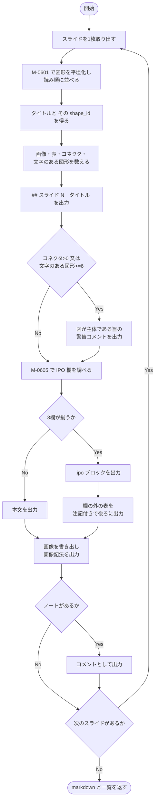
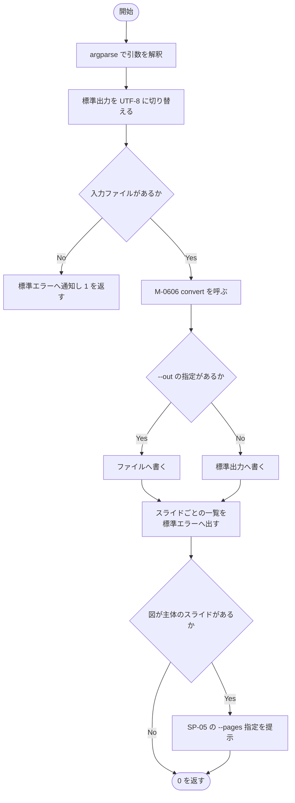

### モジュール詳細 {#sec-sp06-detail}

#### M-0601 `_iter_shapes` {#sec-m0601}

##### 機能

図形の並びを走査し、グループの内側まで辿ってすべての図形を返す。

##### インタフェース

```
for shape in _iter_shapes(shapes): …
```

::: {.tbl caption="M-0601 インタフェース" label="tbl-m0601-if" widths="10,14,20,40,16"}
| 区分 | 名称 | 型 | 内容・値域 | 未設定時 |
|:---:|---|---|---|---|
| 引数 | `shapes` | 図形の並び | スライドの図形、又はグループの図形 | 不可（必須） |
| 戻り値 | － | 生成器 | 図形を1つずつ返す。**グループ自体は返さない** | － |
:::

##### 処理

処理内容を @tbl-m0601-ipo に示す。

::: {.ipo module="M-0601 _iter_shapes" caption="図形の平坦化" label="tbl-m0601-ipo"}
## グループの再帰的な展開

### 入力

- 引数 `shapes`（図形の並び）

### 処理

1. 図形を1つ取り出す。
1. 種別がグループであれば、その図形の子の並びに対して**自身を再帰的に呼び出し**、
   得られた図形をそのまま返す。
1. グループでなければ、その図形を返す。
1. 並びを終えるまで繰り返す。

### 出力

- 図形（1つずつ返す生成器）
:::

処理条件及び例外条件を @tbl-m0601-exc に示す。

::: {.tbl caption="M-0601 処理条件・例外条件" label="tbl-m0601-exc" widths="12,34,54" merge-cols="1"}
| 区分 | 条件 | 処理内容 |
|---|---|---|
| 事前 | なし | － |
| 境界 | グループの入れ子 | 深さの制限を設けていない。PowerPoint の操作上、実務で問題となる深さにはならない |
| 境界 | 空のグループ | 何も返さない |
:::

##### モジュールの呼出し関係

**自身を再帰的に呼び出す。** ほかのモジュールは呼び出さない。循環呼出しはない。

##### その他

M-0606 から、スライド1枚につき1回呼び出される。



#### M-0602 `_lines_of` {#sec-m0602}

##### 機能

図形の中の文字を、箇条書きの階層を保ったまま取り出す。

##### インタフェース

```
lines = _lines_of(shape)
```

::: {.tbl caption="M-0602 インタフェース" label="tbl-m0602-if" widths="10,14,20,40,16"}
| 区分 | 名称 | 型 | 内容・値域 | 未設定時 |
|:---:|---|---|---|---|
| 引数 | `shape` | 図形 | 文字枠を持たない図形でもよい | 不可（必須） |
| 戻り値 | `lines` | `list[tuple[str,str]]` | (字下げ, 文字) の並び。文字枠が無い場合は空リスト | 空リスト |
:::

##### 処理

処理内容を @tbl-m0602-ipo に示す。

::: {.ipo module="M-0602 _lines_of" caption="図形内の文字の取得" label="tbl-m0602-ipo"}
## 段落と階層の抽出

### 入力

- 引数 `shape`（図形）
- モジュール定数 `BULLET`（行頭の箇条書き記号に一致する正規表現）

### 処理

1. 図形が文字枠を持たなければ空リストを返す。
1. 段落を1つ取り出す。
1. 段落内の文字要素を連結し、前後の空白を落とす。
1. 空であれば飛ばす。
1. 段落の階層（0 以上）の数だけ空白2文字を並べ、字下げとする。
1. 行頭の箇条書き記号（`・` `•` `●` `-` 等）を取り除く。
1. (字下げ, 文字) の組として並びへ加える。

### 出力

- 戻り値 `lines`（字下げと文字の組の並び）
:::

::: {.callout-note}
PowerPoint は箇条書き記号を書式として持つが、本文に記号そのものが打ち込まれている
場合も多い。二重に記号が付くのを防ぐため、行頭の記号を取り除いている。
:::

処理条件及び例外条件を @tbl-m0602-exc に示す。

::: {.tbl caption="M-0602 処理条件・例外条件" label="tbl-m0602-exc" widths="12,34,54" merge-cols="1"}
| 区分 | 条件 | 処理内容 |
|---|---|---|
| 事前 | なし | 文字枠を持たない図形を渡してもよい |
| 例外 | 段落が空 | 飛ばす。空行が並ぶのを防ぐ |
| 境界 | 階層が負 | 0 とみなす（`max` により下限を設ける） |
| 境界 | 文字が記号のみ | 記号を取り除いた結果が空になり、その段落は空として扱われない（取り除きは前後の空白落としより後のため、空文字として残る） |
:::

##### モジュールの呼出し関係

ほかのモジュールを呼び出さない。

##### その他

M-0606 及び M-0605 から、図形ごとに呼び出される。



#### M-0603 `_as_markdown` {#sec-m0603}

##### 機能

(字下げ, 文字) の並びを、markdown の段落又は箇条書きに整形する。

##### インタフェース

```
out = _as_markdown(lines, force_list=False)
```

::: {.tbl caption="M-0603 インタフェース" label="tbl-m0603-if" widths="10,16,18,40,16"}
| 区分 | 名称 | 型 | 内容・値域 | 未設定時 |
|:---:|---|---|---|---|
| 引数 | `lines` | `list[tuple[str,str]]` | M-0602 の結果 | 不可（必須） |
| 引数 | `force_list` | `bool` | 真なら字下げが無くても箇条書きにする | `False` |
| 戻り値 | `out` | `list[str]` | markdown の行の並び | 空リスト |
:::

##### 処理

処理内容を @tbl-m0603-ipo に示す。

::: {.ipo module="M-0603 _as_markdown" caption="段落と箇条書きの整形" label="tbl-m0603-ipo"}
## markdown への整形

### 入力

- 引数 `lines`（字下げと文字の組の並び）
- 引数 `force_list`（強制的に箇条書きにするか）
- モジュール定数 `NUMBERED`（既に番号付きリストの形の行に一致する正規表現）

### 処理



### 出力

- 戻り値 `out`（markdown の行の並び）
:::

::: {.callout-note}
`1. 入力値を検証` のように既に番号付きリストの形になっている行に `-` を重ねると、
`- 1. 入力値を検証` となり箇条書きの中に番号が埋もれる。`NUMBERED` による判定は
これを防ぐためである。`(1)`・`①` の形にも対応する。
:::

処理条件及び例外条件を @tbl-m0603-exc に示す。

::: {.tbl caption="M-0603 処理条件・例外条件" label="tbl-m0603-exc" widths="12,34,54" merge-cols="1"}
| 区分 | 条件 | 処理内容 |
|---|---|---|
| 事前 | なし | － |
| 境界 | `lines` が空 | 空リストを返す |
| 境界 | 字下げがあり `force_list` が偽 | 箇条書きとして扱う。階層があるものは箇条書きとみなすため |
:::

##### モジュールの呼出し関係

ほかのモジュールを呼び出さない。

##### その他

M-0606 から、図形ごと及び IPO の欄ごとに呼び出される。
IPO の欄では `force_list` を真として呼ぶ。



#### M-0604 `_table_markdown` {#sec-m0604}

##### 機能

PowerPoint の表を、markdown のパイプ表に変換する。

##### インタフェース

```
out = _table_markdown(table)
```

::: {.tbl caption="M-0604 インタフェース" label="tbl-m0604-if" widths="10,14,20,40,16"}
| 区分 | 名称 | 型 | 内容・値域 | 未設定時 |
|:---:|---|---|---|---|
| 引数 | `table` | 表オブジェクト | python-pptx の表 | 不可（必須） |
| 戻り値 | `out` | `list[str]` | パイプ表の行の並び。行が無ければ空リスト | 空リスト |
:::

##### 処理

処理内容を @tbl-m0604-ipo に示す。

::: {.ipo module="M-0604 _table_markdown" caption="表の変換" label="tbl-m0604-ipo"}
## パイプ表への変換

### 入力

- 引数 `table`（PowerPoint の表）

### 処理

1. 行を1つ取り出す。
1. セルを1つ取り出す。
1. **結合されたセル（原点でないもの）は空文字とする。**
1. セル内の改行を `<br>` に、縦棒を `\|` に置き換える。
1. 全行を集めたのち、最も列数の多い行に合わせて短い行を空文字で埋める。
1. 1行目を見出し行とし、その下に罫線行を挿入する。
1. 2行目以降を本体として並べる。

### 出力

- 戻り値 `out`（パイプ表の行の並び）
:::

::: {.callout-warning}
結合セルは原点にのみ文字を置き、続きのセルは空にする。
markdown のパイプ表は結合を表現できないため、**結合の情報は失われる**。
結合を伴う表は、変換後に手でグリッド表へ書き直す必要がある。
:::

処理条件及び例外条件を @tbl-m0604-exc に示す。

::: {.tbl caption="M-0604 処理条件・例外条件" label="tbl-m0604-exc" widths="12,34,54" merge-cols="1"}
| 区分 | 条件 | 処理内容 |
|---|---|---|
| 事前 | なし | － |
| 例外 | セルに縦棒が含まれる | `\|` に逃がす。表の列が壊れるのを防ぐ |
| 例外 | セルに改行が含まれる | `<br>` に置き換える。パイプ表はセル内改行を直接書けないため |
| 境界 | 行が0件 | 空リストを返す |
| 境界 | 行ごとに列数が異なる | 最大の列数に合わせて空文字で埋める |
:::

##### モジュールの呼出し関係

ほかのモジュールを呼び出さない。

##### その他

M-0606 から、表を持つ図形ごとに1回呼び出される。



#### M-0605 `_find_ipo` {#sec-m0605}

##### 機能

スライドが入力・処理・出力の3欄を持つかを調べ、持つ場合は各欄の中身を返す。

##### インタフェース

```
found = _find_ipo(shapes)
```

::: {.tbl caption="M-0605 インタフェース" label="tbl-m0605-if" widths="10,14,20,40,16"}
| 区分 | 名称 | 型 | 内容・値域 | 未設定時 |
|:---:|---|---|---|---|
| 引数 | `shapes` | `list` | 読み順に並べた図形 | 不可（必須） |
| 戻り値 | `found` | `dict` | 欄名（入力・処理・出力）→ 中身の行の並び。**3欄すべてが揃わなければ空辞書** | 空辞書 |
:::

##### 処理

処理内容を @tbl-m0605-ipo に示す。

::: {.ipo module="M-0605 _find_ipo" caption="IPO 欄の判別" label="tbl-m0605-ipo"}
## 入力・処理・出力の3欄の検出

### 入力

- 引数 `shapes`（読み順に並べた図形）
- モジュール定数 `IPO_SECTIONS`（`入力`・`処理`・`出力`）

### 処理

1. 図形を1つ取り出す。
1. M-0602 で文字を取り出す。空であれば飛ばす。
1. 先頭の行から前後の空白と末尾のコロンを落とす。
1. その文字列が `入力`・`処理`・`出力` のいずれかと一致し、かつ未登録であれば、
   **2行目以降を当該欄の中身として登録する**。
1. 図形を終えるまで繰り返す。
1. 3欄すべてが揃っていれば辞書を返す。揃っていなければ空辞書を返す。

### 出力

- 戻り値 `found`（欄名 → 中身。3欄未満なら空辞書）
:::

::: {.callout-important}
欄名は `入力`・`処理`・`出力` の完全一致で判定する。`入力データ`・`INPUT` などの
表記には対応しない。対象文書の表記が異なる場合は `IPO_SECTIONS` を修正すること。
:::

処理条件及び例外条件を @tbl-m0605-exc に示す。

::: {.tbl caption="M-0605 処理条件・例外条件" label="tbl-m0605-exc" widths="12,34,54" merge-cols="1"}
| 区分 | 条件 | 処理内容 |
|---|---|---|
| 事前 | `shapes` が読み順に並んでいること | 呼出元 M-0606 が保証する |
| 例外 | 同じ欄名の図形が複数ある | 最初に見つかったものを採る（`not in found` の判定による） |
| 例外 | 3欄のうち1つでも欠ける | 空辞書を返す。呼出元は通常のスライドとして処理する |
| 境界 | 欄名だけで中身が無い | 空の並びを登録する。呼出元が「（内容を書く）」に置き換える |
:::

##### モジュールの呼出し関係

M-0602 を呼び出す。再帰呼出し及び循環呼出しはない。

##### その他

M-0606 から、スライド1枚につき1回呼び出される。



#### M-0606 `convert` {#sec-m0606}

##### 機能

スライドを順に処理し、markdown の下書きと処理結果の一覧を返す。

##### インタフェース

```
text, summary = convert(path, media_dir, image_prefix)
```

::: {.tbl caption="M-0606 インタフェース" label="tbl-m0606-if" widths="10,16,18,40,16"}
| 区分 | 名称 | 型 | 内容・値域 | 未設定時 |
|:---:|---|---|---|---|
| 引数 | `path` | `Path` | 入力の `.pptx` | 不可（必須） |
| 引数 | `media_dir` | `Path \| None` | 画像の書き出し先。`None` なら書き出さない | 不可（必須） |
| 引数 | `image_prefix` | `str` | markdown に書く画像パスの前置き | 不可（必須） |
| 戻り値 | 第1要素 | `str` | markdown の下書き | － |
| 戻り値 | 第2要素 | `list[tuple]` | (番号, タイトル, 種別, 図形数, コネクタ数) の並び | － |
:::

##### 処理

処理内容を @tbl-m0606-ipo に示す。

::: {.ipo module="M-0606 convert" caption="スライドの変換" label="tbl-m0606-ipo"}
## スライド1枚の処理

### 入力

- 引数 `path` が指す `.pptx`
- モジュール定数 `DIAGRAM_SHAPES`（図が主体とみなす図形数。値は 6）

### 処理



### 出力

- 戻り値 第1要素（markdown の下書き）
- 戻り値 第2要素（スライドごとの処理結果の一覧）
- 画像ファイル（`media_dir` が指定された場合）
:::

本文の出力では、タイトルの図形を `shape_id` で除外する。
また**2行以上の文字を持つ図形は箇条書きとみなす**（`force_list` を真とする）。
PowerPoint の本文は既定で箇条書きであるためである。

処理条件及び例外条件を @tbl-m0606-exc に示す。

::: {.tbl caption="M-0606 処理条件・例外条件" label="tbl-m0606-exc" widths="12,34,54" merge-cols="1"}
| 区分 | 条件 | 処理内容 |
|---|---|---|
| 事前 | python-pptx が導入済みであること | 未導入の場合、読み込み時に終了する |
| 例外 | IPO 欄の外に表がある | 欄の判断ができない旨の注記を付けて、`.ipo` ブロックの後ろに出力する。**黙って捨てない** |
| 例外 | タイトルが無い | 見出しを「スライド N」とし、`.ipo` の `caption` を「（タイトルを書く）」とする |
| 例外 | `media_dir` が `None` | 画像を書き出さず、枚数を示すコメントを出力する |
| 境界 | 文字のないスライド | 「（文字のないスライド）」と出力する |
| 境界 | ノートが空白のみ | ノートのコメントを出力しない |
:::

##### モジュールの呼出し関係

M-0601、M-0605、M-0603、M-0604 及び M-0602 を呼び出す。
補助モジュール `_reading_order` を用いる。再帰呼出し及び循環呼出しはない。

##### その他

M-0607 から起動につき1回呼び出される。



#### M-0607 `main` {#sec-m0607}

##### 機能

コマンドライン引数を解釈し、変換・出力・処理結果の報告を行う。

##### インタフェース

```
code = main(argv)
```

::: {.tbl caption="M-0607 インタフェース" label="tbl-m0607-if" widths="10,14,18,42,16"}
| 区分 | 名称 | 型 | 内容・値域 | 未設定時 |
|:---:|---|---|---|---|
| 引数 | `argv` | `list[str] \| None` | コマンドライン引数 | `None` |
| 戻り値 | `code` | `int` | 0＝正常、1＝入力ファイルが無い | － |
:::

##### 処理

処理内容を @tbl-m0607-ipo に示す。

::: {.ipo module="M-0607 main" caption="SP-06 の全体制御" label="tbl-m0607-ipo"}
## 変換と報告

### 入力

- 引数 `argv`（コマンドライン引数）
- 入力の `.pptx`

### 処理



### 出力

- markdown の下書き（`--out` の指定先、又は標準出力）
- 画像ファイル（`--media` の指定先）
- スライドごとの処理結果と SP-05 への案内（標準エラー出力）
- 戻り値 `code`
:::

処理条件及び例外条件を @tbl-m0607-exc に示す。

::: {.tbl caption="M-0607 処理条件・例外条件" label="tbl-m0607-exc" widths="12,34,54" merge-cols="1"}
| 区分 | 条件 | 処理内容 |
|---|---|---|
| 事前 | python-pptx が導入済みであること | 未導入の場合、メッセージ E-601 を出して終了する |
| 例外 | 入力ファイルが無い | メッセージ E-602 を出し 1 を返す |
| 例外 | 出力先を開けない | 例外を捕捉しない |
| 境界 | 図が主体のスライドが0枚 | SP-05 への案内を出さない |
:::

##### モジュールの呼出し関係

M-0606 を呼び出す。再帰呼出し及び循環呼出しはない。

##### その他

利用者がコマンドラインから起動したときに1回だけ実行される。


