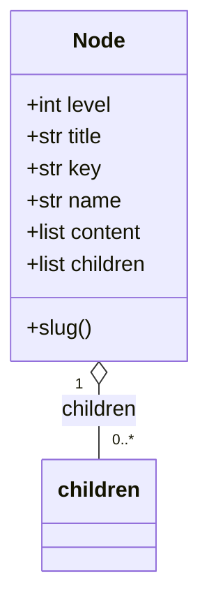

## テーブル一覧 {#sec-lt-list}

局所テーブルの一覧を @tbl-lt-list に示す。

::: {.tbl caption="局所テーブル一覧" label="tbl-lt-list" widths="10,14,10,30,36"}
| ID | 名称 | SP | 用途 | 使用モジュール |
|---|---|:---:|---|---|
| LT-01 | `Report` | SP-01 | ファイル1件の診断結果を保持する | M-0101、M-0102、M-0103、M-0106、`render_csv` |
| LT-02 | `Definition` | SP-02 | 図表番号1件の定義（元番号・label・参照回数）を保持する | M-0201、M-0203、M-0205 |
| LT-03 | `Result` | SP-02 | 変換の結果と取りこぼしの情報をまとめる | M-0201、M-0206 |
| LT-04 | `Change` | SP-03 | 見出し1件の判定結果を保持する | M-0302、M-0303、M-0304 |
| LT-05 | `Node` | SP-04 | 章立てツリーの節点を表す | M-0401、M-0403、M-0404、M-0405、M-0406、M-0407 |
:::

### テーブルサイズ

いずれのテーブルも**要素数の上限を設けていない**。処理対象の文書に含まれる
ファイル・図表・見出し・章の数に比例して増える。

::: {.tbl caption="要素数の見積り" label="tbl-lt-size" widths="12,30,58"}
| ID | 要素数 | 想定される規模 |
|---|---|---|
| LT-01 | 診断対象のファイル数 | 数十件。章ごとに分割された Word で最大でも百件程度 |
| LT-02 | 文書中の図表の数 | 400〜1000 ページ級の設計書で数百件 |
| LT-03 | 1（変換1回につき1個） | － |
| LT-04 | 番号の付いた見出しの数 | 同上で数百件 |
| LT-05 | 章・節・項の数 | 同上で数百件 |
:::

::: {.callout-note}
オーバフローの概念を持たない。上限を設けていないため、
処理対象が大きくなればメモリ使用量が増える。想定する文書の規模（数百件）では
問題にならないと判断し、件数制限を設けていない。
:::

### 他のテーブルとの関係

::: {.tbl caption="テーブル間の関係" label="tbl-lt-rel" widths="20,20,60"}
| テーブル | 関係先 | 関係の内容 |
|---|---|---|
| LT-03 `Result` | LT-02 `Definition` | `definitions` に `Definition` の並びを保持する（包含） |
| LT-05 `Node` | LT-05 `Node` | `children` に自身と同じ型の並びを保持する（再帰的な包含） |
| LT-01 `Report` | － | ほかのテーブルと関係を持たない |
| LT-04 `Change` | － | ほかのテーブルと関係を持たない。ただし `line` が行の並びの添字と対応する |
:::

`Node` の再帰的な包含関係を @fig-lt-node に示す。

::: {#fig-lt-node}

`Node` の再帰構造
:::


